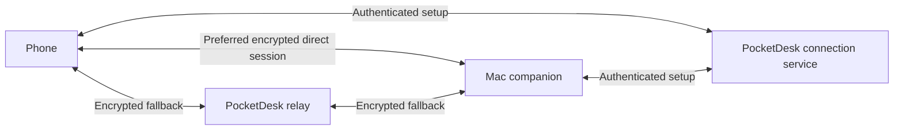
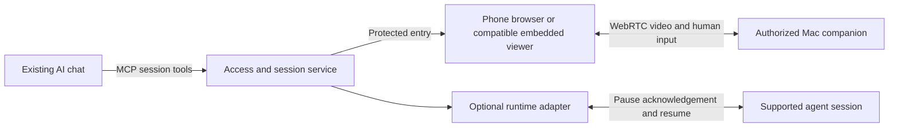

# PocketDesk independent plan review packet

Review only. No implementation, tools, file writes, commands, or account changes. User requested Claude Opus 5 to critically assess each step and recommend improvements. This packet contains the proposed plan and feature coverage; claims remain subject to review.

Return: (1) verdict; (2) prioritized findings with evidence and exact proposed corrections; (3) step-by-step gate/dependency review; (4) missing user features or accidental scope expansion; (5) smallest implementation sequence; (6) unresolved factual questions. Distinguish blockers to planning from later empirical tests. Do not assume competitor traction or demand. Challenge contradictory wording and overspecified security/auth designs. All application work remains paused.

## Canonical purpose, decisions and feature inventory
## 2. Product purpose

**Continue work on your own Mac from your phone while away from home.**

Roshan intends to use PocketDesk for work, coding, ChatGPT or Claude, and university assignments (D08). The experience must support reading, editing, switching between existing Mac applications, and checking the result of a change. Quick interventions remain useful, but they no longer define the entire product. These user needs do not by themselves prove demand beyond Roshan.

The primary user is the owner of the Mac. Helping someone else, team administration, and gaming are separate use cases. Comfortable longer work sessions are a design goal to validate; full-workday laptop replacement is not an established capability. Desired session length and external-keyboard use remain open.

**Differentiation hypothesis:** reliable remote access combined with unusually comfortable phone controls. The split-screen idea supports that hypothesis; it is not sufficient differentiation by itself.

**Confirmed intent:** commercial product, validated through Roshan's own use first (D07). Use the work scenarios below to compare layouts. Proposed validation: record four weeks of voluntary use without reminders, including task, outcome, reason for choosing PocketDesk, and failures. Six useful away sessions is a provisional exploration target, not proof of demand; an infrequent emergency tool needs a different success criterion. Compare the chosen task against an existing app before claiming an advantage. Personal use validates usefulness for Roshan; external customer testing must still establish broader demand and willingness to pay.

### Confirmed decisions

| ID | Decision | Boundary |
|---|---|---|
| D01 | First job: control a Mac while away from home | Internet connectivity is central, not a later add-on |
| D02 | Reconsider platforms and connectivity using research | The attachment's platform assumptions are not binding |
| D03 | Build PocketDesk's own remote access from the start | Do not make installation of Tailscale a product requirement |
| D04 | An awake, unlocked Mac is acceptable for the early prototype | This does not settle locked-host behavior for the public product |
| D05 | Test equipment available: iPhone 17, M4 MacBook Air; possible borrowed iPad; Apple Developer membership | Device OS versions, provisioning, and physical test results are unverified |
| D06 | Establish this document before more coding | Source of truth established; latest clarification keeps this task plan-only, as recorded in D10 |
| D07 | Commercial product, validated through Roshan's own use first | Self-use is the first validation stage, not a substitute for external customer evidence |
| D08 | Intended recurring use: work, coding, ChatGPT/Claude, and university assignments | Broader than quick checks; exact apps, session lengths, and keyboard preference remain unspecified |
| D09 | From the first nine concepts, Roshan prefers 2, 3, and 7, also likes 4; asks for a much more polished Apple app feel with Liquid Glass | These are reference preferences, not approval of every pictured control or a final implementation |
| D10 | Prepare an implementation plan for a new agent; do not continue coding in this task | All three refined concepts are acceptable references; prioritize full-screen content, collapsible controls, native SwiftUI styling, and measured performance over further static polishing. The initial interpretation to start now was explicitly corrected by Roshan |
| D11 | Investigate a workspace sized for the phone and larger-text host resolutions | Portrait virtual-display support is an experiment, not a dependency on Sidecar or a verified capability |
| D12 | Build only the smallest useful private MVP first to find out whether the experience works; prioritize speed to real-device evidence | Commercial intent remains later. Broader beta/release features and exhaustive benchmarking are not prerequisites to this first feasibility decision |
| D13 | Use native GPT subagents as needed, with smaller efficient coding workers and parent-led judgment/integration, following swarm-orchestrator | No Astra workers or reviewers. Keep this task plan-only; the implementing agent verifies available models and concurrency before dispatching |
| D14 | Explore many deliberately rough UI/UX alternatives using Paper and Figma, with Mobbin inspiration | No final layout, branding, or design system selected; Claude design tooling deferred. Mockups are comparison material, not implementation approval |
| D15 | Research live desktop viewing and human interaction through MCP, ideally inside ChatGPT or Claude on a phone; compare existing products | Research only. Human live viewing, human control, and agent visual input are separate capabilities. Password entry is one example, not the whole scope; protected prompts and mobile host support remain unverified |
| D16 | Prefer a protected live website as the viewer foundation, opened from chat; embed the same viewer in compatible chat apps later | Browser-first feasibility research and a concrete plan authorized, including parallel research of implementation options. No browser/MCP implementation, public exposure, or account setup authorized by this decision |
| D17 | Consolidate the resulting feature list, status, and plan into this existing single source of truth | Research reports support PRODUCT; they do not independently authorize features or become competing specifications |
| D18 | Explicitly reconfirmed: this session is planning only; do not start implementation | Finish research, feature inventory and proposed execution sequence only. No application changes, deployment or account setup |
| D19 | Use comparable apps to learn useful features; delegate the feature comparison and obtain a critical Claude review of the finished plan using the requested Opus 5 model if available | Research and plan review only. Do not infer competitor adoption, silently substitute the requested review model, or start implementation |

### Work scenarios that guide the designs

These are proposed concrete tests derived from D08, not claims that Roshan has selected a particular editor, AI workflow, or assignment type.

| Scenario | Proposed task | What the controller must make comfortable |
|---|---|---|
| Coding | Read an error, edit a few lines in the Mac's editor, run a harmless test/command, inspect its output | Sharp text, indentation/punctuation, caret placement, selection, shortcuts, switching editor and Terminal |
| ChatGPT or Claude on the Mac | Read an existing conversation, enter/refine a prompt, then inspect or use its result in another Mac app | Long text, scrolling, prompt editing, switching applications, Mac-local copy/paste |
| University work | Read a reference in one Mac window, edit an assignment in another, save and check it | Sustained reading, precise selection, app switching, keyboard visibility, and confidence that edits are saved |

**Value question to test:** when does access to the existing Mac workspace help more than using the corresponding phone app or website? Possible reasons include open work, local files/tools, or a task already running on the Mac. These are hypotheses, not confirmed restrictions of ChatGPT, Claude, or university software. PocketDesk remains a general desktop controller. D15 now authorizes research into a live MCP viewer, but does not authorize implementing an AI integration, autonomous coding system, or assignment-submission feature.

Design priority: compare both controller layouts while reading and editing, not only while clicking a target. Include a proposed 20-minute mixed reading/typing session and record fatigue, zoom/pan frequency, typing corrections, hidden content, and whether the user wants a keyboard or larger screen. This is a usability experiment, not a new minimum session-length promise. Revisit the external-keyboard milestone if phone-only entry prevents useful work.

### Proposed platform scope

Start with a native iPhone client and Apple-silicon Mac companion. Support ordinary phone portrait and landscape layouts first. Use an iPad as a secondary layout test, with dedicated iPad optimization considered after the phone journey works. Keep future Windows/Linux hosts and Android clients possible without building them now.

The earlier Duo/foldable concept remains a layout exploration. It is not a requirement for first use or a promise of verified hinge behavior. Proposed minimum OS versions are iOS 26 and macOS 26, inherited from the handoff and still subject to compatibility review.

## 3. Research translated into design

The research gathered 24 numbered examples across iOS and other platforms, plus an away-access discussion. These are qualitative reports across different releases, not 24 unique participants, a representative survey, or a hands-on benchmark.

| Evidence pattern | Design response | What we must test |
|---|---|---|
| Remote access is valuable for emergencies and short interventions | Saved Mac, simple Connect, readiness check before leaving | Complete a useful task on cellular without returning to the Mac |
| Users may like one app's controls but trust another app's connections | Treat connection reliability and input comfort as separate goals | Compare both on the same tasks and networks |
| Tiny targets, cursor jumps, and click offsets cause frustration | Relative trackpad by default; stable geometry; explicit click/drag controls | Correct target after zoom, rotation, keyboard opening, and display changes |
| Software keyboards obscure useful desktop content | Reserve a visible desktop region; keep keyboard controls compact | Read and edit without repeatedly hiding the keyboard |
| Text composition and shortcuts fail in surprising ways | Separate committed text from physical keys; visible modifier state | Unicode, composition, punctuation, shortcuts, and external keyboard cases |
| Frozen views and endless connecting states undermine trust | Honest states, stale-view protection, bounded retries, next action | Recover safely from outages without replaying actions |
| Pricing and companion requirements are confusing | Clearly explain included apps, service requirements, and future relay limits | Users understand the offer before payment |

Screens and Jump Desktop are the closest initial comparisons. Moonlight/Sunshine and tablet/fold reports inform performance and interaction testing. Control Pro's advertised free local feature set weakens the original LAN-only differentiation claim. None of this establishes that PocketDesk will outperform them.

## 4. Complete feature map

Everything in this section is **proposed** unless it directly restates D01–D06. “Release” means required before the first public paid release; items may be delivered earlier. Later ideas are retained in section 11.

### Connection, trust, and availability

| ID | Feature | Proposed stage | Required experience |
|---|---|---|---|
| F01 | Built-in remote access | Prototype | Connect across networks through PocketDesk; no separate VPN app |
| F02 | Direct connection with relay fallback | Prototype | Attempt a direct route; fall back when necessary; test both routes |
| F03 | Pair beside the Mac | Prototype | Expiring QR, explicit local approval, persistent revocable trust |
| F04 | Pairing fallback | Prototype | Paste the same full-strength invitation when scanning is unavailable; no weak short-code shortcut |
| F05 | Saved Mac | Prototype | Return to a paired Mac without repeating setup |
| F06 | Device management | Prototype / release | Prototype: one phone–Mac pair; release proposal: several saved Macs/phones, one controller per Mac at a time |
| F07 | Reconnect and cancellation | Prototype | Fresh authenticated session after interruption; cancel always available; no action replay |
| F08 | Before you leave check | Beta | Confirm host readiness and an actual outside-network test; show when last verified |
| F09 | Host availability controls | Prototype | Clear awake/unlocked requirement, explicit keep-awake choice, dated capability observations; no guaranteed permission-expiry forecast |
| F10 | Locked, sleeping, or restarted Mac | Release decision | Determine supported behavior before public promises; early prototype may stop |
| F11 | Optional start at login | Beta | Explicit opt-in, off by default; does not imply recovery through login/FileVault |

### Viewing and navigation

| ID | Feature | Proposed stage | Required experience |
|---|---|---|---|
| F12 | Real selected-display stream | Prototype | Aspect-correct, fresh Mac content; captured cursor is authoritative |
| F13 | Portrait viewing model | Design comparison | Compare adjustable split with full-screen plus revealable controls; no default approved |
| F14 | Landscape view | Prototype | Preserve usable viewing/input after rotation; dedicated 70–75% side-control layout is a beta candidate |
| F15 | Fit, zoom, and pan | Prototype | Continuous zoom, reset, and unambiguous viewport pan are required for reading; 1–3× is a starting range to validate |
| F16 | Adjustable split / full-view mode | Beta | User can prioritize reading without losing an obvious control/disconnect route |
| F17 | Display selection | Prototype / beta | Select one existing display on Mac first; safe in-session phone switching in beta |
| F18 | Adaptive quality | Prototype / beta | Bounded live stream first; polished Auto, Sharp, and Save data controls in beta |
| F19 | Quality and connection details | Beta | Actual route, resolution, frame rate, and measured network information when available |
| F20 | View-only sessions | Prototype | Useful viewing without Accessibility permission or remote-control consent |

### Input and task completion

| ID | Feature | Proposed stage | Required experience |
|---|---|---|---|
| F21 | Relative trackpad | Prototype | One finger moves pointer; two fingers scroll; predictable sensitivity |
| F22 | Click, right-click, double-click | Prototype | Gesture and labeled-button routes; no tiny essential targets |
| F23 | Deliberate drag | Prototype | Visible held state; explicit release; guaranteed cleanup on interruption |
| F24 | Native text entry | Prototype | Evaluate immediate committed-text entry plus separate key events; compose-and-Send remains a fallback candidate, not the settled default |
| F25 | Keys and shortcuts | Prototype | Esc, Tab, Return, Delete, arrows; Command/Option/Control/Shift clearly shown |
| F26 | Modifier behavior | Beta | One-shot by default; deliberate lock/hold; visible and easy to clear |
| F27 | Sensitivity and scroll preference | Beta | Adjustable linear gain, predictable fine movement, natural/reversed scrolling choice |
| F28 | Optional direct-touch mode | Beta candidate | Tap actual content; reject letterboxing; separate remote drag from local pan |
| F29 | External keyboard | Release | Tested shortcuts, text composition, and focus; no doubled input |
| F30 | Essential shortcut buttons | Beta | Small user-tested set, such as Copy, Paste, Select All, Undo; operate Mac's existing clipboard only |

### Safety, settings, and delivery

| ID | Feature | Proposed stage | Required experience |
|---|---|---|---|
| F31 | Stop sharing and revoke | Prototype | Prominent Mac stop; phone disconnect; revoke removes future access |
| F32 | Stale-view protection | Prototype | Visible stale state; prevent unsafe control while view is unreliable |
| F33 | Permission center | Prototype | Capture and control separate; request only when needed; actionable recovery |
| F34 | Interruption cleanup | Prototype | Release remote-held input; stop/clear video; never replay text/clicks |
| F35 | Accessible native interface | Prototype / release | Accessible foundations immediately; full audit before release |
| F36 | Privacy and diagnostics | Prototype / beta | No content logging; optional redacted diagnostics export in beta |
| F37 | Phone background privacy | Prototype | End active control and conceal captured content in background/app switcher |
| F38 | Distribution | Beta / release | TestFlight phone app and signed/notarized Mac host; clean-machine verification |
| F39 | Pricing, purchase, restore | After validation | Free research beta; business model and relay economics reviewed before billing |
| F40 | Help and support | Beta / release | Setup, permission help, network troubleshooting, privacy policy, support route |

### Browser viewer and chat integration — current research direction

#### Coverage of Roshan's previous conversation

Checked against user messages in conversation `01a0992a-27f6-7ca3-862c-670b343deebd` on 13 September 2026. Times below are UTC. This is a traceability index into the existing specification, not another feature backlog. Technical safeguards and specific control layouts are proposed design responses rather than claims that Roshan dictated every detail.

| User idea or request | Source moment | Where it is retained / status |
|---|---|---|
| Try many rough UI/UX directions using Paper and Figma, with Mobbin inspiration | 06:50:12–06:50:55 | D14, sections 5–6, design exploration exports; no final design selected |
| Consider Claude design tooling for a later final design system; use Paper/Figma first | 06:50:55 | D14 and implementation ledger; deferred possibility, not a prerequisite |
| While away from the laptop, see what is happening on the existing desktop during development | 06:51:58 | D01/D08/D15, B01–B05 and B14; browser work unbuilt |
| Let an agent/Codex request screen sharing through an MCP integration | 06:51:58–06:52:32 | B16; later tool integration after standalone proof |
| Live sharing for the human, not a replacement with screenshots | 06:52:32 | B04 is continuous video; B18 screenshots remain a separate optional model capability |
| Live interaction inside ChatGPT or Claude's mobile app | 06:57:19–06:57:47 | B06–B07/B17; host compatibility unverified, preserved as an explicit goal |
| Enter a password directly from the phone as one example of broader interaction | 06:57:19–06:57:47 | B20 plus B07; separate secure-field/protected-prompt experiments, no password through chat |
| Check existing products and the actual Codex/Claude capabilities | 06:53:33–06:56:24 | API assessment and competitor feature comparison; current D19 prioritizes learning from features |
| Use a live website if embedded chat support does not work | 07:17:26 | B01/B16/B17; protected browser selected as the foundation in D16 |
| Research the approach, then keep the feature list in one source of truth | 07:18:21–07:20:21 | This document, B01–B20, section 9B2, and subordinate implementation packages |
| Do not implement during this session | 07:26:58 | D18 remains in force; review is now separately authorized by D19 |

Human takeover and return (B19) is a proposed workflow elaboration of direct interaction while an agent works. It remains in the plan, but a reliable pause/resume protocol is an engineering proposal, not a capability established by the original request. The earlier native F01–F40 inventory and broader work/university scenarios remain intact; selecting the browser foundation did not delete them.

**Confirmed direction D16; proposed implementation scope. Every browser/MCP feature below is currently unbuilt.** Existing Mac/native foundations are listed in section 12. A website is another client of the Mac companion, not a way to capture or control an arbitrary Mac without installing and authorizing the companion. Preserve existing native clients while testing this route; no replacement or deletion was requested.

The first supported target to prove is a standalone phone browser. Opening inside a chat app is optional and must not be required for basic live viewing. HTML supplies the interface; WebRTC carries video and human input. A live viewer for the human does not automatically supply video to an AI model. [Browser WebRTC](https://developer.mozilla.org/en-US/docs/Web/API/WebRTC_API), [MCP Apps](https://modelcontextprotocol.io/extensions/apps/overview)

| ID | Feature | Proposed stage | Required experience / acceptance boundary |
|---|---|---|---|
| B01 | Protected browser viewer | First browser proof | Open an HTTPS page in Safari/Chrome; clear Connect and End session actions; never imply a loaded page is a connected Mac |
| B02 | Browser enrollment and Mac readiness | Before real access | Establish browser authority with the user at the Mac; name selected display, capture status, and separate control consent; reuse normal OS permission flows |
| B03 | Short-lived, scoped access | Before real access | A chat link is an entry point, not a reusable key; bind each session to the authorized browser and Mac, expiry, and view/control mode; preview/prefetch must not start or consume a session |
| B04 | Live selected-display video | First browser proof | Advancing WebRTC video, correct aspect ratio, observable freshness; generated fixtures prove transport only, followed by real Mac capture |
| B05 | Fit, zoom, pan, and rotation | Browser viewing MVP | Keep Mac text inspectable and preserve viewport geometry when orientation or keyboard changes; distinguish local panning from remote pointer motion |
| B06 | Relative trackpad and pointer actions | Browser control MVP | Touchpad, scroll, click, right-click, double-click, deliberate drag and Release; direct absolute touch remains a later option |
| B07 | Text, keys, and shortcuts | Browser control MVP | Commit Unicode/IME text once, supply labeled special keys and one-shot modifiers, retain uncertain drafts visibly, and never replay uncertain input |
| B08 | Explicit view-only access | Before real access | Viewing works without control permission; Mac rejects input even if a browser crafts packets. A data channel used for session/status messages is not a control grant |
| B09 | Stale-view protection | Browser viewing/control MVP | Disable input when capture/video is unhealthy, show the reason, and do not treat repeated stale frames as healthy capture |
| B10 | Interruption and held-input cleanup | Browser control MVP | Release remote-held state on hide/disconnect where possible; Mac-side lease remains authoritative when the browser is suspended or disappears |
| B11 | Fresh reconnect and cancellation | Browser MVP | Revalidate authority and establish a fresh session after interruption; provide cancel/retry; never resume with queued clicks/text |
| B12 | Stop, expiry, and revoke | Before real access | Mac Stop sharing and expiry end access; browser close is not the only cleanup mechanism; revoked/replayed credentials fail |
| B13 | One active viewer/controller | Browser MVP | Do not silently evict the native phone or another tab; explain busy/ended state. Concurrent viewers and independent controller handoff are later work |
| B14 | Direct/relay connection and diagnostics | Private/public acceptance | Distinguish page load, signaling, media, and input health; report actual route and measurements; test forced TURN separately from direct/private paths |
| B15 | Mobile browser usability and accessibility | Browser MVP foundations | Visible focus, labeled controls, readable UI, comfortable touch targets, soft-keyboard layout, explicit playback fallback; streaming desktop semantics are not promised to screen readers |
| B16 | Chat/MCP session tools and link | After standalone browser proof | An authorized agent can request session/status/stop and return the viewer entry point; human video and keystrokes travel outside the model/tool transcript |
| B17 | Embedded chat viewer | Later compatibility layer | Reuse the browser viewer in supporting hosts; explicit Open in browser fallback; test each host's media, focus, fullscreen and lifecycle behavior |
| B18 | Optional agent frame/status inspection | Later, separate grant | Agent receives requested fresh frames or structured state with clear scope; this is distinct from the human's continuous video |
| B19 | Human/agent takeover and return | Later workflow experiment | A supported runtime adapter must acknowledge pause and account for queued/in-flight work before claiming human ownership; explicitly resume with fresh context. MCP alone does not control arbitrary running sessions. Cooperative ownership is not a guarantee against input from unrelated Mac software |
| B20 | Secure fields and protected prompts | Separate experiment | User types directly into the remote interface; no password through chat/tools or persistent logging. Test ordinary secure fields and OS authorization separately; do not promise remote TCC repair or login/FileVault unlock |

**Initial browser scope excludes:** audio/microphone forwarding, file/clipboard synchronization, session recording, multiple simultaneous viewers, billing, a new consumer account platform, and guaranteed locked/sleeping-host access. These remain explicit later decisions, not missing prerequisites for a generated-video experiment.

**Host support, checked 13 September 2026:** Claude documents interactive connectors on iOS/Android, but PocketDesk WebRTC and keyboard behavior there remain untested. OpenAI's private developer-mode custom MCP app route is web-only; broader mobile plugin availability does not establish support for this private custom viewer. A standalone browser remains the common foundation. [Claude](https://support.claude.com/en/articles/13454812-use-interactive-connectors-in-claude), [OpenAI custom apps](https://help.openai.com/en/articles/12584461), [OpenAI plugins](https://learn.chatgpt.com/docs/plugins)

## Canonical technical and acceptance plan
## 8. Connectivity, privacy, and security boundaries

**Confirmed outcome:** PocketDesk handles its own remote access. **Proposed architecture:** native WebRTC for video and input transport, a PocketDesk service to introduce authenticated devices, and a relay for networks that prevent direct connections. “Own remote access” means owning the integration and customer experience; it does not require inventing cryptography or codecs.

The setup service should not be able to substitute a different authenticated endpoint. Protect negotiation end to end; bind sessions and inputs to fresh identifiers; reject replayed, malformed, oversized, expired, or revoked requests. Use maintained cryptographic and media components and obtain security review before public release.

End-to-end encryption is a requirement, not a completed security certification. The service can still observe connection metadata such as addresses, timing, and traffic volume. Do not claim “no cloud,” “zero metadata,” or anonymity. Prototype beta access needs registration/relay abuse limits, short-lived relay credentials, and explicit cost controls.

Screen capture begins only for authorized content after authentication. Control additionally requires the Mac user's consent and relevant OS permission. Stop sharing must end both promptly. No remote shell, arbitrary scripts, login-password storage, hidden screen capture, keystroke logging, automatic clipboard upload, or analytics SDK is proposed.

Heartbeats and a proposed two-second session lease provide a fallback for lost disconnect messages. Separately evaluate a shorter held-button/modifier lease, starting at 0.5–1 second, and block new drags when delivery health is uncertain. Test loss and jitter before freezing timer values: aggressive expiry can release a legitimate drag unexpectedly, and releasing a mouse button can itself complete a file drop. No timeout can guarantee undoing actions already applied. The host releases only remote-generated held state. Stale-video detection must distinguish an unchanged desktop from an interrupted pipeline.

Proposed media baseline: SDR H.264, aspect preservation, bounded queues, one automatic quality mode. Compare 30 and 60 fps with text readability, input response, motion, battery, and network cost measured together; neither rate is an approved shipping promise. Test sharp idle refresh without mistaking repeated stale frames for capture health. Defer user-facing quality presets. Hardware acceleration, achieved frame rate, battery life, and latency require physical measurement.

The unattended Mac's physical screen and notifications may reveal what is shared. Explain this during setup; offer notification guidance without silently changing system settings. Blanking the physical display while preserving usable capture is an unverified later capability.

The detailed [remote protocol draft](Docs/REMOTE-PROTOCOL.md) is subordinate engineering material and may change after this review. The attachment's two-TCP LAN protocol is not the chosen internet architecture.

## 9. Proposed milestones and acceptance

### A. Product/design agreement — sufficient to begin implementation

The second-round concepts and architecture discussion provide enough direction for an implementation handoff (D10). Roshan clarified that coding should continue with a new agent, not in this task. The recommended native direction uses an edge-to-edge session viewport, collapsible connection header, floating trackpad, and keyboard on demand. Interaction details still need device testing; existing exploratory code is evidence to assess, not a constraint on the design.

### B. Working private prototype

**Immediate milestone: a feasibility MVP (D12).** Deliver one phone controlling one awake, unlocked Mac across networks, using the existing stack, native default controls, readable fit/zoom/pan, basic mouse/text/keys, explicit trust/control consent, and safe disconnect. Developer setup is acceptable. Its purpose is to decide whether Roshan can complete one useful work task from the phone. Do not build the complete backlog before answering that question.

MVP completion requires an observed physical iPhone/Mac task over cellular, a local baseline, a separately verified forced-relay session, successful pairing/rejection/revocation checks, and recovery/input-release checks including an interruption during a drag. Record actual response/readability, route, failures, and any Mac intervention. A small timing sample can guide feasibility, but cannot establish the later p95 targets. If devices or service access block the live test, report a runnable but **unvalidated MVP**, with the exact missing step; do not declare the hypothesis proven.

Stop this delivery at the feasibility result and a concise continue/change/stop recommendation. Dedicated iPad work, virtual displays, lock/login support, accounts/billing, polished onboarding, multiple devices, audio/files/clipboard sync, extensive competitor benchmarking, and public release engineering stay outside this milestone. Authentication, input cleanup, meaningful tests, and independent review of sensitive paths remain required. The broader prototype and beta validation below is retained as follow-up scope; it is not all required before the first feasibility decision.

One phone, one Mac, one explicitly selected existing display. The prototype has only four task-level requirements: establish trust and connect; read/navigate a zoomed view; make a precise pointer/text/key change; disconnect/recover safely. Pair/revoke, permission checks, view-only authorization, input cleanup, and honest failure states remain necessary foundations. The user may leave the host awake and unlocked. Developer-only setup is acceptable if clearly labeled.

| Prototype must include | Next-stage scope, not required to pass prototype |
|---|---|
| Expiring pairing with local approval, stored trust, revoke, Stop sharing | Multiple saved devices, account recovery UI |
| One selected display, fresh video, continuous zoom/pan, basic rotation | In-session display switching, custom landscape side panel, dedicated iPad |
| Relative input, click/right/double-click, deliberate drag, text and keys | Direct touch, external keyboard, sensitivity preferences, shortcut palettes |
| Permission/control consent, view-only when control is disabled | Elaborate mode selection or settings |
| Direct and forced-relay connection; stale/error/cancel states | Quality presets, customer diagnostics panel, exports |
| Explicit keep-awake choice and dated readiness observations; manual cellular check | Polished departure wizard, push alerts, service-independent LAN path |

The feature map is the complete backlog. Mixed-stage entries describe progressively richer versions; the two columns above define the prototype boundary. No requirement for an external beta or public release is silently deleted by this narrowing.

Expanded prototype validation after the initial feasibility MVP requires actual iPhone 17/M4 Mac task completion on LAN, cellular, and another external Wi-Fi network. A local loopback, simulator demo, or successful build does not pass the remote-access gate. Demonstrate a forced relay session separately from a direct session.

Provisional connectivity/task gate: on two different days, away from home, make a small edit and run one harmless command in Terminal without someone touching the Mac during or to restore those sessions. Initial setup happens beforehand. This is a technical smoke test, not the full usability gate. Also exercise the coding, AI-conversation, and assignment scenarios in section 2, including a proposed 20-minute work session. Record completion time, errors, interventions, readability, and fatigue for both controller candidates.

Provisional performance bars for review: at least 19/20 connection attempts reach a usable view within 10 seconds in each declared supported test condition; physical input-to-visible p95 at most 150 ms on the reference LAN and 400 ms on the declared relay route. These are proposed budgets, not measurements or guarantees. Record RTT, geography, load, resolution, and sample size; collect at least 100 interactions for latency. Developer records measurements; Roshan assesses readability and usefulness. Misses trigger investigation or an explicit documented scope/budget revision, not quietly moving the threshold after a test.

### B2. Browser feasibility — proposed next sequence, not started

Browser research does not replace or pass the native physical gates above. The website path can prove transport with generated frames while real Mac capture remains blocked, but must subsequently pass real capture and human-input tests.

| Gate | Scope / feature IDs | Evidence required before progressing |
|---|---|---|
| G0 · Protocol compatibility | B03, B04, B08 | Cross-language fixtures for authenticated signaling, binary data-channel JSON, replay rejection and field bounds; inspect H.264 negotiation/decoded frames; no real desktop; browser fixtures use separate authority, saved phone pairing remains byte-for-byte unchanged, and native reconnect still passes |
| G1 · Standalone live viewer | B01, B04, B08, B09, B12 | Generated changing video in an ordinary browser; explicit playback/error state; view-only injection denied; Stop, expiry and reload end the old session |
| G2 · Browser controls | B05–B07, B10–B11, B15 | Pointer/text/IME/keys exercise against a harmless fixture; stale and disconnect input rejected; no doubled text or queued replay; visible draft/acknowledgement semantics |
| G3 · Private real-phone task | B02–B15 | Installed Mac runtime permissions repaired first; selected real display, actual reflected edit and interrupted drag on physical iPhone Safari, then iPhone Chrome as a distinct target. Private Tailscale may be used for this test only; page/signaling success alone is insufficient |
| G4 · Standalone internet access | B14, existing F01–F02 | Provider setup resumed; authenticated public signaling, real cellular session and separately forced TURN, correct route metrics, cleanup and revoke verified |
| G5 · Chat integration | B16, then B17–B19 selectively | Authorized tools open the already proven browser path; no session secrets or human input in model history; test Claude/mobile or other embedded hosts individually and retain external-browser fallback |

Use Safari and Chrome as distinct browser acceptance targets and test any in-app/embedded browser separately. Hardware keyboard, IME, soft-keyboard viewport changes, playback restrictions and background suspension need actual device observations. A browser-only loopback result is not physical iPhone proof. B20 protected-input testing remains separate and is not a prerequisite to showing a generated live stream.

The execution packages, implementation write-sets and validation details belong in the [implementation ledger](Docs/IMPLEMENTATION-PLAN.md); this table is the authoritative product acceptance sequence. Research authorizes these proposals, not starting their implementation.

### C. Usable external beta

Unaided onboarding, readiness check, complete recovery/error flows, tuned keyboard/view layouts, accessible controls, diagnostics, and repeat-use research. Deliver through TestFlight and a signed/notarized Mac installer. Decide multi-device management and locked-host support before promising them.

### D. Public release decision

Require observed preference/repeated usefulness, sustainable relay economics, compatibility and security review, release signing, privacy/support materials, and a validated purchase model. No delivery date or guaranteed App Store approval is implied.

| Area | Proposed acceptance evidence |
|---|---|
| Useful task | Exercise coding, Mac-based ChatGPT/Claude, and assignment workflows from outside home; evaluate a sustained reading/editing session as well as quick corrections |
| Trust | Wrong/expired/replayed/revoked credentials cannot authorize video or input |
| Relay | Direct and forced-relay sessions independently demonstrated; route correctly reported |
| Input | No wrong-target click across fit/zoom/rotation/keyboard/display changes; no stuck holds past lease expiry |
| Text | No doubled committed text; Unicode and shortcuts tested; secure-input limitations documented |
| Recovery | Network change, outage, backgrounding, process termination, and permission loss tested; no replay |
| Availability | Separate tests for lock, display sleep, system sleep, lid close, logout, restart, and display removal |
| Stability | At least 50 connection cycles and a 30-minute session; bounded memory and no stale resource use |
| Accessibility | VoiceOver for app controls, large text, contrast, reduced motion/transparency, labeled gesture alternatives |
| Performance | Report median/p95 physical input-to-visible response and connection times by route/network; no invented latency claims |
| Distribution | Fresh installation and pairing on physical devices using intended distribution |

Network testing should include healthy and busy Wi-Fi, cellular, external Wi-Fi, relay-only conditions, brief loss, added delay, IPv6 where available, and restricted networks. The provisional numeric bars above await agreement on reference conditions. The handoff's LAN targets are historical proposals, not internet guarantees.

## Proposed engineering packages
### Proposed browser implementation packages — not started

Roshan explicitly reconfirmed this session is planning only (PRODUCT D18). These are proposed write-sets for a later implementation task, not current assignments. PRODUCT section 9B2 owns acceptance and ordering; this table translates its gates into bounded engineering work.

| Package | Proposed files / ownership | Dependency and validation |
|---|---|---|
| Contract and generated fixture | Browser-specific shared protocol types and tests; extend `RemoteTests` with advancing synthetic frames | G0 first. Specify versioned fields, timestamps/counters, binary framing and authenticated mutual identity before live access. Review crypto design; fixed cross-language vectors, malformed/replay rejection, no native trust mutation. No real screen or injected Mac input |
| Browser admission and grants | Dedicated route/state in `Server/`, browser enrollment/session integration in shared/host code | G0 contract. Preserve native `/signal`, Origin rejection, registration and rate limits; a separate browser route needs exact origin policy and independent credential types. Test inert GET/prefetch, wrong key/origin/mode, redemption race, expiry, Stop and native/browser revoke isolation |
| Standalone viewer | Proposed new browser client directory, owned by one worker | G1 after contract and browser admission/grants. HTTPS page, receive-only video, existing host-created ordered binary `control` channel used only for status in view mode, and explicit playback/failure UI. Channel-open currently drives capture startup; changing that requires an explicit shared lifecycle change. Generated counter advances; host denies crafted input in view-only; no saved phone credentials or production screen required |
| Human input and lifecycle | Browser controls plus shared/host input gates; assign one integration owner | G2 after viewer. Relative touchpad, zoom/pan, committed Unicode/IME text and explicit keys; test harmless fixture response, acknowledgements, cancel, stale frames, held-state lease and no replay. Direct absolute touch excluded |
| Private physical acceptance | Test harness and redacted receipts | G3 after fixture. The prior private listener is stopped and its proxy served only `/signal`; reuse needs a reviewed restart and browser-route mapping, preserving unrelated configuration. Real capture requires restored runtime Mac permissions; physical Safari/Chrome, readable video, reflected edits and interrupted drag must be observed |
| Public reachability | Provider configuration and operational tests | G4 only after user resumes provider/account work. Authenticated public WSS, physical cellular and separately forced TURN with actual route/usage observations; do not infer this from Tailscale or local signaling |
| Chat integration | Small MCP control adapter; optional embedded client wrapper | G5 after standalone proof. Tools request/status/stop and return inert locators. Local harness/Mac controls issue grants before this package exists. Check exact provider reachability and host capabilities; media and human input never enter tool history |

Parent integration must preserve one active viewer policy and existing native clients. Browser enrollment must not use `createPair()`/`HostPair.rotated()` to overwrite the phone pair. A view-only session may retain a channel for status/readiness, but the Mac must reject input regardless of crafted browser packets. A new channel-free lifecycle is a separate change.

Supporting reports and hosting assumptions are indexed in [browser research](../outputs/browser-viewer-research-2026-09-13/README.md). No browser code, new service, account, deployment or physical test was performed during this planning pass.

Final planning review corrected stale device/permission wording, viewer dependencies, channel lifecycle, native-identity preservation and browser acceptance targets. All seven product/ledger/research documents passed local file-link validation; whitespace checks passed. These are documentation checks only. No browser implementation or live acceptance was performed.

## Current synthesis
# PocketDesk planning assessment

Updated 2026-09-13T07:51:24Z. Research and planning only; subordinate to [PRODUCT](../PRODUCT.md). No application changes, deployment, account setup, or competitor installation performed.

## Where the idea stands

The proposed workflow is: use an existing AI conversation on a phone, open a protected live view of your own Mac, interact directly when needed, then return to the agent. The standalone browser viewer is the selected foundation; embedding it in compatible chat apps comes afterward. Continuous human video, optional model screenshots, and agent execution control are separate capabilities.

The browser foundation is technically supported by the available building blocks. A universal takeover button for arbitrary running agents is not established by MCP. That part requires a cooperating runtime and an explicit ownership protocol. These are architecture findings, not an end-to-end product demonstration.

Roshan reports interest from developer friends. His latest direction is to learn from comparable products' features, without treating their existence as a reason to abandon the idea. Their adoption, retention, revenue, and reliability have not been established in this review. See the [feature comparison](COMPETITOR-FEATURES-2026-09-13.md) for documented overlaps and useful lessons.

## Recovered context and existing evidence

Reviewed the main conversation `01a0992a-27f6-7ca3-862c-670b343deebd`, related implementation `01a095ce-fca6-7041-b53b-9f4b24aa5c08`, planning `01a0957a-549b-7312-8f30-6b0920e12a8d`, earlier exploration `01a09060-e9e9-7d52-b724-0b708b7329a3`, and source chat `6aa4fed9-bce4-83ea-bf8c-73cfc90c4833`. This was targeted history recovery plus repository inspection, not an exhaustive audit of every historical tool output.

The direction evolved from native phone remote desktop and layout exploration to a live browser viewer reached from chat. Earlier native work remains useful infrastructure. Archived final-check receipts show 33 native tests, 33 service tests, and successful Mac/phone builds. The same checkpoint records failed runtime permission probes. Neither those tests nor historical installation proves physical phone viewing/control, cellular connectivity, or relay performance. No new runtime tests were run during this planning review.

All browser features B01–B20 remain unbuilt. The current native signaling endpoint rejects browser Origin headers. Browser access needs a deliberately authenticated ingress, not removal of that guard globally. Existing ScreenCaptureKit capture, H.264 WebRTC media, and CGEvent input provide reusable starting points; browser authentication and protocol interoperability remain implementation work.

## API feasibility

| Surface | Supported building block | Boundary for PocketDesk |
|---|---|---|
| Mac capture/input | ScreenCaptureKit selection and `SCStream`; Core Graphics mouse/keyboard events | Installed, authorized companion required. Early awake/unlocked host assumption remains. Protected fields and OS prompts need separate proof. [Capture](https://developer.apple.com/documentation/screencapturekit/capturing-screen-content-in-macos), [CGEvent](https://developer.apple.com/documentation/coregraphics/cgevent) |
| Browser media/input | `RTCPeerConnection`, video tracks, binary `RTCDataChannel`, SDP/ICE | Signaling, viewer authorization, coordinate mapping, reconnect, and mobile behavior are application responsibilities. [WebRTC](https://webrtc.org/getting-started/peer-connections) |
| MCP tools and UI | Tool calls plus a sandboxed interactive app resource | Can open/manage a viewing session. Does not itself transport the desktop video or pause an arbitrary agent. [MCP Apps](https://modelcontextprotocol.io/extensions/apps/overview) |
| Claude phone embedding | Interactive connectors documented on iOS/Android as well as desktop/web surfaces | Best documented first mobile embedding candidate. Continuous WebRTC and touch behavior in its sandbox still need testing. Remote MCP calls originate from Anthropic infrastructure; a phone-only tailnet route is insufficient. [Interactive connectors](https://support.claude.com/en/articles/13454812-use-interactive-connectors-in-claude), [Remote connectors](https://support.claude.com/en/articles/11175166-get-started-with-custom-connectors-using-remote-mcp) |
| ChatGPT embedding | MCP App resource registration and declared UI network/frame permissions | Private developer-mode documentation specifies web. Broader plugin mobile availability does not prove a private desktop viewer works on phone. Keep browser fallback. [UI API](https://developers.openai.com/plugins/build/chatgpt-ui), [Developer mode](https://developers.openai.com/api/docs/guides/developer-mode), [Plugin surfaces](https://learn.chatgpt.com/docs/plugins) |
| Codex runtime integration | App Server thread start/resume, turn start/steer/interrupt, completion events | Suitable for sessions the integration owns or is authorized to control. Not automatic access to every existing Codex app task; interrupt does not prove all background processes stopped. [App Server](https://learn.chatgpt.com/docs/app-server) |
| Claude runtime integration | Agent SDK query, resume, tool permissions, interrupt/abort controls | Requires an adapter for owned sessions. Interrupt receipts can leave queued work or subagents outside the acknowledged scope. Third-party SDK authentication is separate from merely connecting a passive MCP viewer. [SDK types](https://code.claude.com/docs/en/agent-sdk/typescript), [SDK setup](https://code.claude.com/docs/en/agent-sdk/quickstart) |
| Relay | TURN credentials generated by a trusted backend | TURN relays media; it supplies neither Mac authorization nor agent control. Cloudflare setup remains deferred. [Credential API](https://developers.cloudflare.com/realtime/turn/generate-credentials/) |

OpenAI's secure MCP tunnel is an additional private-development endpoint option, not a desktop media tunnel. Public plugin distribution has its own review path. Neither is required to settle the initial browser feasibility question. [Connect ChatGPT](https://developers.openai.com/plugins/deploy/connect-chatgpt), [Submission](https://developers.openai.com/plugins/deploy/submission)

## Proposed architecture and takeover contract

The host enforces viewer scope, expiry, revocation, view-only mode, fresh-frame input checks, and a single controller. Human video/input goes directly through the viewer path. Model inspection is an explicit separate frame/status operation. Keeping human keystrokes out of chat history alone cannot guarantee secrecy if an agent still captures the screen.

For a supported agent: request takeover, stop dispatch of new actions, resolve queued/in-flight actions under the adapter's documented limits, obtain a scoped pause acknowledgement, then grant human control. On return, release held inputs, obtain fresh screen/context, and explicitly resume. If acknowledgement is unavailable, the UI must not claim that the agent is paused. This is cooperative ownership; unrelated Mac processes remain outside its guarantee. These details refine B19 without making it an initial-viewer dependency.

## Proposed next sequence, after implementation authorization

1. Finalize browser authentication and wire contracts, retaining the existing safety rules.
2. Build the smallest standalone live viewer with view-only and direct human input; verify real iPhone Safari on an awake, authorized Mac.
3. Complete a useful away-from-home task on cellular, including a forced TURN path, reconnect, and stop/revoke behavior.
4. Add MCP session/status/stop tools that open the proven browser path.
5. Probe embedded Claude mobile, then the available ChatGPT surfaces individually. Retain the browser path wherever embedding fails.
6. Test one explicit runtime adapter and its pause/queue/resume behavior before promising integrated agent handoff.

The planning decision is ready: retain the browser foundation and treat embedding and runtime handoff as separately demonstrated extensions. Remaining physical tests are future feasibility work, not evidence already obtained. Competitor lessons can improve the design without expanding the first implementation into an agent dashboard, terminal manager, or full development environment.

## Competitor feature evidence
# PocketDesk competitor feature comparison

**Research date:** 13 September 2026  
**Evidence boundary:** This is a primary-source feature review, not hands-on testing. “Advertised” means a vendor or project currently claims or documents the behavior. It does not establish reliability, adoption, revenue, or active users. No competitor was installed and no account was created.

## PocketDesk comparison point

PocketDesk’s proposed browser direction is: live human viewing and control of the owner’s existing Mac from a protected phone browser, with that browser opened from an existing AI chat; an MCP App may later embed the same viewer where a host supports it. Human WebRTC video and input stay outside the model transcript. Agent frame inspection and a clear human/agent handoff are separate, optional capabilities. All browser/MCP work remains unbuilt and the physical native Mac-to-phone acceptance gate is still open. See [PRODUCT](../PRODUCT.md#browser-viewer-and-chat-integration--current-research-direction).

The distinctions used below matter:

- **MCP configuration management** edits which MCP servers a coding agent can use; it is not itself a remote-viewer integration.
- **Exported desktop tools** give the model screenshots and actions through MCP; they do not provide continuous video to the human.
- **Embedded viewer** places a live human-facing stream and controls in an app or page; it may use WebRTC without being an MCP App.

## Feature comparison

| Product | Specific advertised or documented features | Actual surface | Relationship to PocketDesk | Useful lesson for PocketDesk |
|---|---|---|---|---|
| **[WhipDesk](https://whipdesk.com/)** | Mobile-browser control of the whole dev machine; mouse and keyboard input; phone-first landscape/fullscreen controls; PIN before the first frame; direct/STUN-first connection with TURN fallback. Its architecture documents a remote H.264 WebRTC track plus DataChannel, zoomed viewport cropping, a low-resolution minimap overview, unchanged-frame skipping, and pausing when no controller is visible. It also advertises agent-state alerts, native hook acceleration, scheduled prompts, prompt snippets, recorded UI sequences, and web push. [README](https://github.com/BinaryBananaLLC/WhipDesk/blob/main/README.md) · [architecture](https://github.com/BinaryBananaLLC/WhipDesk/blob/main/docs/ARCHITECTURE.md) · [hooks](https://github.com/BinaryBananaLLC/WhipDesk/blob/main/docs/HOOKS.md) | **Standalone human live viewer and controller** in a PWA/browser; agent awareness is host monitoring and hooks. | This is the closest direct advertised overlap with PocketDesk’s human Mac-from-phone browser goal. It does not document opening the viewer from an existing AI chat, MCP App embedding, model screenshot tools, or explicit human/agent ownership transfer. A bounded scan of current `main` found no MCP-named paths and no MCP mention in its README, architecture, hooks, or root package file; this is not proof that MCP exists nowhere in the project or roadmap. | Treat sharp zoom as a server/capture concern: crop and encode the viewed region while retaining a cheap overview. Consider state-aware alerts, scheduled follow-ups, reusable prompts, visible minimap navigation, unchanged-frame suppression, and background push after the safe browser proof. |
| **[ServerCC](https://servercc.app/)** | Phone-native SSH terminal and coding-agent sessions; persistent tmux sessions; parallel instances; files, diffs, ports, worktrees, and tmux/herdr takeover. Its separate VNC client connects to macOS Screen Sharing/ARD or standard VNC by **SSH tunnel, direct connection, or built-in Tailscale**, offers quality/speed modes, and shows the desktop fullscreen. Its keyboard accessory has Esc, Tab, auto-repeat arrows, sticky Ctrl/Shift/Alt/Command, zoom controls, and an interaction toggle. [VNC docs](https://servercc.app/docs/vnc) | **Native VNC human viewer** inside the ServerCC phone app. Its “[MCP](https://servercc.app/docs/mcp)” feature is **configuration management** for project `.mcp.json` and user `~/.claude.json`; it does not export ServerCC’s VNC viewer through MCP. | It proves a useful product composition—agent terminal plus a separate live desktop view in one phone app—but it is not a browser viewer, chat-launched experience, MCP App, or documented cooperative agent/desktop handoff. It also depends on SSH/direct/Tailscale and an already enabled VNC server rather than PocketDesk’s own pairing and relay path. | Copy the compact keyboard accessory pattern and test sticky modifiers, held-arrow repeat, zoom, and explicit interaction mode. Keep route and quality choice truthful and visible. Preserve a quick path from the agent/session screen to “inspect what it built.” |
| **[Offsite](https://offsite.sh/)** | Native Mac/iPhone/Watch board for real CLI sessions, tmux persistence, git/files, notifications, direct/LAN/Tailscale/relay path racing, and session context handoff. Its Agent Browser is one host Chromium that both agent and human can control, with PiP/docked/full modes, responsive device presets, quality/frame-rate controls, screenshots and accessibility snapshots. Its Simulator card streams the iOS Simulator and forwards taps/typing. [Agent Browser](https://docs.offsite.sh/cards/agent-browser/) · [Simulator](https://docs.offsite.sh/cards/simulator/) · [handoff](https://docs.offsite.sh/work/handoff-and-ask/) | **Embedded browser/simulator viewers** plus **exported agent tools**. Its separate [Computer Use](https://docs.offsite.sh/computer-use/computer-use/) feature gives a model screenshots and Mac actions behind host and per-session gates. | Offsite documents human takeover of its Agent Browser and Simulator, not a human live viewer for the arbitrary whole Mac desktop. Its general Mac Computer Use path is model-oriented screenshots/actions rather than continuous phone video. It is a native Offsite workspace, not a protected browser opened from an existing AI chat or an MCP App embedded there. | Strong references are per-card PiP/fullscreen modes, low-rate previews until enlarged, explicit agent cursor, user-selected quality/frame rate, per-session Computer Use grants, and separate personal versus agent browser profiles. Its handoff rule is especially useful: read an old session, then start a fresh session with context instead of injecting text into a terminal that may contain a half-written human draft. |
| **[AI Tether](https://ai-tether.com/)** | Phone, web, and Mac dashboard for Claude Code, Codex, and Grok; live status sorted by attention; streamed transcripts with reconnect backfill; remote permission approval; follow-ups, interruption, launch/resume; tmux terminal control; QR pairing; end-to-end encrypted hosted or self-hosted relay. It explicitly says Codex launched through AI Tether is controllable, while a Codex TUI started independently is watch-only. | **Agent-session dashboard and terminal transport**, not a whole-desktop viewer. | It is closer to remote agent supervision than PocketDesk’s general Mac control. It does not advertise continuous Mac desktop video, control of arbitrary Mac apps, MCP App embedding, or a viewer opened from an existing chat. Its owned-versus-existing Codex distinction is a useful honest limit rather than an automatic takeover claim. | Show ownership and capability per session: “controllable,” “watch-only,” “needs permission,” “waiting,” and “ended.” Sort attention above routine progress, show full commands before approval, deny timed-out approvals safely, and backfill transcripts after reconnect without pretending the desktop state was preserved. |
| **[Windows 365 for Agents](https://github.com/microsoft/windows-365-for-agents)** | Managed, pooled Windows Cloud PCs for agent workloads; Entra/Intune governance; acquire/use/release lifecycle; 65 MCP tools for desktop, browser, accessibility, shell, and session work. A separate browser JavaScript screen-share SDK embeds an iframe with real-time WebRTC video, view-only or interactive mode, and `takeControl`/`releaseControl`. The human and agent target the same Cloud PC; the most recent human takeover wins and release returns control to the agent. [README](https://github.com/microsoft/windows-365-for-agents/blob/main/README.md) · [screen sharing](https://github.com/microsoft/windows-365-for-agents/blob/main/docs/screen-sharing.md) · [MCP tools](https://github.com/microsoft/windows-365-for-agents/blob/main/docs/mcp-tools.md) | **Exported MCP computer tools plus a separate embedded human WebRTC viewer.** The viewer is an SDK iframe, not an MCP App, and screen media does not travel through the MCP tooling gateway. | This is the strongest architectural precedent for PocketDesk’s split between model actions and human live media, and for explicit takeover/return. It applies to provisioned enterprise Cloud PCs, not the user’s existing Mac, and requires Agent 365 identity, scopes, pools, and an integrating app. It does not establish availability inside ChatGPT/Claude mobile. | Preserve two channels that address the same session: agent actions and human media/input. Use explicit view/control scopes, view-only construction, take/release controls, fresh-token reconnect, and an ownership indicator. PocketDesk should improve on “most recent caller wins” by requiring an acknowledged pause and accounting for queued/in-flight agent work before declaring human ownership. |
| **[ScreenMCP](https://github.com/ludekvodicka/ScreenMCP)** | Human selects one monitor, window, or region; model gets `look` and change-aware `wait_for_change`; redaction masks and labelled highlights apply before encoding; Off/Read-only/Interactive modes; emergency Stop; local audit with typed content redacted. In Interactive mode the model can inspect controls/read text/click/type, and a write request from Read-only may wait for explicit approval. [README and tool surface](https://github.com/ludekvodicka/ScreenMCP/blob/main/README.md) | **Exported desktop screenshots and actions through MCP.** Interactive actions are documented for **Windows only**. The project explicitly excludes video/streaming, non-Windows interactive control, and elevated-window control; browser-origin requests are rejected. | It is a good precedent for PocketDesk’s optional later agent-frame path, not a human phone viewer. Its “persistent stream” means the selected OS capture source stays open between model requests; the model still receives discrete snapshots, not continuous human video. It does not provide phone controls, browser viewing, chat embedding, or cooperative handoff. | Borrow human-selected scope, pre-encode redaction, change hashes, `wait_for_change`, Stop/Read-only/Interactive states, per-client approval, and redacted local audits for B18. Keep this grant separate from the human WebRTC session and do not call Mac agent actions supported until physically verified. |

## Product interpretation

The evidence does not justify treating every product above as the same competitor or as proof that PocketDesk’s complete experience already exists. WhipDesk is the direct remote-desktop comparison. ServerCC and AI Tether are polished adjacent workflows around mobile agent supervision. Offsite combines agent sessions with purpose-specific live browser/simulator surfaces and model computer use. ScreenMCP is an agent-vision/control component. Windows 365 supplies the clearest enterprise architecture for shared human/agent control.

The strongest feature set to learn from is therefore:

1. **WhipDesk:** viewport-aware encoding, minimap, alerts, hooks, scheduling, and browser push.
2. **ServerCC:** a compact phone keyboard accessory with sticky modifiers, repeat keys, zoom, and a visible interaction toggle.
3. **Offsite and AI Tether:** attention-first session state, explicit watch-only/controllable labels, safe reconnect, per-session grants, and context handoff without terminal-input collisions.
4. **Windows 365:** separate agent-tool and human-media channels aimed at the same session, with explicit take/release ownership.
5. **ScreenMCP:** selective source sharing, redaction, change-aware snapshots, Stop/Read-only/Interactive states, and a reviewable audit trail.

PocketDesk’s remaining product hypothesis is still distinct and unverified: a protected browser session opened from the AI chat the user is already in, controlling the existing Mac workspace, with optional MCP App embedding and a deliberate agent handoff. The next comparison that matters is hands-on task evidence—readability, input accuracy, interruption recovery, and takeover clarity on a real phone—rather than feature-count claims or assumptions about competitor traction.
