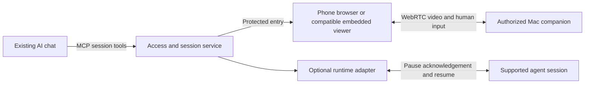

# PocketDesk planning assessment

Updated 2026-09-13T08:40:40Z. Research and planning only; subordinate to [PRODUCT](../PRODUCT.md). No application changes, deployment, account setup, or competitor installation performed.

## Where the idea stands

The proposed workflow is: use an existing AI conversation on a phone, open a protected live view of your own Mac, interact directly when needed, then return to the agent. The standalone browser viewer is the selected foundation; embedding it in compatible chat apps comes afterward. Continuous human video, optional model screenshots, and agent execution control are separate capabilities.

The browser foundation is technically supported by the available building blocks. A universal takeover button for arbitrary running agents is not established by MCP. That part requires a cooperating runtime and an explicit ownership protocol. These are architecture findings, not an end-to-end product demonstration.

Roshan reports interest from developer friends. His latest direction is to learn from comparable products' features, without treating their existence as a reason to abandon the idea. Their adoption, retention, revenue, and reliability have not been established in this review. See the [feature comparison](COMPETITOR-FEATURES-2026-09-13.md) for documented overlaps and useful lessons.

## Recovered context and existing evidence

Reviewed the main conversation `01a0992a-27f6-7ca3-862c-670b343deebd`, related implementation `01a095ce-fca6-7041-b53b-9f4b24aa5c08`, planning `01a0957a-549b-7312-8f30-6b0920e12a8d`, earlier exploration `01a09060-e9e9-7d52-b724-0b708b7329a3`, and source chat `6aa4fed9-bce4-83ea-bf8c-73cfc90c4833`. This was targeted history recovery plus repository inspection, not an exhaustive audit of every historical tool output.

The direction evolved from native phone remote desktop and layout exploration to a live browser viewer reached from chat. Earlier native work remains useful infrastructure. Archived final-check receipts show 33 native tests, 33 service tests, and successful Mac/phone builds. The same checkpoint records failed runtime permission probes. Neither those tests nor historical installation proves physical phone viewing/control, cellular connectivity, or relay performance. No new runtime tests were run during this planning review.

All browser features B01–B20 remain unbuilt. The current native signaling endpoint rejects browser Origin headers. Browser access needs a deliberately authenticated ingress, not removal of that guard globally. Existing ScreenCaptureKit capture, H.264 WebRTC media, and CGEvent input provide reusable starting points; browser authentication and protocol interoperability remain implementation work.

## API feasibility

| Surface | Supported building block | Boundary for PocketDesk |
|---|---|---|
| Mac capture/input | ScreenCaptureKit selection and `SCStream`; Core Graphics mouse/keyboard events | Installed, authorized companion required. Early awake/unlocked host assumption remains. Protected fields and OS prompts need separate proof. [Capture](https://developer.apple.com/documentation/screencapturekit/capturing-screen-content-in-macos), [CGEvent](https://developer.apple.com/documentation/coregraphics/cgevent) |
| Browser media/input | `RTCPeerConnection`, video tracks, binary `RTCDataChannel`, SDP/ICE | Signaling, viewer authorization, coordinate mapping, reconnect, and mobile behavior are application responsibilities. [WebRTC](https://webrtc.org/getting-started/peer-connections) |
| MCP tools and UI | Tool calls plus a sandboxed interactive app resource | Can open/manage a viewing session. Does not itself transport the desktop video or pause an arbitrary agent. [MCP Apps](https://modelcontextprotocol.io/extensions/apps/overview) |
| Claude phone embedding | Interactive connectors documented on iOS/Android as well as desktop/web surfaces | Best documented first mobile embedding candidate. Continuous WebRTC and touch behavior in its sandbox still need testing. Remote MCP calls originate from Anthropic infrastructure; a phone-only tailnet route is insufficient. [Interactive connectors](https://support.claude.com/en/articles/13454812-use-interactive-connectors-in-claude), [Remote connectors](https://support.claude.com/en/articles/11175166-get-started-with-custom-connectors-using-remote-mcp) |
| ChatGPT embedding | MCP App resource registration and declared UI network/frame permissions | Private developer-mode documentation specifies web. Broader plugin mobile availability does not prove a private desktop viewer works on phone. Keep browser fallback. [UI API](https://developers.openai.com/plugins/build/chatgpt-ui), [Developer mode](https://developers.openai.com/api/docs/guides/developer-mode), [Plugin surfaces](https://learn.chatgpt.com/docs/plugins) |
| Codex runtime integration | App Server thread start/resume, turn start/steer/interrupt, completion events | Suitable for sessions the integration owns or is authorized to control. Not automatic access to every existing Codex app task; interrupt does not prove all background processes stopped. [App Server](https://learn.chatgpt.com/docs/app-server) |
| Claude runtime integration | Agent SDK query, resume, tool permissions, interrupt/abort controls | Requires an adapter for owned sessions. Interrupt receipts can leave queued work or subagents outside the acknowledged scope. Third-party SDK authentication is separate from merely connecting a passive MCP viewer. [SDK types](https://code.claude.com/docs/en/agent-sdk/typescript), [SDK setup](https://code.claude.com/docs/en/agent-sdk/quickstart) |
| Relay | TURN credentials generated by a trusted backend | TURN relays media; it supplies neither Mac authorization nor agent control. Cloudflare setup remains deferred. [Credential API](https://developers.cloudflare.com/realtime/turn/generate-credentials/) |

OpenAI's secure MCP tunnel is an additional private-development endpoint option, not a desktop media tunnel. Public plugin distribution has its own review path. Neither is required to settle the initial browser feasibility question. [Connect ChatGPT](https://developers.openai.com/plugins/deploy/connect-chatgpt), [Submission](https://developers.openai.com/plugins/deploy/submission)

## Proposed architecture and takeover contract

The host enforces viewer scope, expiry, revocation, view-only mode, fresh-frame input checks, and a single controller. Human video/input goes directly through the viewer path. Model inspection is an explicit separate frame/status operation. Keeping human keystrokes out of chat history alone cannot guarantee secrecy if an agent still captures the screen.

For a supported agent: request takeover, stop dispatch of new actions, resolve queued/in-flight actions under the adapter's documented limits, obtain a scoped pause acknowledgement, then grant human control. On return, release held inputs, obtain fresh screen/context, and explicitly resume. If acknowledgement is unavailable, the UI must not claim that the agent is paused. This is cooperative ownership; unrelated Mac processes remain outside its guarantee. These details refine B19 without making it an initial-viewer dependency.

## Proposed next sequence, after implementation authorization

1. Run the isolated S0 phone/link/readability probes with non-sensitive, realistic code-text video. Begin authorized Mac permission recovery in parallel; no real desktop or OS input before reviewed admission.
2. Settle and test the G0 browser identity, separate BrowserPeer store, one-use ticket, geometry and freshness contract. Preserve native pairing and input safety.
3. Build the smallest authorized live viewer and controls on physical Safari from the start. Verify readability with real ScreenCaptureKit output, harmless edits, interruptions and separate secure-field experiments; test Chrome as another surface.
4. Complete one useful away task on cellular plus a forced TURN path once provider work is resumed. Record failures, readability and actual route. Longer studies and broad performance statistics remain follow-up work.
5. Add MCP session/status/stop tools for the proven browser path. Real hosted-chat use requires a provider-reachable MCP endpoint; a private phone route alone is insufficient.
6. Test T2 embedded view-only and T3 embedded full control separately per eligible chat host, retaining T1 external-browser access.
7. Test one cooperating runtime adapter's scoped pause/queue/resume behavior before promising integrated agent handoff. Ordinary GUI chat interaction requires no such claim.

The planning decision is ready: retain the browser foundation and treat embedding and runtime handoff as separately demonstrated extensions. Remaining physical tests are future feasibility work, not evidence already obtained. Competitor lessons can improve the design without expanding the first implementation into an agent dashboard, terminal manager, or full development environment.

## Independent review outcome

Claude Opus 5 completed two critical-review passes in [PocketDesk plan critical review](https://claude.ai/chat/d7820995-9114-48c8-8c6b-91207ec67fa3). The parent incorporated earlier phone/readability probes, explicit browser admission, clearer embedding tiers and stronger freshness criteria. Claude corrected several initial overstatements after source checks. The [reconciliation record](CLAUDE-REVIEW-RECONCILIATION-2026-09-13.md) explains accepted, modified and rejected recommendations. PRODUCT 0.10 is the current specification; the uploaded packet remains the original review snapshot.
