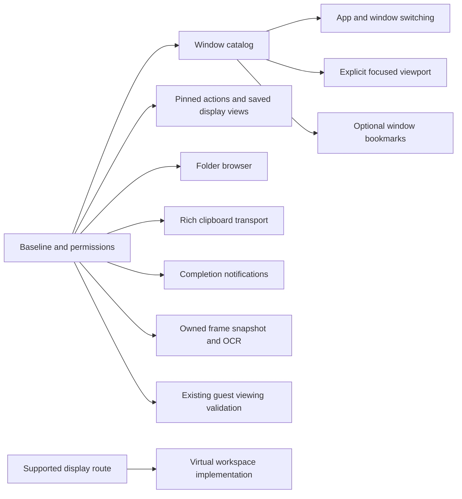

# Farside: build plans for ten proposed features

5 October 2026 · Independently reviewed by GPT-6 Astra

This document turns the ten-feature research shortlist into bounded engineering plans. The current request authorizes research, planning, and review; it does not start implementation, installation, deployment, or release. This is a planning deliverable, not a replacement for `PRODUCT.md`.

## What the source audit changed

Main source is `4524689916bccec56ba681f808a7ff3e3fa8d8e6`. Existing uncommitted implementation notes and unrelated launch/research files were preserved. Local tools are Xcode 27.0 / 27A266a and macOS 27.0.1 / 26A434. Native target stanzas in `project.yml` and the generated `PocketDesktop.xcodeproj/project.pbxproj` confirm deployment 26 and iPhone device family 1 for the production phone. The same project also contains older prototype targets with different settings; inspect the actual native target rather than the file's first global default. Recheck configuration before implementation. No new OS 27-only API is required by the proposed initial slices.

Three corrections to the shortlist matter:

- Guest viewing already has host, browser, backend, cryptography, expiry, and congestion code. Feature 10 begins with validating and completing that existing feature. Standalone assistance or guest control is additional work.
- Farside already remembers the last display and holds a short-lived resume viewport. Feature 6 adds explicit named, durable task views.
- File transfer currently requires effective control authority. Some older product prose describes a looser rule. These plans preserve the actual conservative gate; reconcile the documentation before choosing a different permission model.

Virtual display creation remains an unresolved shipping question. The debug prototypes dynamically use private `CGVirtualDisplay` classes/selectors. Dynamic lookup does not turn them into public APIs; a vendor's shipping feature or notarized app does not establish our supported implementation route.

## Recommended execution order

| Stage | Work | Concrete output |
|---|---|---|
| 0 | Baseline acceptance and feasibility checks | Confirm actual native targets; run current core task on physical iPhone; investigate public AX window switching; audit existing guest viewing; establish virtual-display route separately |
| 1 | 3A pinned existing actions; 6A display/viewport bookmarks | Small useful phone-side additions with existing input/viewport paths |
| 2 | Shared window catalog; 1A app switching; 2A explicit focus | A coherent choose-app → fit-task workflow |
| 3 | 1B exact supported windows; 3B custom chords; 6B window hints | Broader navigation with fresh target and input checks |
| 4 | 4 granted-folder browsing; 5 explicit image clipboard | Two separate bounded bulk-data features |
| 5 | 7 completion events; 8 one-shot local text recognition | Monitoring and copying improvements |
| 6 | 10 guest viewing productization; optional recipient/standalone design | Existing view-only help made dependable; wider assistance only after a separate authority design |
| Separate track | 9 supported virtual display | Go/no-go feasibility result before production implementation |

These are dependency stages, not promised delivery dates. Work within a stage may run independently once the shared contracts are frozen. Existing guest validation can happen in Stage 0 rather than waiting for the later UI work.

## Shared implementation rules

**Authority and lifecycle.** A capability advertises support, not permission. Every host operation independently checks the current authenticated peer, session, effective control/view permission, scope, geometry, lock/privacy state, and request lifetime as applicable. Owner utility handlers do not apply to browser guests. Stop, lock, pause, changed scope, revocation, or a retired session invalidate pending target catalogs, work, receipts and buffers. In-flight callbacks must check their captured generation again immediately before effects and publication.

**Protocol compatibility.** The current enrollment request allows at most eight features; capture status allows thirty-two. Preserve the v2 typed commitment and existing pairing transcript. Add support through the existing authenticated extended-capability negotiation, with measured slot budgeting and graceful omission when full. Do not append several names unconditionally or change encryption. New message families are sent only after both peers negotiate them. Legacy behavior remains available. Define bounded request/response records, cancellation and typed results before UI implementation. Names below are proposed, not current protocol constants.

**Window metadata.** Current capture-scope status intentionally keeps target handles and window/document titles on the Mac. A new owner-only catalog is an explicit metadata-policy change. Fetch it only when its UI is opened; bound and sanitize names, avoid thumbnails initially, never put titles in logs, push, analytics or bookmarks by default, and flush the catalog when closed or retired. Document this change in PRODUCT before implementation. New input handles come from retained public AX objects, not private conversions from ScreenCaptureKit IDs.

**Interaction.** Opening sheets cancels active pointer/keyboard holds. Manual pan/zoom wins over automatic view adjustments. Keep one obvious exit or Whole desktop action. Use glass for compact controls, keeping the remote content and click target sharp. Dynamic Type, VoiceOver and Reduce Transparency are part of the design. Do not reopen the parked iPad/Duo release scope.

**Evidence.** Source review, builds, automated behavior, physical correctness, performance, and external service/release acceptance are separate checkpoints. Every implementation package needs a rollback switch and a short task-based hardware recipe. No feature may claim an app task completed merely because input was posted or a push provider accepted a request.

## 1. Fast Mac app and window switching

**User result:** Open a compact switcher and reach an already-running Mac app or supported open window without steering through the Dock.

**Solution:** A host-owned, ephemeral `HostWindowCatalog` retains `NSRunningApplication` plus launch identity and public `AXUIElement` window references. Enumerate ordinary nonminimized windows on the current captured display. Public AX geometry supports window targeting; ScreenCaptureKit inventory supplies capture context, not a verified AX-to-CGWindowID bridge. No installed-app launcher, process termination, AppleScript, remote shell, or thumbnails in the initial slice.

**Build packages:**

1. Feasibility adapter: enumerate public AX windows and try app activation/window raise in Safari, Finder, Terminal, Xcode and Electron. Record unsupported and modal-window behavior. Never use `_AXUIElementGetWindow` or title-only matching to bridge identities.
2. `WindowCatalogFrame` behind proposed `windows.catalog.1`: `list(requestID, sessionEpoch, geometryEpoch)`; bounded response with revision, ephemeral handles, app name, optional sanitized window label, and supported-operation flags. Start with at most 50 entries, 128-character labels, and a response bound below the existing control-frame cap; tune after measuring.
3. Activation request includes handle, catalog revision, context epoch and request ID. Revalidate the retained process/window at use, cancel current holds, and call public `NSRunningApplication.activate` or `AXUIElementPerformAction(kAXRaiseAction)`.
4. Confirm through fresh frontmost/focused-window observation. Return `confirmed`, `requested`, `stale`, `unsupported`, `notAllowed`, or `timedOut`. A successful API call is only a request until observation confirms it. A timeout never triggers automatic replay.
5. Add a small searchable recent-app list, then individual windows where the adapter proves support. If exact-window selection is unavailable, offer app-level activation and explain the limitation.

**Existing seams:** `RemoteHost/HostCaptureScope.swift`, `BigTextWindows.swift`, `HostModel.swift`; `RemoteShared/ControlProtocol.swift`; `RemotePhone/NativeSessionView.swift` and `RemotePhoneApp.swift`. Proposed new catalog/frame files isolate the service from capture-scope authority.

**Acceptance:** Two same-app windows; closed target; relaunched process/PID reuse; two similar window labels; permission loss; local focus change during activation; unsupported AX; modal dialog; fullscreen/Spaces/Stage Manager; Stop while pending. On physical iPhone, switch and perform a harmless edit in the actually focused target. Disable the capability and confirm the ordinary session works.

**Effort/dependencies:** Medium, with public exact-window behavior as a feasibility gate. Shared catalog is reused by 2 and optional 6B. [Apple activation](https://developer.apple.com/documentation/appkit/nsrunningapplication/activate(options:)), [AX action API](https://developer.apple.com/documentation/applicationservices/1462091-axuielementperformaction).

## 2. A focused window view that fits the phone

**User result:** Explicitly fit a selected editor/browser/terminal into the phone area, keep the useful region visible while typing, and return to the prior whole-desktop view.

**Solution:** Change the phone viewport over its existing authorized full-display stream. This does not change to narrowed window capture, move Mac windows, or grant input to the current view-only app/window-sharing mode.

**Build packages:**

1. Start with Focus current window. A bounded host geometry request reads the public AX focused window; return display identity, current geometry epoch, clipped display-local bounds, catalog revision if relevant, and result. This can precede the full switcher.
2. Use `FocusGeometry` and the existing `ViewportTransform` coordinate conventions to fit the rect into the current safe area. Preserve sensible zoom limits and show Whole desktop. Save the previous viewport for that return action.
3. Add catalog target selection after 1. If it changes Mac focus, apply the viewport only after a fresh confirmed target/geometry result. Wait for Big Text/display changes to settle before fitting.
4. Refit on keyboard/inset changes only while explicit focus remains active. Manual pan/zoom suspends this behavior. Coordinate with caret reveal so the two do not fight. A closed, moved-to-other-display, unsupported or stale window exits focused mode with clear feedback.
5. Optional bounded refresh handles window move/resize; do not follow every focus change or issue unbounded AX queries.

**Existing seams:** `RemoteShared/ViewportTransform.swift`, `FocusGeometry.swift`; `RemotePhone/KeyboardFocusReveal.swift`, `ViewportPreference.swift`, `NativeSessionView.swift`. Proposed `window.focus.1` is a geometry service, never a new capture/control grant.

**Acceptance:** Negative global monitor origins; Retina scale; rotation; transport crop; partially offscreen/oversized/tiny window; keyboard open/close; late geometry reply after display switch; manual pan; Big Text transition; closed target; return to previous view. Frame region, echoed crop and pointer mapping must stay aligned; a geometry status cannot be assumed to describe an older displayed frame.

**Effort/dependencies:** Medium. Current-window geometry can ship independently; chosen-window focus depends on 1. [AX geometry](https://developer.apple.com/documentation/applicationservices/axuielement), [ScreenCaptureKit](https://developer.apple.com/documentation/screencapturekit).

## 3. Personally pinned shortcut buttons

**User result:** Choose and order a few familiar actions for each app; later define a labeled single keyboard chord.

**Solution:** Extend existing app-aware `ShortcutCatalog` chips. Keep pinning and custom chord execution as separate slices; multi-step macros are a later feature.

**Build packages:**

1. Add a versioned phone-local `ShortcutProfileStore`, keyed by trusted Mac identity and app bundle ID. Give actions stable UUIDs/catalog IDs; current chip IDs derive from labels and cannot safely identify duplicate custom names.
2. Add Pin, Reorder, Hide and Restore defaults, with a small maximum visible set. This needs no new wire operation. Preserve existing secure-focus hiding, effective control gates and modifier clearing.
3. Add an allowlisted key/modifier editor with a human-readable preview. No stored password, arbitrary text injection, script, executable expression, or multi-step replay.
4. For app-specific custom chords, negotiate proposed `input.scopedChord.1`. Bind request ID to a fresh host app-context token; compare exact frontmost process identity at input posting under the existing lifetime gate. Reject stale or secure contexts. Global macOS event routing can still race a local focus change; do not promise atomic app-targeted execution.
5. Return posted/rejected/uncertain, not Saved or Tests passed. Do not retry after uncertainty. Existing ordinary keyboard input remains available.

**Existing seams:** `RemoteShared/StillTextPreferences.swift`, `HardwareKeyboard.swift`; `RemotePhone/RemotePhoneApp.swift:2594`, `NativeSessionView.swift:1597`; `RemoteHost/HostInputExecutor.swift`.

**Acceptance:** Duplicate labels; reorder; restore; corrupt storage; unknown apps; app switch between rendering/tap/post; secure fields; held modifiers; international layouts; disconnect after admission; Dynamic Type and VoiceOver. Physical acceptance checks both received chord and actual app behavior.

**Effort/dependencies:** Low for pins; medium for custom guarded chords. The latter needs a fresh app-context contract, which can share catalog process identity. [Apple public input event API](https://developer.apple.com/documentation/coregraphics/cgevent).

## 4. Phone-side Mac file browsing

**User result:** Browse an approved Mac folder through a phone-sized interface and retrieve a file without steering the Mac open panel.

**Solution:** Read-only browsing of owner-local folder grants, followed by existing file-transfer machinery. Keep the Mac picker as fallback. Initially shallow navigation and filtering, single-file download, then local preview. Recursive search/recent files come later inside granted roots.

**Build packages:**

1. Add a Mac Shared folders section with root grant IDs, local bookmark/path identity, readonly scope and revoke action. Select roots through the existing owner-local open panel. Inspect production host sandbox entitlements before choosing security-scoped bookmark options; OS scope and app-level grants are distinct. Do not require blanket home access or Full Disk Access.
2. Proposed `files.browse.1`: `roots`, `list`, `download`, `cancel`; paged names/type/size/date with opaque host-resolved entry IDs. Bound metadata, enumeration time and page bytes; no absolute path supplied by the phone. Readability of names does not convey file authority.
3. At every open revalidate root, entry and current session/control policy. Use descriptor-based no-follow traversal, verifying identities through the open operation. A string-prefix check or one symlink-resolution pass cannot prevent replacement races. Initially exclude symlinks/aliases, packages and special files; show unsupported items clearly.
4. Register an explicit requested download ID, then reuse `FileTransferEngine`, integrity checks, cancellation and bulk pacing with a new descriptor-backed `FileByteSource`. Pass the securely opened/validated descriptor through the entire read lifetime; existing `FileHandleByteSource(url:)` checks URL metadata then reopens the path, which would undo the race protection. Recheck identity/size as needed, define concurrent-file-edit failure behavior, and close the retained descriptor on cancel/revoke. Do not allow the existing unsolicited-file rejection to be bypassed. Preview only supported retrieved files on the phone using Quick Look; retain Files/share-sheet access.
5. Revoke stops enumeration, data reads and access leases. Handle missing/changed roots, external-drive removal, TCC denial and iCloud placeholders without pretending a file is local or silently fetching it.

**Existing seams:** `RemoteHost/HostFileTransfer.swift`, `HostModel.swift:1214`; `RemoteShared/FileTransfer.swift`, `FileTransferEngine.swift`; `RemotePhone/PhoneFileTransfer.swift`, `FileTransferViews.swift`. New browse service/frame/store/UI stay separate from the generic input path.

**Acceptance:** Symlink/alias escape; component substitution during traversal; file replacement between listing/open; revoked root during read; wrong session/scope; large folders; Unicode; empty and oversized files; disk full; unplugged volume; cloud placeholder; no unsolicited payload; video/input responsiveness during transfer. Preserve the current full-display/effective-control gate until PRODUCT and code are deliberately reconciled.

**Effort/dependencies:** High relative to pinning. Dedicated permissions and adversarial file-open tests are necessary. [FileManager enumeration](https://developer.apple.com/documentation/foundation/filemanager/contentsofdirectory(at:includingpropertiesforkeys:options:)), [scoped access](https://developer.apple.com/documentation/foundation/url/startaccessingsecurityscopedresource()), [Quick Look](https://developer.apple.com/documentation/quicklook/qlpreviewcontroller).

## 5. Image and formatted-text clipboard

**User result:** Deliberately paste an image or formatted paragraph across devices while existing automatic text sync keeps its current behavior.

**Solution:** Explicit image clipboard first, structured rich text second. Preserve the old text/URL protocol and 256 KiB bound. Never put multi-megabyte images onto the ordered input/control channel or turn on automatic image upload.

**Build packages:**

1. Use the system `UIPasteControl`/item-provider paste path for phone-to-Mac image consent. Mac-to-phone image retrieval is also explicit. Read privacy markers across all pasteboard representations before payload access.
2. Proposed `clipboard.rich.1` negotiates offers/results over bounded control messages and payload over a distinct reliable bulk channel, or a separately reviewed bulk namespace. Specify transfer ID, direction, source change-count/generation, byte count, dimensions, MIME/UTType, digest, cancellation and deadlines. Apply backpressure/Low Data behavior without starving input.
3. Canonical single-image PNG: proposed initial limits 8 MiB encoded, 16 megapixels and 64 MiB decoded storage, one transfer at a time. These are engineering limits to measure, not Apple requirements. Validate before allocation/write, normalize orientation, retain alpha and strip unnecessary metadata.
4. Mutate the destination pasteboard atomically only after full validation and a fresh authority/effect check. If the source clipboard changes while loading, cancel or require another tap. Recheck authority separately before optional Cmd-V; stored and pasted are different outcomes. Do not auto-retry paste input. Integrate rich transfers into a common clipboard transaction coordinator with existing automatic text assemblers/readers/outboxes: a newer explicit transaction retires older automatic work and has precedence. Negotiated peers need a source revision/commit barrier carried with automatic text and rich receipts, so even an unseen late old text chunk cannot overwrite a committed image. Advance accepted source/local change-count baselines at commit, discard stale revisions, then resume watching without echoing the explicit mutation. Keep legacy text-only behavior when rich ordering support is absent.
5. Rich text: bounded plaintext fallback plus allowlisted attributed runs; validate UTF-16 ranges and reconstruct local representations. Initially bold/italic/underline and a small color set. Strip embedded files/attachments and links in the first slice; no arbitrary remote HTML/RTFD or network loading. Add approved links only after separate validation.

**Existing seams:** `RemoteShared/ClipboardTransfer.swift`, `PeerMedia.swift`; `RemoteHost/HostClipboard.swift`; `RemotePhone/PhoneClipboard.swift`, `NativeSessionView.swift` paste control. File-transfer pacing/integrity can inform transport, but clipboard is its own transaction and must not masquerade as a user-visible incoming file.

**Acceptance:** Transparent and rotated image; decompression bomb; invalid/oversized PNG; concealed marker on another representation; clipboard replacement; canceled/late chunks; delayed old automatic-text final chunk after rich commit, including a transfer first observed after commit; no clipboard echo; fresh newer text sync after the barrier; disconnect/lock before commit or Cmd-V; congested/Low Data path; legacy peer fallback; unsupported receiving app; formatting/plain fallback; invalid ranges. Physical paste into Notes, Messages/Mail and suitable Mac apps.

**Effort/dependencies:** Medium-to-high; independent of folder browsing. [System paste control](https://developer.apple.com/documentation/uikit/uipastecontrol), [paste item providers](https://developer.apple.com/documentation/uikit/uipasteconfigurationsupporting/paste(itemproviders:)), [local-only pasteboard options](https://developer.apple.com/documentation/uikit/uipasteboard/setitems(_:options:)).

## 6. Named saved task views

**User result:** Save a view such as Terminal on the second monitor and deliberately restore its display/zoom/position after reconnecting.

**Solution:** Reuse `ResumeViewport` math, while keeping explicit bookmarks separate from the existing automatically expiring resume capsule and last-display memory.

**Build packages:**

1. Versioned `TaskViewStore`: stable bookmark ID, user-entered label, trusted Mac identity, display fingerprint/topology descriptor, geometry, normalized focus, zoom and fit/fill. Phone-local storage; no screenshot, draft, clipboard, automatically captured document title or command history.
2. Save/Rename/Delete/Restore UI. Deliberate End continues to discard only transient automatic-resume state; explicit bookmarks survive. Forgetting a Mac removes its bookmarks.
3. After fresh authentication, resolve the monitor from current host-bound descriptors, not a durable bare `CGDirectDisplayID`. Validate topology/rotation/scale and wait for Big Text/capture geometry settlement. Identical displays or absent stable descriptors require explicit selection/remapping, not guessed matches.
4. Restore only viewport/display through existing operations. Preserve current view/control authority; a saved viewOnly=false cannot upgrade viewing permission. On changed geometry offer Fit/remap, avoiding silent stale positioning. No replayed keyboard/mouse events.
5. Optional later window hint depends on 1's catalog. Persist a bundle identity and deliberate user hint, never ephemeral AX handles/PIDs/window IDs. Resolve freshly and let the user choose ambiguous matches. Do not auto-launch or reopen documents.

**Existing seams:** `RemotePhone/SessionResumeCapsule.swift`, `NativeSessionView.swift` resume application; `RemoteShared/DisplaySelection.swift`, `ViewportTransform.swift`. No new wire family for the display-only slice if existing geometry descriptors prove sufficient; add a bounded descriptor extension if they do not.

**Acceptance:** Correct/wrong/re-paired host; corrupt store; identical monitors; reused display ID; unplugged display; changed scale/rotation; display-switch interruption; narrow or view-only session; keyboard insets; forget host; End removes capsule but preserves explicit bookmark. Restore must wait until actual current geometry is ready.

**Effort/dependencies:** Low-to-medium for viewport-only; window-aware restoration depends on 1. Any inability to establish a stable display fingerprint remains an explicit remap path rather than a reliability claim.

## 7. Completion and failure notifications

**User result:** Opt into an alert when a supported job finishes or fails, then return through Farside's normal Connect path.

**Solution:** Extend the existing fixed-vocabulary agent hook and push system. Do not read arbitrary process logs, infer completion from screen changes, or add a remote shell.

**Build packages:**

1. Introduce typed `completed` and `failed` events plus per-event opt-ins, keeping `needs_user` unchanged. Prefer an owner-installed script that reports its own exit status as the first reliable completion/failure source. Add an agent integration only after verifying its exact hook semantics: Stop or idle proves the documented hook condition, not successful completion of the user's job, and must not be mislabeled success. Farside receives events; it does not execute scripts remotely. Preserve strict local bearer/origin/parser rules.
2. Extend `AgentAlertEvent`, frame interpretation, hook parser/script and host admission. Give each event a stable ID and opaque job/run identity. Separate dedupe/cooldown by event/run where necessary so a completion cannot suppress a subsequent needs-attention alert or vice versa. Keep a bounded global rate limit with a reserved attention budget.
3. Update backend strict validator, registry preference schema, event storage/migration, retention and APNs collapse strategy together. Current backend accepts only `needs_user`; adding Swift enum cases alone will fail. Older registrations receive only their understood events.
4. Phone payload parsing/categories/preferences and foreground handling get the same event vocabulary. Give completion/failure separate localized copy, category/actions and interruption policy: they must not inherit `AGENT_HELP` Reply/Snooze/needs-you behavior or time-sensitive success alerts. Start with an ordinary Open Farside action and normal interruption level; existing attention preferences stay separate. Push stays generic, with no job title, output, window title, path or secrets. Tapping an alert goes through authentication/Connect, then current status; it never runs input or opens a stale job target directly.
5. Preserve canonical-primary-phone background routing and current connected-device live delivery. All-paired-device fan-out requires a later explicit routing/opt-in/removal design. Keep acceptance-by-APNs distinct from displayed delivery; bounded nonsecret local history can show received events, but the service is not a guaranteed task ledger.

**Existing seams:** `RemoteShared/AgentAlert.swift`, `AgentAlertFrame.swift`; `RemoteHost/HostAgentAlerts.swift`, `AgentAlertGate.swift`, `AgentAlertBridge.swift`, `AgentBridgeHTTP.swift`; phone `SystemIntegrations/AgentAlert*`, `AgentNotifications.swift`; backend `src/push.ts`, `src/room.ts`, migrations and hook script tests.

**Acceptance:** Attention then completion within current cooldown; two runs of one job; duplicate/reordered events; unknown event/old phone; disabled alerts; forged local request; hook reset/removal; revoked pairing; source unavailable; token rotation; no confidential push content; completion has its own copy/actions and never acquires attention-only escalation. Provider fixtures plus separately authorized physical APNs test with Focus/notifications off and a delayed notification tap. Do not promise delivery or exact completion timing from a push.

**Effort/dependencies:** Medium for one source, high for broad integrations. Backend/provider changes need coordinated roll-out after local verification. [APNs best-effort delivery](https://developer.apple.com/documentation/usernotifications/sending-notification-requests-to-apns), [App Review notification requirements](https://developer.apple.com/app-store/review/guidelines/).

## 8. Copy text from the streamed picture

**User result:** Explicitly freeze a region and select recognized text through native phone controls.

**Solution:** One-shot local Vision recognition on a small owned snapshot. It is a copy tool, not automatic screen indexing or a replacement for exact clipboard data.

**Build packages:**

1. Add a one-shot snapshot request inside renderer presentation authority. Bind it to `VideoPresentationIdentity`, current display/scope/geometry/crop/rotation and a request generation. Copy only the currently authorized visible region into owned storage while the fence remains valid. Do not retain the decoder buffer or blindly save a latest decode callback.
2. Reuse the copy-before-score pattern in `LegibilityProbe`; release frame/decoder resources before Vision. `onFrameDrawn` alone is not authority because callbacks can run outside the presentation fence. Start with one snapshot/recognition job, a 4-megapixel crop and bounded memory; measure before tuning.
3. Off-main `VNRecognizeTextRequest`, accurate mode, supported language selection. Disable language correction for code by default. Display the exact same frozen owned snapshot being recognized, not the live stream underneath changing region boxes. Return recognized text and regions to an editable native selection sheet, labeled as recognized text. Preserve line breaks and offer region retry. A draw/encode callback is not proof of physical presentation; name snapshot metadata according to its actual receipt and do not claim presented-frame evidence without the presentation callback.
4. Lifecycle cancellation fences results, sheet publication and Copy, not only Vision execution. Lock/background/Stop/scope/geometry change retires the snapshot and text. No disk storage, Photos write, cloud OCR, indexing or automatic paste. Suppress known secure-focus/concealed states; do not claim every visible secret can be detected.
5. Initial slice is authenticated owner foreground Picture with current eligible authority. Guest browser extraction or unattended/background recognition is outside it. An unsupported pixel format or canceled job returns ordinary control without affecting the stream.

**Existing seams:** `RemotePhone/OwnedVideo/VideoPresentationSession.swift`, `OwnedMetalVideoView.swift`, `VideoPresentationAdmission.swift`, `VideoFrameEnvelope.swift`; `RemotePhone/LegibilityProbe.swift`; `RemoteShared/LegibilityScore.swift`. Isolate a new snapshot/OCR service from the benchmark scoring scheduler.

**Acceptance:** All crop/rotation paths and supported BGRA/NV12 formats; retina text; code punctuation/indentation; supported non-English scripts; tiny text; copy after cancellation; queued GPU work after retirement; no snapshot surviving privacy change; sustained stream while OCR works. Compare recognized text with known test strings and report measured error; no universal accuracy or latency promise before physical measurements.

**Effort/dependencies:** Medium, with renderer ownership review before UI work. Public `VNRecognizeTextRequest` is available from iOS 13/macOS 10.15, below our deployment baseline. [Vision text request](https://developer.apple.com/documentation/vision/vnrecognizetextrequest), [image handler and orientation](https://developer.apple.com/documentation/vision/vnimagerequesthandler).

## 9. Phone-shaped virtual Mac display

**User result:** A separate Mac workspace shaped for the phone, including a genuine headless use case, without disturbing the owner's physical workspace.

**Solution status:** Conditional. Existing debug private-API prototypes establish experiments, not a supported production solution. No public virtual-display creation route was established in this audit; CoreGraphics public headers in the installed SDK contain no `CGVirtualDisplay` declaration. That search result is not proof that every possible supported route is unavailable.

**Build packages:**

1. Feasibility decision: investigate a documented supported Apple API/entitlement or a supported distributable display driver/provider, including license, OS compatibility, signing/notarization, distribution restrictions and operational cost. A potential vendor/provider must provide a real integration contract; do not infer one from Workbench marketing.
2. If a supported route is established, implement `VirtualWorkspaceProvider` with capability/preflight/create/readiness/teardown semantics. Require bounded startup, exact raster/logical-scale evidence, capture readiness separate from display existence, and one retained cleanup owner. Keep unsupported private experiments in debug targets, excluded from Release.
3. Capture only the intended workspace and use an explicit move-one-window action, after separate product approval, rather than automatically moving all windows. Track user changes so disconnect does not overwrite the owner's later layout. Hardware display/headless geometry and input mapping must be measured on actual machines.
4. Model restore/teardown across explicit End, background/PiP, network loss, lock, quit, crash, external-display changes and late callbacks. If teardown cannot be proved, retain/quarantine ownership and give recovery guidance; a timeout is not cleanup proof.
5. Go/no-go: release implementation only with supported distribution and physical lifecycle evidence. If no supported route is found, leave this feature unresolved. Existing Big Text plus explicit focused viewport is a useful separate fallback, not a completed virtual-display feature and not equivalent headless support.

**Existing seams:** `RemoteHost/VirtualDisplaySpike.swift`, `VirtualDisplayPortraitPrototype.swift`; `RemoteShared/VirtualDisplayPrototypePolicy.swift`; current Big Text/capture/watchdog owners. Do not merge private prototype symbols into production or change deployed OS targets as a shortcut.

**Acceptance:** 1×/2× exact mode; headless boot/session conditions; readable text and correct pointer scaling; sleep/wake/lock; forced quit; unplug display; provider crash; repeated creation/removal; window restoration without overwriting local edits; no private virtual-display symbols in Release. Performance targets are measured against the current accepted baseline with builds/browsers stopped.

**Effort/dependencies:** High/unknown. Supported-route decision precedes a reliable implementation estimate. [Apple public-API requirement](https://developer.apple.com/app-store/review/guidelines/), [CoreGraphics](https://developer.apple.com/documentation/coregraphics).

## 10. Temporary guest assistance

**User result:** Let a recipient temporarily view the approved Mac session, with explicit owner consent and immediate revocation; consider wider assistance later.

**Existing solution:** `HostGuestController`, `GuestGrant`/`GuestCrypto`, `GuestMediaPeer`, backend `guest.ts`/`guest-page.ts` and room routing already provide temporary browser viewing. The current contract requires a live paid owner remote session, allows at most two guests, expires invitations in two minutes and grants viewing for at most ten minutes. Approval verifies a full recipient fingerprint. Grants bind recipient keys, owner session, scope and geometry; media is video-only and input data channels close. These are source facts, not claims of current deployed/physical readiness.

**Build packages:**

1. Audit existing integration/tests and establish service/deployment compatibility. Validate Mac Create/Copy/Review/End UI, recipient browser flow, crypto cross-language fixtures, paid-route admission and authority revocation before adding any new protocol.
2. Productize the view-only flow: clear remaining lifetime, unavailable/expired/declined states, accessible fingerprint verification and retry guidance; no reusable pairing grant. Preserve the original max counts, owner consent, route limits and media budget unless a deliberate later decision changes them.
3. Verify zero pixels before approval and prompt terminal fencing on Stop, lock, pause, changed share scope/geometry, owner end, expiry, service reset and revoked entitlement. Preserve owner-input/media priority and deny guest video when congestion/capacity authority is unknown. Avoid invitation secrets in server logs, analytics and referrers. A recipient can retain pixels already received; revocation cannot erase them.
4. Optional native guest viewer is a distinct recipient UX over the same view-only grant. Do not reuse owner pairing or advertise clipboard/files/audio/control to guests.
5. Standalone Mac-present assistance without an active owner remote session requires a new owner-session/route/consent design. Guest control requires a separately signed control grant, ownership arbitration, fresh input lifetime, release/cancellation and audit design; changing `mode` to control is insufficient. Plan those as separate later phases, not implicit permissions in this feature.

**Existing seams:** `RemoteHost/HostGuestController.swift`, `HostGuestSettingsView.swift`, `GuestMediaPeer.swift`, `HostModel.swift:184`; `RemoteShared/GuestGrant.swift`, `GuestCrypto.swift`, `GuestRelayFrame.swift`, `GuestBudgetPolicy.swift`; backend `src/guest.ts`, `guest-page.ts`, `room.ts`, `test/guest.test.ts`; native guest policy/consent/media tests.

**Acceptance:** Expired/replayed/forwarded invite; wrong recipient signature/fingerprint; duplicate recipient; third guest; no approval; attempted input/audio/file/clipboard channel; local/expired unpaid route; service-heartbeat stall; scope/geometry change; pending-approval revoke; queued frame after grant retirement; congestion; owner-session end. Later physical browser-to-Mac tests verify the real hosted flow after authorized staging deployment; no live link is created during planning.

**Effort/dependencies:** Medium for validation/polish of current view-only code; high for native recipient, standalone sessions or control. [Screens Assist inspiration](https://www.edovia.com/en/screens-assist); the Farside authority model is source-owned and must not inherit a competitor's assumptions.

## Integration and release checks

For each feature, adopt a scoped PRODUCT decision and create an implementation lane from the then-current main after inspecting active work and capability capacity. Freeze the shared schema first, keep default behavior behind a proposed internal rollout switch, and use isolated worktrees. The parent owns common model/UI files and protocol integration; independent services may be delegated when implementation is actually requested. Builds use the shared Xcode lock and pinned dependencies. Installs remain through integrated main and the established signing/permission identity script.

Required common task: connect on a real iPhone, reach the right Mac content, make one harmless edit or retrieve one file, interrupt with Home/lock, return, and explicitly End. Add malformed/stale/legacy-peer cases and each feature's adversarial checks. Compare actual rendering, latency, heat and battery with the same-build baseline where relevant; a simulator screenshot or synthetic timer is not physical performance acceptance. Confirm rollback leaves pairing, view-only gates, privacy, clipboard, keyboard, files and background recovery intact.

App Review 4.2.7 is conditional on specific-software mirroring; it does not automatically ban a generic remote desktop's shortcut or window picker. Native window metadata/app controls and utility features still need a coherent generic-host design and an explicit review assessment. The public-API and confidential-push restrictions also remain applicable. These are implementation/release design gates, not permission questions blocking this planning task. [Current Apple guidelines](https://developer.apple.com/app-store/review/guidelines/).

## Verification record

- Primary source/API investigator: completed read-only review of features 1–6, public AX activation/raise, paste controls, folder grants, resume state and current authority.
- Root: inspected feature 7–10 source, compatibility limits, public Vision availability and current Apple guidelines; fetched current iOS/macOS 27 release notes through the Apple documentation tool.
- Independent reviewer: GPT-6 Astra, high reasoning, explicitly selected by the user for this task. Read all ten plans and shared/integration sections, checked source and revised findings, and approved this as a planning deliverable with no unresolved blocking planning issue. Required corrections for descriptor-backed file reads, automatic/rich clipboard ordering, notification behavior/source semantics and OCR ownership/presentation claims are incorporated. Exact-window activation and supported virtual-display creation retain their explicit feasibility gates. Review does not establish code behavior, physical acceptance or App Store approval.
- No implementation, build, test execution, installation, backend deployment, invitation, purchase or submission performed in this planning pass.
