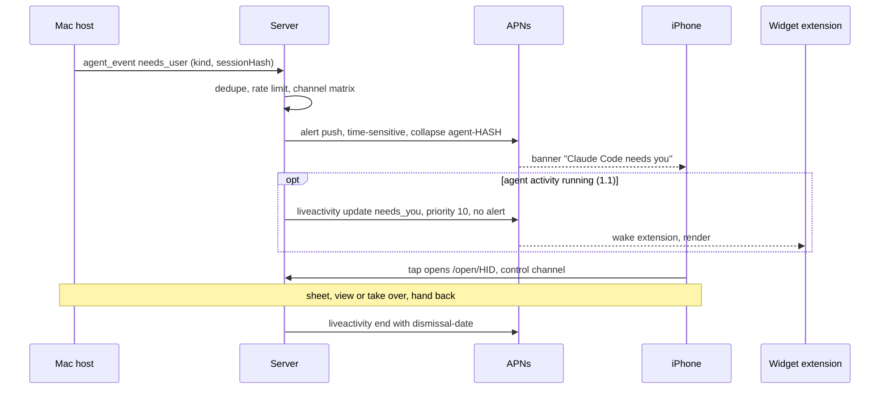
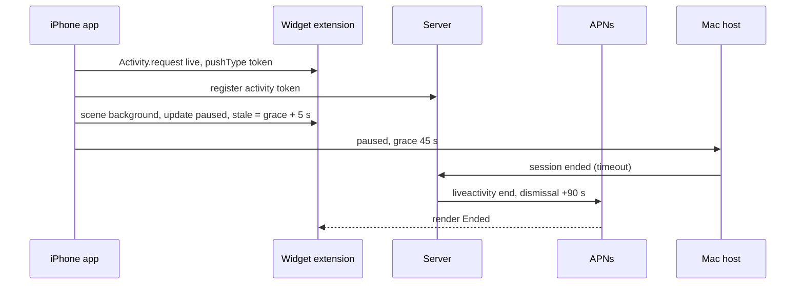

# Farside: system integrations (Live Activities, Siri and App Intents, notifications, Mac side)

Checked 28 September 2026 (every fetch below is dated the same day unless a publication date is given). Research only: no product code, project file or existing document was modified, nothing was built, deployed or registered, and no push was sent. [PRODUCT.md](../../../PRODUCT.md) stays the scope authority; this file feeds it.

**Evidence labels.** **[A]** primary Apple source: developer.apple.com documentation, HIG, App Review Guidelines, WWDC session transcripts, release notes, Apple Newsroom. **[S]** Apple Support page. **[R]** Farside repo or docs read locally. **[3P]** third-party page: lower confidence, datapoints only. **[I]** my inference from the above. **[U]** unverified: needs a device or account test before anyone relies on it. Apple's documentation pages are JavaScript-rendered, so the text was read from Apple's published documentation JSON and the session transcript pages; the URLs cited are the human-facing ones. Context7 (`/websites/developer_apple_appintents`, `/websites/developer_apple_activitykit`, `/websites/developer_apple_appintentstesting`) returned the same Apple text and is cited where it supplied a symbol detail.

**Known evidence limits.** No device, simulator or APNs call was used, so every behaviour marked [U] is a to-do, not a finding. I did not find primary sources for Uber or Apple Sports Live Activity design; the precedents below come from Apple's HIG and Apple's own Flighty write-up instead. Siri AI is a beta that shipped 14 Sep 2026; whether it can call a third-party, non-schema App Shortcut from free-form speech is not documented anywhere I could read.

---

## 0. Bottom line

### 0.1 Decision table

Effort is engineer-days as a planning range for one engineer, assuming the APNs client, token registry, `/open` deep link and hook bridge from [PHONE-AND-AGENT-GAPS.md](PHONE-AND-AGENT-GAPS.md) section 5 (WP2 server push, WP4 phone) exist. It is not a commitment.

| # | Surface | Verdict | Effort | Why in one line |
|---|---|---|---|---|
| N1 | "Agent needs you" alert: Time Sensitive (opt-in), one category with two background actions, summary-safe literal copy, hidden-preview placeholder, thread and collapse ids, 15 min expiry, "Send test alert" | **Ship in 1.0 (must)** | 3-4 on top of WP2/WP4 | Time Sensitive is the only documented level that breaks through Focus and the scheduled summary; nothing else delivers the promise |
| N2 | Universal link `/open/<id>` as the notification tap target, reused by Live Activity and widget taps | **Ship in 1.0 (must)** | 0.5 | Already planned; one routing path for every surface |
| I1 | App Shortcuts v1: Connect to Mac, End session, Is my Mac awake? (also appear in Shortcuts, Spotlight, Action button) with a hard safety baseline | **Ship in 1.0 (must)** | 4-6 | Cheap, no extension target, gives Siri, Spotlight and Action button in one adoption |
| LA1 | Session Live Activity: Paused (resume within N seconds), Live, Ended, with an End button; server pushes the end | **Ship in 1.0 (stretch, conditional)** | 6-9 (incl. 2-3 for the extension target) | A visible kill switch plus "resume" affordance. Only worth building if background grace (UX-AUDIT F5.2) ships; otherwise 1.1 |
| C1 | Control Center and Lock Screen controls: End session, Connect to Mac | **Ship in 1.0 (stretch; cut first)** | 2-3 after LA1's extension exists | Reuses intents; Connect only opens the app, which HIG treats as the weaker kind of control |
| LA2 | Agent Live Activity: working, needs you, you have the wheel, handed back; push-to-start on blocked | **Ship in 1.1** | 8-12 | Needs a spike on whether a Live Activity alert breaks through Focus; needs an opt-in |
| W1 | Mac status widget (Home, Lock Screen, StandBy) with widget push; host reports sleep and wake | **Ship in 1.1** | 5-7 | The honest home for "is my Mac reachable"; a Live Activity is the wrong tool |
| C2 | Status control updated by `controls` push | **Ship in 1.1** | 1-2 after W1 | Same data as W1 |
| I3 | Keep Mac awake / Let Mac sleep intents (bounded, host-consented); Live Activity countdown when started from a control | **Ship in 1.1** | 4-6 | The safest useful Mac-side action; canonical Live Activity shape (start, end, timer) |
| I4 | Send to my Mac: clipboard only, plus share extension | **Ship in 1.1** | 6-9 | Needs a host clipboard protocol and consent; never auto-paste, never press Return |
| I5 | Interaction donation for Connect, Spotlight `MacEntity`, `OpenIntent` | **Ship in 1.1** | 2-3 | Personalization; low risk |
| LA3 | Custom `.small` activity layout for Watch and CarPlay | **Ship in 1.1** | 1-2 | Default compact-pair is acceptable until then |
| N3 | Reminder policy, per-agent mute, quiet hours | **Ship in 1.1** | 2-3 | Needs real usage data |
| L1 | Focus filter for agent alerts (`SetFocusFilterIntent`, `filter-criteria`) | Later | 2-3 | Nice, not needed |
| L2 | Entity annotations on notifications (`appEntityIdentifiers`), on-screen entity annotations, Siri AI schema domains | Later | 1-3 | No schema domain fits (section 3.2) |
| L3 | `LongRunningIntent` file send with automatic Live Activity progress (iOS 27 only) | Later | 3-4 | Only if file transfer ships |
| L4 | Native Mac `ControlWidget` in the menu bar (macOS 26+) | Later | 2-3 | The menu bar extra already exists |
| L5 | Rich notification with redacted, end-to-end encrypted thumbnail via a notification service extension | Later (research only) | n/a | Screen content on a lock screen; see section 7.2 |
| X1 | Critical alerts | **Don't** | n/a | Needs an Apple-granted entitlement for health, safety and security cases; this is not that |
| X2 | Communication notifications (`INSendMessageIntent`) | **Don't** | n/a | Built for messages and calls between people; an agent is not a sender [I] |
| X3 | A blind "Approve" notification action | **Don't** | n/a | Approving something you have not looked at defeats the product, and macOS security prompts generally cannot be clicked by synthetic input [I] |
| X4 | A "Take over" notification action | **Don't** | n/a | HIG and the `.foreground` doc both say do not add an action that merely opens the app; the tap already does |
| X5 | PushKit, VoIP, CallKit, silent-audio loops, silent pushes to wake the app | **Don't** | n/a | Guideline 2.5.4; the earlier round already rejected these |
| X6 | Broadcast or channel Live Activity pushes | **Don't** | n/a | Built for many users sharing one event; ours is one user per Mac |
| X7 | A permanent "Mac reachable or asleep" Live Activity | **Don't** | n/a | HIG: defined start and end, at most 8 hours; also looks like an always-on ad |
| X8 | Screen thumbnails, prompt text, file names or agent free text in any Live Activity, notification or widget | **Don't** | n/a | Lock screen and Always-On are visible to others |
| X9 | Per-second latency ("38 ms") in a Live Activity | **Don't** | n/a | Activities cannot poll; pushing it burns budget; a stale number misleads |
| X10 | Intents that type, click, launch apps or run commands on the Mac | **Don't** | n/a | The Siri model picks the intent and its arguments; that is the prompt-injection class Apple warns about (section 3.8) |
| X11 | Handoff for control sessions | **Don't** | n/a | Set `isEligibleForHandoff = false` on any session `NSUserActivity` |
| X12 | Visual Intelligence integration | **Don't** | n/a | Nothing to search or open from a camera image |

Sums: 1.0 must is about 8-11 days; the stretch items add 8-12. One engineer cannot do both before 2 Nov alongside the engine work, which is why the cut order in 0.3 is explicit.

### 0.2 Ten findings that change earlier assumptions

1. **iOS 27 shipped on 14 Sep 2026, but Siri AI is a beta.** English only, opt-in, an Apple Intelligence device required, French, Japanese, Korean, Portuguese and Spanish "next month", and not initially in the EU on iOS, iPadOS and watchOS or in China ([Apple Newsroom, 14 Sep 2026](https://www.apple.com/newsroom/2026/09/siri-ai-a-profoundly-more-capable-and-personal-assistant-is-here/) [A]). Classic Siri, Spotlight, Shortcuts and the Action button reach App Shortcuts without it; treat Siri AI as a bonus, never a dependency.
2. **No App Schema domain fits a remote-desktop app.** The 12 primary domains are Audio, Calendar, Camera, Clock, Mail, Maps, Messages, Notes, Phone, Photos, Reminders and System/in-app search; Apple says to apply a schema only where the app genuinely matches it, and the HIG says custom actions go through App Shortcuts ([schema domains](https://developer.apple.com/documentation/appintents/app-schema-domains), [Making actions discoverable](https://developer.apple.com/documentation/appintents/making-actions-and-content-discoverable-by-apple-intelligence), [HIG Siri](https://developer.apple.com/design/human-interface-guidelines/siri) [A]). So Farside gets fixed phrases, not free-form Siri AI language understanding, unless a spike proves otherwise.
3. **`authenticationPolicy` defaults to `alwaysAllowed`, which runs even when the device is locked** ([context7 / AppIntent docs](https://developer.apple.com/documentation/appintents/appintent/authenticationpolicy-1r9kh) [A]). Every intent that reveals Mac state or opens control must set `.requiresAuthentication`. Only End session should stay unauthenticated (it moves toward safety).
4. **A Live Activity does not keep the app alive.** It renders from a widget extension that has no network access; you can start one only while foregrounded, from a `LiveActivityIntent`, or by push-to-start, and update or end it from the app only while the app is running; when suspended, only APNs can change it ([ActivityKit](https://developer.apple.com/documentation/activitykit/activity), [Displaying live data](https://developer.apple.com/documentation/activitykit/displaying-live-data-with-live-activities), [WWDC23 10185](https://developer.apple.com/videos/play/wwdc2023/10185/) [A]). A remote session that ends when the phone leaves the app therefore needs server-pushed end and `stale-date` fallbacks.
5. **The session Live Activity's real job is the moments the app is not on screen.** HIG: the Live Activity appears in the Dynamic Island while the app is not in use. With the current behaviour (`.background` ends the session, [R] RemotePhoneApp.swift:359) it would show almost nothing; with background grace it shows "Paused, resume within 0:42" and an End button. Build it only with grace.
6. **iPhone notifications and Live Activities appear on the controlled Mac only after iPhone Mirroring is set up, and iPhone Mirroring is unavailable in the EU** (iPhone widgets on the Mac desktop use a separate setting, section 3.6) ([Apple Support 120684](https://support.apple.com/en-us/120684), [120421](https://support.apple.com/en-us/120421) [S]). Apple says the iPhone must be on but need not be nearby for the mirrored notifications and Live Activities to arrive, so a Farside Live Activity can show in the menu bar of the very Mac being controlled. Treat that as a free at-the-Mac indicator and keep the content generic.
7. **APNs keys are now environment-scoped.** Team-scoped keys are limited to either Sandbox or Production, at most two per environment, and older both-environment keys keep working but are discouraged ([Establishing a token-based connection](https://developer.apple.com/documentation/usernotifications/establishing-a-token-based-connection-to-apns) [A]). The portal plan in `APPLE-PORTAL-SETUP-2026-09-28.md` says one "Farside APNs" key; plan two (sandbox and production) or topic keys.
8. **HIG says not to pair an ordinary push with a Live Activity for the same update, but Apple documents no interruption level for a Live Activity alert.** The `aps` table lists `interruption-level` generally; nothing says a Live Activity alert breaks through Focus. Until a device test proves it, the Time Sensitive alert push remains the one alerting channel for "needs you" and a Live Activity, when present, mirrors state silently (section 4.4). That is a deliberate, flagged deviation from the HIG line.
9. **Notification summaries and prioritization are user-level Apple Intelligence features with no developer opt-out or API.** Self-contained, literal text survives them; quirky text does not ([Apple Support](https://support.apple.com/guide/iphone/summarize-notifications-and-reduce-interruptions-iph1fbe7d2b9/ios) [S]; [Courier, 22 Jul 2026](https://www.courier.com/blog/apple-intelligence-notifications) [3P]). Put the personality in the Live Activity and in-app, keep the alert literal.
10. **iOS 27 adds Dynamic Island in landscape.** Compact and minimal now show in portrait and landscape, and in landscape they cannot grow in width; a new `isDynamicIslandLimitedInWidth` environment value (iOS 27 only) drives an alternate trailing view ([WWDC26 223](https://developer.apple.com/videos/play/wwdc2026/223/), [symbol](https://developer.apple.com/documentation/swiftui/environmentvalues/isdynamicislandlimitedinwidth) [A]). The remote app deploys to iOS 26.0 ([R] project.yml), so this needs an availability check and a fallback.

Delta from the previous round: section 3.5 of PHONE-AND-AGENT-GAPS put every Live Activity at 1.1. This file keeps the agent Live Activity at 1.1 but moves the session Live Activity to a conditional 1.0 stretch, drops "Take over" and "Approve" as notification actions, and corrects the APNs key advice.

### 0.3 Cut order and checkpoints

Cut in this order if the schedule slips: C1 (controls), then LA1 (session Live Activity), then I1 down to Connect and End session only. Never cut: N1 with the tap-to-open path, the "Send test alert" control, and the safety baseline in section 3.3.

| Date (2026) | Checkpoint |
|---|---|
| 5 Oct | Human portal steps: App ID for the app and for a widget extension, capabilities, two APNs keys, App Group |
| 12 Oct | Spikes S-APNS-1, S-NOTIF-1, S-INT-1, S-LA-1 finished |
| 19 Oct | **Decision: LA1 in or out.** In only if background grace works on a device and WP2 is done |
| 26 Oct | N1 and I1 integrated; LA1 and C1 integrated if in |
| 2 Nov | Go/no-go with receipts (section 8.4) |
| 3 Nov | Submit |
| 17 Nov | Launch target |

---

## 1. Platform baseline: what is current, shipped and announced

| Item | State on 28 Sep 2026 | Source |
|---|---|---|
| iOS 27, iPadOS 27, macOS 27 ("Golden Gate") | Released 14 Sep 2026 with SDK 27 in Xcode 27 | [Newsroom](https://www.apple.com/newsroom/2026/09/siri-ai-a-profoundly-more-capable-and-personal-assistant-is-here/), [iOS 27 notes](https://developer.apple.com/documentation/ios-ipados-release-notes/ios-ipados-27-release-notes), [macOS 27 notes](https://developer.apple.com/documentation/macos-release-notes/macos-27-release-notes) [A] |
| Siri AI | Beta, English, opt-in, Apple Intelligence devices (iPhone 15 Pro and 16 or later, iPad and Mac M1 or later); other languages October; not in EU or China at launch; server-model features have daily limits | Newsroom [A] |
| Apple Intelligence-enabled devices | iPhone 15 Pro, 15 Pro Max, 16 models or later; older iPhones still run iOS 27 without Siri AI | Newsroom footnotes [A] |
| Live Activities on iPhone and iPad | Lock Screen, Dynamic Island (iPhone), Home Screen banner for alerting updates on devices without the island, StandBy | [ActivityKit](https://developer.apple.com/documentation/activitykit), [HIG](https://developer.apple.com/design/human-interface-guidelines/live-activities) [A] |
| Live Activities on Mac, Watch, CarPlay | Forwarded from the iPhone: Mac menu bar (macOS 26+), Watch Smart Stack, CarPlay Dashboard | HIG [A]; [WWDC25 278](https://developer.apple.com/videos/play/wwdc2025/278/) [A] |
| Dynamic Island in landscape | New in iOS 27 | WWDC26 223 [A] |
| Controls (`ControlWidget`) | iOS and iPadOS 18, macOS 26, watchOS 26; on Mac they come from apps running on the Mac, not from a paired iPhone | [ControlWidgetButton](https://developer.apple.com/documentation/widgetkit/controlwidgetbutton), WWDC25 278 [A] |
| `LongRunningIntent` | iOS 27 and later only; extends the 30-second intent limit and shows progress as a Live Activity with a stop button | [LongRunningIntent](https://developer.apple.com/documentation/appintents/longrunningintent), [WWDC26 345](https://developer.apple.com/videos/play/wwdc2026/345/) [A] |
| `IntentModes` and `supportedModes` | iOS 26 and later | [supportedModes](https://developer.apple.com/documentation/appintents/appintent/supportedmodes) [A] |
| AppIntentsTesting | New in the 27 releases | WWDC26 240 [A] |
| Dictation on the on-device model ("AFM Core Advanced") | Supported devices only | Newsroom [A] |
| Shortcuts "describe a shortcut" | Shipped with 27 | Newsroom [A] |
| iPhone Mirroring | Requires Apple silicon or T2 Mac and macOS 15 or later; Live Activities on Mac need macOS 26 or later; unavailable in the EU; macOS 27 adds resizing and a Command-4 Control Center shortcut | [S 120421](https://support.apple.com/en-us/120421) |
| Critical alerts | Still an Apple-issued entitlement. The iOS 27 notes list a fixed beta bug where critical alerts turned on automatically; do not rely on it | [entitlement](https://developer.apple.com/documentation/bundleresources/entitlements/com.apple.developer.usernotifications.critical-alerts), iOS 27 notes [A] |
| App Review Guidelines | Updated 8 Jun 2026; 4.5.3 now names Live Activities | [Guidelines](https://developer.apple.com/app-store/review/guidelines/) [A] |
| Farside deployment targets | Remote app iOS 26.0, Mac host macOS 26.0, SDK 27 | [R] project.yml |

---

## 2. Live Activities and the Dynamic Island

### 2.1 Documented facts and limits

| Topic | Fact | Source |
|---|---|---|
| Lifetime | Up to 8 hours active; the system then ends it and removes it from the Dynamic Island at once; it may stay on the Lock Screen up to 4 more hours (12 total). After an end, the default Lock Screen stay is up to 4 hours; you can set a custom dismissal within that window (`dismissalPolicy` or `dismissal-date`); a past date removes it immediately | [Displaying live data](https://developer.apple.com/documentation/activitykit/displaying-live-data-with-live-activities), [push article](https://developer.apple.com/documentation/activitykit/starting-and-updating-live-activities-with-activitykit-push-notifications) [A] |
| Payload size | Static plus dynamic data combined at most 4 KB; assets must not exceed the presentation size (minimal image at most 45 x 36.67 pt); the Lock Screen view is truncated above 160 pt tall | Same [A] |
| Sandbox | No network and no location inside a Live Activity; updates come from ActivityKit in the app or from push | [WidgetKit strategy](https://developer.apple.com/documentation/widgetkit/developing-a-widgetkit-strategy) [A] |
| Start | `Activity.request` only while the app is foregrounded, unless a `LiveActivityIntent` starts it (the system launches the app process without opening the app); or a push-to-start token (`pushToStartTokenUpdates`, iOS 17.2+); a push start must include an `alert`; you cannot start one with a broadcast push | [Activity](https://developer.apple.com/documentation/activitykit/activity), [LiveActivityIntent](https://developer.apple.com/documentation/appintents/liveactivityintent), push article [A] |
| Start variants on iOS 18+ | `input-push-token: 1` returns an update token; `input-push-channel` subscribes to a channel; `ActivityStyle.transient` shows a temporary expanded island | Push article, Displaying live data [A] |
| Update and end from the app | Allowed while the app is in the background, but the app must be running | [Activity](https://developer.apple.com/documentation/activitykit/activity) [A] |
| Update via push | Headers `apns-push-type: liveactivity`, `apns-topic: <bundle id>.push-type.liveactivity`, `apns-priority` 5 or 10; payload keys `timestamp`, `event` (`start`, `update`, `end`), `content-state`, `stale-date`, `dismissal-date`, `relevance-score`, `alert`; content-state is decoded with default `Codable` strategies, so no custom encoders; the system ignores an update that arrives after the activity ended | Push article [A] |
| What wakes what | A push wakes the widget extension to render, not the app. A new push token gives the app background runtime to forward it; a push start wakes the app with runtime to fetch assets | Push article, WWDC23 10185 [A] |
| Budget | Priority 5 is opportunistic and has no limit; priority 10 is delivered immediately and counts against a budget that depends on device condition; exceeding it throttles. `NSSupportsLiveActivitiesFrequentUpdates` raises the budget; the user can turn it off, and if that toggles, the system ends all ongoing activities. Apple gives no numeric budget | WWDC23 10185, push article [A] |
| Alerts | An `AlertConfiguration` or `alert` lights the screen and plays a sound; on iPhone and iPad it shows the expanded Dynamic Island, or the Lock Screen presentation as a banner on devices without an island (device unlocked, app not in use); on Apple Watch it uses the alert title and body | [Displaying live data](https://developer.apple.com/documentation/activitykit/displaying-live-data-with-live-activities) [A] |
| Stale and relevance | `staleDate` flips `isStale` so the view can say the data is outdated; `relevanceScore` (for example 100 versus 50) decides which activity gets the island and the Lock Screen order | Same [A] |
| Removal | The person can remove it from the Lock Screen at any time; that ends the activity but does not cancel the underlying task | Same [A] |
| Broadcast channels | For many people following one event (the WWDC26 session says hundreds or thousands running the same activity); the capability can only be enabled on developer.apple.com; a channel cannot start an activity and cannot update widgets. Not relevant to one person and one Mac (X6) | [WWDC26 223](https://developer.apple.com/videos/play/wwdc2026/223/), push article, [widget push](https://developer.apple.com/documentation/widgetkit/updating-widgets-with-widgetkit-push-notifications) [A] |
| User controls | Settings > Apps > (app) > Live Activities; `areActivitiesEnabled` and `activityEnablementUpdates`; frequent-update toggle via `frequentPushesEnabled`. A device can hit its limit of active plus scheduled activities, so `request` can fail | Same [A] |
| Interactivity | `Button` and `Toggle` with an App Intent (`LiveActivityIntent`); buttons do nothing in CarPlay; `Link` works in the expanded and Lock Screen presentations | Same, HIG [A] |
| Animation | The system ignores your animation modifiers and uses its own timing; HIG caps custom animation at 2 seconds; no animation on Always-On with reduced luminance (`isLuminanceReduced`) | Same, HIG [A] |
| Visibility of other platforms | visionOS does not support Live Activities | [ActivityKit](https://developer.apple.com/documentation/activitykit) [A] |

### 2.2 Where a Live Activity appears

| Surface | Presentation used | Notes | Source |
|---|---|---|---|
| iPhone with Dynamic Island | Compact (leading plus trailing), minimal (when several apps compete), expanded (long-press or alert), Lock Screen | Shown in the island only while your app is not in use; iOS 27 also in landscape | HIG, WWDC26 223 [A] |
| iPhone without an island | Lock Screen presentation; banner on an alerting update | | [A] |
| iPad | Lock Screen presentation only (HIG lists 425 x and 500 x 84-160 pt) | | HIG [A] |
| StandBy | Minimal; tap expands the Lock Screen view scaled 2x with the background colour extended; Night Mode tints red | Check contrast; `showsWidgetContainerBackground` and `isActivityFullscreen` | HIG, WWDC26 223 [A] |
| Apple Watch Smart Stack | Compact pair by default; custom layout with `supplementalActivityFamilies([.small])`; interactive | Alert title and body reach the wrist | HIG, WWDC25 278 [A] |
| CarPlay Dashboard | Compact pair by default; `.small` custom layout; buttons inactive | Not opt-out-able as far as the docs show [I] | HIG [A] |
| Mac menu bar | Compact, minimal, expanded from a paired iPhone; click opens iPhone Mirroring | Needs iPhone Mirroring set up; per-Mac "Allow Live Activities from iPhone" toggle; not in the EU | HIG, [S 120684](https://support.apple.com/en-us/120684) |
| Duo (foldable) | The outer camera region expands into the Dynamic Island | | [HIG Duo](https://developer.apple.com/design/human-interface-guidelines/designing-for-iphone-duo) [A] |

Dimensions to design against (HIG, points): compact leading and trailing 52.33 x 36.67 on 393-wide devices and 62.33 x 36.67 on 430-wide; minimal 36.67 to 45 wide x 36.67; expanded 371 or 408 wide x 84-160; Dynamic Island width 230 (iPhone 17, 17 Pro) or 250 (iPhone Air, 17 Pro Max); Lock Screen margin 14; corner radius 44 [A].

### 2.3 Which Farside states earn a Live Activity

| Candidate | Verdict | Reasoning |
|---|---|---|
| (a) Active remote session: "Connected to Roshan's MacBook Air, 12 min, 38 ms" | **Yes, but not as written.** Show Paused, Live, Ended and an End button; never a latency number | Defined start and end, under 8 hours, and a real safety benefit (a visible kill switch while a Mac is shared). Latency cannot update: the app is suspended, the extension has no network, and per-second pushes waste the priority-10 budget (X9). Use `Text(timerInterval:)` for elapsed time; it needs no updates. Flighty's lesson applies: assume the phone cannot be reached and let the view compute from time ([Behind the Design: Flighty, 5 Jun 2023](https://developer.apple.com/news/?id=970ncww4) [A]) |
| (b) Agent needs you / agent working, push-driven | **Yes, at 1.1**, and "working" is honest only as elapsed time plus a tool-call or task count, not "step 4/7" | Claude Code hooks expose events (permission prompt, notification, stop), not a plan length; a task list exists only if the hook can read the agent's own todo tool [I, U]. The "needs you" moment maps to a push start (which must carry an alert) or an update on a running activity |
| (c) Background "Mac reachable or asleep" | **No** | Not a task with an end; would sit for up to 8 hours and look like an always-on ad. The right surfaces are a widget and a status control (W1, C2). Also the server can only claim "asleep" if the host announced sleep; otherwise the honest word is "not seen since" |

### 2.4 Spec A: session Live Activity (`FarsideSession`)

**Data model.** Static attributes: `macId` (opaque, maps to the Mac name in the App Group), `sessionId`, `startedAtUnix`. Dynamic state uses string-raw enums and integer Unix seconds so a server can build it byte-for-byte.

```swift
struct FarsideSessionAttributes: ActivityAttributes {
    enum Phase: String, Codable, Hashable { case live, paused, reconnecting, ended }
    enum Route: String, Codable, Hashable { case local, direct, relay }
    enum EndReason: String, Codable, Hashable { case user, timeout, macStopped, error }
    struct ContentState: Codable, Hashable {
        var phase: Phase
        var graceEndsAtUnix: Int?
        var route: Route?
        var endedReason: EndReason?
    }
    let macId: String
    let sessionId: String
    let startedAtUnix: Int
}
```

Reasons: default `Codable` on a payload-less enum produces nested keyed JSON rather than a plain string [I], and default `Date` encodes as seconds since 2001 rather than Unix time [I, U]; both are silent update failures because the system decodes with default strategies ([push article](https://developer.apple.com/documentation/activitykit/starting-and-updating-live-activities-with-activitykit-push-notifications) [A]). Golden tests in section 8.1 pin the wire format.

**State machine and who moves it.**

| State | Entered when | Moved by | Lock Screen title | Lock Screen line | Compact trailing | Button |
|---|---|---|---|---|---|---|
| live (visible in the island only if backgrounded with PiP or later survival; otherwise unseen) | Handshake complete | App | Holding your Mac | Roshan's MacBook Air, direct | elapsed `12:04` | End session |
| paused | Scene goes `.background` inside grace | App (a few seconds of background time), then nothing | Mac on hold | Farside lets go in 0:42. Come back and it never happened. | grace countdown `0:42` | End session |
| reconnecting | Connection drop while foregrounded | App | Reaching for your Mac | Hold on. It is a long way. | spinner glyph | End session |
| ended, user | End pressed anywhere | App or `EndSessionIntent` | Session ended | Your Mac has its desk back. | check glyph | none |
| ended, timeout | Grace ran out | **Server push** (app suspended) | Let go of your Mac | You were away too long. Tap to reconnect. | `!` glyph | Reconnect link |
| ended, Mac stopped | Host released | Server push | Sharing stopped | It was stopped at the Mac. | `!` glyph | none |

Set `staleDate` to grace end plus 5 seconds on every paused update; if the end push is lost the view flips itself to "Session ended?" using `context.isStale`, so a lost push never shows "Paused" forever. End the activity with `dismissalPolicy: .after(now + 90 s)` (HIG's 15-30 minutes is for summaries you want read; a control session needs none).

**Presentations.** All copy below is the quirky-but-clear house voice from the brand brief ([R] design/farside-round1/DITHER-BRIEF.md: "always clear about what a button does"). The Siri dialogs in section 3 are plain on purpose, because HIG Siri warns that humor grows irritating with repetition.

Compact (leading and trailing, read as one unit):

```
 paused, portrait                          paused, iOS 27 landscape (width limited)
+----------------------------------+      +--------------------------------+
| (dither glyph)  [sensor]   0:42  |      | (dither glyph)  [sensor]  ( ) |
+----------------------------------+      +--------------------------------+
  leading 18 pt, amber key line             trailing collapses to a ring using
  trailing: Text(timerInterval:)            isDynamicIslandLimitedInWidth (iOS 27);
  13 pt semibold, monospacedDigit,          on iOS 26 always use the narrow form
  fixed width, minimum scale 0.8
```

Minimal: the state glyph tinted by state (live green-phosphor, paused amber, ended signal red); while paused a circular `ProgressView(timerInterval:)` ring shows the grace. Never a bare logo: Apple's design session says convey information even in the minimal size ([WWDC23 10194](https://developer.apple.com/videos/play/wwdc2023/10194/) [A]).

Expanded (hug the sensor, no forehead, one interactive element):

```
+-----------------------------------------------+
| (glyph) Farside      [sensor]         12:04    |   leading, trailing regions
| Holding your Mac                              |   bottom region
| Roshan's MacBook Air . direct        [End session] |   name in .privacySensitive()
+-----------------------------------------------+
```

Lock Screen: 14 pt margins, height 84-100 pt while live and 84 pt when paused, the same information as the expanded view, `activityBackgroundTint` set explicitly so StandBy fills edge to edge. In the Dynamic Island set `keylineTint` to the state colour. Verify the auto-generated dismiss button colour (`activitySystemActionForegroundColor`) on both appearances.

Accessibility: label the whole activity ("Farside. Paused. Resumes for 42 more seconds."), give the timer an `accessibilityLabel`, drop the glyph pulse under Reduce Motion, and test with Always-On reduced luminance and Night Mode red tint.

**Privacy rules.** Nothing documents a way for a Live Activity view to know the phone is locked [I], so the choice is made in settings, not at render time: the Mac name and agent label show only if the person turned on "Show Mac name on Lock Screen" in Farside settings (default off, stored in the App Group; otherwise the view says "Your Mac"). Also mark those views `privacySensitive()` so Apple's own redaction applies on top. Apple documents that switch for widgets (Settings > Face ID & Passcode > Allow Access When Locked) and the HIG asks Live Activities to support redaction, but whether it applies to Live Activity views the same way is unverified [U, S-PRIV-1] ([Creating a widget extension](https://developer.apple.com/documentation/widgetkit/creating-a-widget-extension) [A]). Do not use the widget Data Protection entitlement at `NSFileProtectionComplete` or `CompleteUnlessOpen` for the shared extension: Apple says that makes iOS widgets unavailable as iPhone widgets on Mac, which W1 wants [A].

**Start, update, end.**

1. Start after the handshake, only if `areActivitiesEnabled` and the setting is on, with `pushType: .token`. Read the token from `pushTokenUpdates` (it is nil right after `request`) and register it with the server; on every new token replace the old one.
2. On `.background`, inside a `UIApplication.beginBackgroundTask`, update to paused with `graceEndsAtUnix` and tell the host and server "paused". Background task completion is an allowed use under guideline 2.5.4.
3. On `.active` within grace, update to live and cancel the host timer.
4. On launch, iterate `Activity<FarsideSessionAttributes>.activities`, end any whose session is gone (Apple's own advice after a crash or system stop).
5. `EndSessionIntent: LiveActivityIntent` (runs in the app process, launched in the background): send end to the host or relay with credentials from the shared Keychain group, end the activity, dismiss after 30 s. It works with no network by ending locally and queuing the release; the host's own 60 s disconnect grace is the backstop ([R] PHONE-AND-AGENT-GAPS 5.3).
6. Whether tapping End on the Lock Screen while locked runs without unlocking is not documented for Live Activity buttons; the intent's `authenticationPolicy` decides and should be `.alwaysAllowed` here [U, S-LA-3].

Removing the activity from the Lock Screen must not end the session: Apple says removal ends the activity but not the task, so the End button, not the swipe, is the kill switch.

### 2.5 Spec B: agent Live Activity (`FarsideAgent`, 1.1)

Static: `macId`, `agentKind` (`claude_code`, `codex`, `cursor`, `other`; never free text), `runId`, `startedAtUnix`. Dynamic: `phase` (`working`, `needs_you`, `human_active`, `handed_back`, `finished`, `expired`), `blockedSinceUnix?`, `toolCalls?`, `tasksDone?`, `tasksTotal?`, `helpId?`.

| Phase | Lock Screen title | Line | Compact trailing | Button | Priority and alert |
|---|---|---|---|---|---|
| working | Agent at work | Claude Code, 12 min. Nothing needs you. Yet. | elapsed | none | 5, no alert |
| needs_you | Claude Code needs you | Stuck on something only a human can click. | wait timer `2:14` in amber | Take over (`Link`) | 10; alert per section 4.4 |
| human_active | You have the wheel | The agent is paused until you hand it back. | `You` glyph | Hand back | 10, no alert |
| handed_back | Handed back | The agent is on it again. | check | none | 5, end after 60 s |
| finished | Agent finished | Done in 12 min. No further questions. | check | none | 5, end after 5 min |
| expired | Request expired | The agent moved on without you. Nothing was sent to your Mac. | `!` | none | 5, end after 2 min |

Rules:

- **Opt-in.** A push-started activity that appears unannounced is exactly what the HIG warns against: unexpected activities surprise people and push them to turn Live Activities off in Settings. Ship a Settings toggle, "Show agent runs on the Lock Screen", default off, plus a per-run "Watch this agent" started from the app in the foreground. Only with the toggle on does the server use the push-to-start token.
- **One activity per run**, not one per help request; a repeated request updates the same activity. HIG: prefer a single activity that changes over several.
- **A run can outlive 8 hours.** End at 7 h 55 m with a final state; do not restart silently, since a push start must alert.
- **Progress honesty.** "Working" shows elapsed time via `Text(timerInterval:)` and, if known, a count. Push counts at priority 5, coalesced to at most 2 per minute, and only when the count moved by 5 or more.
- **Multiple agents** on one Mac: one activity, ticking between agents, not one per agent (Apple design session: tick between sessions).
- **`isDynamicIslandLimitedInWidth`**: needs-you trailing becomes the amber glyph only in landscape.

Push start payload, using the iOS 18 form so the app receives an update token (attribute and state fields must match the Codable types exactly):

```json
{
  "aps": {
    "timestamp": 1790000000,
    "event": "start",
    "attributes-type": "FarsideAgentAttributes",
    "attributes": { "macId": "m_7f3a", "agentKind": "claude_code", "runId": "r_91c2", "startedAtUnix": 1789999100 },
    "content-state": { "phase": "needs_you", "blockedSinceUnix": 1790000000, "helpId": "h_20af" },
    "input-push-token": 1,
    "alert": {
      "title": { "loc-key": "AGENT_NEEDS_YOU_TITLE", "loc-args": ["Claude Code"] },
      "body": { "loc-key": "AGENT_NEEDS_YOU_BODY", "loc-args": [] },
      "sound": "default"
    }
  }
}
```

### 2.6 What great apps do (and what this file could not verify)

| Precedent | Lesson | Source |
|---|---|---|
| Flighty | Airport-sign hierarchy, one line per fact; before the flight a countdown and gate; the activity expands only when something significant changes; in flight it computes progress locally because the team assumes it will not hear from the phone until landing | [Apple, Behind the Design, 5 Jun 2023](https://developer.apple.com/news/?id=970ncww4) [A] |
| Timer (Apple) | Two buttons in the Lock Screen view, a countdown in the minimal view instead of a logo | HIG, WWDC23 10194 [A] |
| Rideshare (HIG example) | Compact layout while searching; grow the height only when new information exists | HIG [A] |
| Sports (HIG example) | Numeric content transitions for changes; one activity that rotates events | HIG [A] |
| Apple's design session | Alert by expanding the island instead of also sending a push; use a shape that is concentric with the island; heavier, rounder type; bold colour for identity; apps must not draw UI that points at the island | [WWDC23 10194](https://developer.apple.com/videos/play/wwdc2023/10194/) [A] |
| Uber, Apple Sports | Not verified from primary sources here | n/a |

### 2.7 Pitfall checklist (build and review)

- Views take a plain value; `ActivityConfiguration` only maps context to that value. That makes previews and snapshot tests possible; `ActivityAttributes.previewContext(_:isStale:viewKind:)` renders each presentation in Xcode ([doc](https://developer.apple.com/documentation/activitykit/activityattributes/previewcontext%28_%3Aisstale%3Aviewkind%3A%29) [A]).
- No `Date`, no payload-carrying enums, no custom `JSONEncoder` strategies in `ContentState`.
- Timer text: fix the width and use monospaced digits so it does not expand across the island [I, U]; `showsHours: false` keeps it at five characters past an hour [U].
- Images at or below the presentation size, or the request can fail.
- Support all four presentations plus StandBy and small family; the system requires the four.
- Provide an in-app control for the activity (HIG: make it easy to turn off) and end the activity the moment the task ends.
- Do not put anything in the app that draws attention to the island.

---

## 3. Siri, App Intents and Apple Intelligence

### 3.1 Shipped versus announced

| Capability | State | Source |
|---|---|---|
| Classic Siri, Spotlight, Shortcuts and Action button running App Shortcuts | Shipped, all supported devices | [HIG App Shortcuts](https://developer.apple.com/design/human-interface-guidelines/app-shortcuts), [Action button](https://developer.apple.com/design/human-interface-guidelines/action-button) [A] |
| Siri AI with personal context, on-screen awareness, broader app actions | Beta since 14 Sep 2026, English only, Apple Intelligence devices, not EU or China initially | Newsroom [A] |
| Apps reach Siri AI through App Intents: entities, intents, on-screen context | Documented for schema-conforming apps; entity schemas feed the Spotlight semantic index; intent schemas make actions callable in natural language | [WWDC26 240](https://developer.apple.com/videos/play/wwdc2026/240/), [343](https://developer.apple.com/videos/play/wwdc2026/343/), [344](https://developer.apple.com/videos/play/wwdc2026/344/) [A] |
| Custom, non-schema actions via App Shortcuts | The HIG says App Shortcuts are the route for custom actions that no schema covers. Whether Siri AI resolves free-form speech to them is not documented | HIG Siri [A]; [U, S-INT-2] |
| On-screen awareness | `userActivity` (one primary item) or `appEntityIdentifier` view annotations (many items) | WWDC26 240, 343 [A] |
| Notification entity annotations | `UNMutableNotificationContent.appEntityIdentifiers` lets Siri act on the entity behind an announced notification | WWDC26 343 [A] |
| Interaction donations | `IntentDonationManager`; donate only real UI actions; excessive donation is ignored | WWDC26 343 [A] |
| `RelevantEntities`, `EntityCollection`, `SyncableEntity`, `ValueRepresentation`, `@UnionValue` parameters, `Duration` and `PersonNameComponents` parameters | New with the 27 releases | [WWDC26 345](https://developer.apple.com/videos/play/wwdc2026/345/) [A] |
| Shortcuts | Actions from any App Intent appear on Mac too; App Shortcuts themselves are not supported on macOS | HIG App Shortcuts [A] |
| Visual Intelligence | Camera or screenshot understanding; apps supply entity search and open intents | [WWDC26 Apple Intelligence guide](https://developer.apple.com/wwdc26/guides/apple-intelligence/) [A] |

### 3.2 What applies to Farside

There is no fitting domain (Files is a "Shortcuts-specific" domain whose schemas explicitly do not make types discoverable by Siri; Assistant is Japan-only and for voice-based conversational apps) [A]. So Farside ships plain App Intents plus App Shortcuts, and treats Siri AI's natural-language layer as an unproven bonus. Two consequences:

1. Phrase design matters. Every App Shortcut phrase must include the app name, and phrases are trained per language; HIG asks for brief phrases and natural variants.
2. "Farside" is an unusual word. Speech recognition may hear "far side". Test it on device, do not add a "Far Side" alias (the trademark risk in [R] Docs/launch/STORE-LISTING.md section 1), and keep the store title suffix in mind: the phrase uses `\(.applicationName)`, which is the display name, not the store title.

### 3.3 Intent catalog and the safety baseline

All intents live in a shared Swift package linked by the app and the widget extension. Modes use the iOS 26 `supportedModes` API.

| Intent | Parameters | Mode and authentication | Confirmation | App Shortcut phrases (each carries the app name) | Ships |
|---|---|---|---|---|---|
| `ConnectToMacIntent` | `mac: MacEntity` (defaults to the only paired Mac; asks only if several) | `.foreground(.immediate)`; `.requiresAuthentication` | None; the person sees the session | "Connect to my Mac with Farside", "Open my Mac in Farside", "Farside, reach my Mac", "Connect to `\(\.$mac)` with Farside" | 1.0 |
| `EndSessionIntent` | none; `LiveActivityIntent` | `.background`; `.alwaysAllowed` | None (moves toward safety) | "End my Farside session", "Disconnect Farside", "Stop Farside" | 1.0 |
| `MacStatusIntent` | `mac` optional | `.background`; `.requiresAuthentication` | None | "Is my Mac awake in Farside", "Check my Mac with Farside" | 1.0 |
| `AgentStatusIntent` | none | `.background`; `.requiresAuthentication` | None | "Does my agent need me in Farside", "Any agents waiting in Farside" | 1.1 |
| `KeepMacAwakeIntent` | `duration: AwakeDuration` (AppEnum: 1, 2, 4, 8 hours; iOS 27 may use native `Duration`) | `.background`; `.alwaysAllowed` so a Shortcuts automation can run it; host must have opted in; hard cap 8 h | Siri confirms above 4 h | "Keep my Mac awake with Farside", "Farside, keep my Mac awake for `\(\.$duration)`" | 1.1 |
| `LetMacSleepIntent` | none | `.background`; `.alwaysAllowed` | None | "Let my Mac sleep with Farside" | 1.1 |
| `SendToMacIntent` | `content: @UnionValue { String, URL, IntentFile }` | `.background`; `.requiresAuthentication` | Always, with a snippet of the first 80 characters | "Send this to my Mac with Farside" | 1.1 |
| `OpenHelpRequestIntent` | `help: HelpRequestEntity` | `.foreground(.immediate)`; `.requiresAuthentication` | None | none (used by notification and Spotlight taps) | 1.1 |

Sources for the mechanics: [App Shortcuts](https://developer.apple.com/documentation/appintents/app-shortcuts), [AppShortcutsProvider](https://developer.apple.com/documentation/appintents/appshortcutsprovider), [IntentAuthenticationPolicy](https://developer.apple.com/documentation/appintents/intentauthenticationpolicy), [supportedModes](https://developer.apple.com/documentation/appintents/appintent/supportedmodes) [A]. The HIG limits an app to 10 App Shortcuts and one optional parameter per shortcut; the parameter must be an entity or enum for spoken use [A, I].

**Safety baseline for every intent (build gate).**

1. Default `.requiresAuthentication`; the two exceptions are End session (safe direction) and the bounded keep-awake pair, each justified above.
2. The phone is not trusted by the Mac. Each Mac-side action is a capability the host enforces, granted by the person at the Mac ("Allow phone Shortcuts to keep this Mac awake"), rate-limited, capped, and refused without a live pairing.
3. Never expose typing, clicking, key presses, app launching or command execution as an intent (X10).
4. `SendToMacIntent` writes the Mac clipboard only. It never pastes, never presses Return, never targets a focused terminal. Mark items with a private pasteboard type so the phone and Mac do not echo each other (section 5.4).
5. Return plain dialogue: HIG says omit the app name and humor from Siri responses and make voice-only output stand alone ("Roshan's MacBook Air checked in 2 minutes ago and looks awake").

### 3.4 Voice and copy rules for Siri surfaces

HIG Siri: keep responses succinct, device-independent, omit your app name, avoid attempts at humor, help people understand errors; never impersonate Siri or use reserved phrases such as "Hey Siri" in your own copy [A]. App Review 2.5.11: sign up only for intents users would expect from the stated functionality, keep aliases tied to your own name (no generic terms or third-party app names), resolve the request in the most direct way with no ads, and disambiguate only when needed [A]. In practice: no "Claude" or "Codex" in any phrase, alias or shortcut name.

### 3.5 Controls, Lock Screen and Action button

| Control | Kind | Action | Notes |
|---|---|---|---|
| End session | `ControlWidgetButton` | `EndSessionIntent` | Fits the HIG best: acts without launching the app; `.alwaysAllowed` |
| Connect to Mac | `ControlWidgetButton` with `OpenIntent` | Opens the app | Works, but HIG prefers controls that avoid launching the app; keep it as the cheap 1.0 option |
| Keep Mac awake (1.1) | Button with a `LiveActivityIntent` | Starts a countdown Live Activity without opening the app | The canonical HIG shape: control starts a Live Activity |
| Mac status (1.1) | `ControlWidgetToggle` or button, `ControlPushHandler` | Reload via the `controls` push type | Headers `apns-push-type: controls`, topic `<bundle id>.push-type.controls`, body `{"aps":{"content-changed":true}}` |

[Creating controls](https://developer.apple.com/documentation/widgetkit/creating-controls-to-perform-actions-across-the-system), [Updating controls](https://developer.apple.com/documentation/widgetkit/updating-controls-locally-and-remotely), [HIG Controls](https://developer.apple.com/design/human-interface-guidelines/controls) [A]. Controls are iOS 18 and later. Set `promptsForUserConfiguration` only if several Macs are paired; redact the title and value when locked; the Action button (iPhone only, not iPad) gets the App Shortcut "Connect to Mac"; HIG asks for labels of at most three words that start with a verb, and hint text built from verbs.

### 3.6 Widgets, Focus, Spotlight, Visual Intelligence

| Item | Verdict | Notes |
|---|---|---|
| Interactive widget (W1) | 1.1 | Status only; the button is an `OpenIntent` because video needs the foreground. Widgets can fetch from the network (Live Activities cannot) ([strategy](https://developer.apple.com/documentation/widgetkit/developing-a-widgetkit-strategy) [A]) |
| Widget push | 1.1 | `apns-push-type: widgets`, topic `<bundle id>.push-type.widgets`, `WidgetPushHandler.pushTokenDidChange`; budgeted and opportunistic, in addition to timelines ([article](https://developer.apple.com/documentation/widgetkit/updating-widgets-with-widgetkit-push-notifications) [A]) |
| iPhone widgets on the Mac desktop | Free once W1 exists | Needs iOS 17+, same Apple Account, iPhone nearby or on the same Wi-Fi, and "Use iPhone widgets" enabled; no Mac app required ([S 108996](https://support.apple.com/en-us/108996)) |
| Focus filter | Later | `SetFocusFilterIntent` plus the `filter-criteria` payload key ([Focus](https://developer.apple.com/documentation/appintents/focus) [A]) |
| Spotlight | 1.1 | App Shortcuts already appear in Spotlight; an indexed `MacEntity` adds a searchable Mac row; index only the display name, and honour that Search may be available when locked (iOS 27 notes list a fixed bug about it) |
| Visual Intelligence | Don't | X12 |

### 3.7 Shortcuts automations

Personal automations that fit Farside without new risk: "When I leave home, keep my Mac awake for 4 hours" (I3), "When my Work Focus turns on, check my Mac" (`MacStatusIntent`), "When the charger connects at the office, send the clipboard to my Mac" (I4, with the confirmation snippet). Automations run intents in the background, so the 30-second background limit applies ([LongRunningIntent](https://developer.apple.com/documentation/appintents/longrunningintent) [A]); whether `.requiresAuthentication` intents run from a locked-phone automation is not documented [U, S-INT-4]. The iOS 27 notes list a fixed bug where migrated Focus automations did not run; test on 27.x. "Describe a shortcut" (newsroom) can compose our actions with model-written glue, which is another reason to keep the intent set small and safe.

### 3.8 Can Siri trigger Mac-side actions through Farside?

Yes, mechanically: intent, relay, host. Whether it should is a security question, and Apple's own WWDC26 session names the threat. When an intent adopts a schema it becomes a tool the Siri model can call, and because the model chooses the intent and its arguments, an indirect prompt injection can steer it into misusing the app ([WWDC26 347](https://developer.apple.com/videos/play/wwdc2026/347/) [A]). Apple's mitigations: risk-based automatic confirmation for schema intents, `authenticationPolicy` for locked-device attacks (the schema default can only be tightened), and threat modelling of every untrusted context source and every side effect. Custom App Shortcuts do not inherit schema risk metadata, so Farside must supply the equivalent by hand.

| Action class | Blast radius | Policy |
|---|---|---|
| Read status | Leaks that the Mac is on or off | Authenticate; no confirmation |
| Open a session | The person then sees and controls | Authenticate; foreground |
| End a session | Toward safety | Always allowed |
| Keep awake, bounded | Battery and heat | Host opt-in; cap 8 h; confirm above 4 h; refuse under low battery unless on power |
| Clipboard write | Clipboard poisoning: text the person later pastes into a terminal | Authenticate; confirmation snippet with the first 80 characters; host toggle; no paste, no Return |
| Type, click, launch, run | Full control by an injected prompt | Not exposed as an intent |

Untrusted context that could steer Siri toward a Farside intent: on-screen web pages, messages, and any text the agent on the Mac produces. The agent-alert path carries no free text for that reason.

### 3.9 What needs the foreground

| Capability | Foreground needed | Why |
|---|---|---|
| Remote video, touch and keyboard input | Yes | WebRTC decode and render; per [R] PHONE-AND-AGENT-GAPS section 1 PiP is a separate, unproven route |
| Connect to Mac | Yes (`.foreground(.immediate)`) | Starts video |
| End session, status, keep awake, send text | No | Short network calls, 30-second background limit; longer work needs `LongRunningIntent` (iOS 27) |
| Live Activity start | Yes, or from a `LiveActivityIntent` | ActivityKit rule |
| Live Activity update or end | Only that the app is running | Otherwise push |
| Widget refresh | No | Timeline plus widget push |
| Notification actions | No; system launches the app in the background | [Declaring actionable notification types](https://developer.apple.com/documentation/usernotifications/declaring-your-actionable-notification-types) [A] |

### 3.10 States and copy for the remaining surfaces

**Siri and Shortcuts dialogue (plain on purpose; HIG Siri says omit the app name and humor).**

| Intent | Success | Failure or edge |
|---|---|---|
| Connect | "Connecting to {Mac}." | "I could not reach {Mac}. It may be asleep or offline." With several Macs and no name: "Which Mac?" |
| End session | "Session ended." | "There is no open session." |
| Mac status | "{Mac} checked in {n} minutes ago and looks awake." or "{Mac} went to sleep at {time}." | "I have not heard from {Mac} since {time}. It may be asleep, off or offline." (the honest word, because only an announced sleep can be called sleep) |
| Keep awake | "{Mac} will stay awake for {duration}." | "Turn on phone shortcuts in Farside on your Mac first." |
| Send to Mac | Confirmation snippet: "Send this to {Mac}?" plus the first 80 characters; then "Sent. It is on {Mac}'s clipboard. Nothing was pasted." | "Farside could not reach {Mac}. Nothing was sent." |

**Mac status widget (W1, 1.1).** Families: `systemSmall` (also the StandBy tile), `systemMedium` (adds the Connect button, an `OpenIntent`), `accessoryCircular`, `accessoryRectangular`, `accessoryInline`. Timeline policy `never` plus widget push and an app-triggered reload on foreground, using `Text(date, style: .relative)` for ages so it does not need reloads. The tap target is the universal link for the Mac. The name follows the same "Show Mac name on Lock Screen" setting as the Live Activities.

| State | Signal | Small-widget copy | Detail line |
|---|---|---|---|
| Awake | Phosphor dot | Awake | Seen just now |
| Asleep (host announced it) | Amber dot | Asleep | Since 11:42 pm |
| Not seen | Grey dot, hollow | Not seen | Since 11:42 pm. Asleep, off or offline. |
| Agent needs you | Amber, pulses unless Reduce Motion or Always-On | Needs you | Waiting 2:14 |
| No Mac paired | none | Pair a Mac | Your Mac, within reach. |

**Keep-awake Live Activity (I3, 1.1).** Started by a `LiveActivityIntent` from a control, the Action button or a Shortcuts automation, with no app launch; a countdown via `Text(timerInterval:)` needs no updates, so the phone can be off the network the whole time. Lock Screen title "Mac staying awake", line "1:58 left. Battery permitting.", button "Let it sleep". Ended by the timer, the button, or a server push when the host releases early (low battery, lid closed, or the person turned it off at the Mac): title "Mac can sleep again". Cap 8 hours, which matches the Live Activity lifetime.

---

## 4. Notifications

### 4.1 Documented facts

| Topic | Fact | Source |
|---|---|---|
| Interruption levels | `passive` (no light or sound), `active` (default, respects Focus and summary), `time-sensitive` (immediate, lights the screen, breaks through Focus and the scheduled summary, the user can turn it off per app), `critical` (needs the Apple entitlement, bypasses mute and Do Not Disturb) | [UNNotificationInterruptionLevel](https://developer.apple.com/documentation/usernotifications/unnotificationinterruptionlevel), [timeSensitive](https://developer.apple.com/documentation/usernotifications/unnotificationinterruptionlevel/timesensitive), [critical](https://developer.apple.com/documentation/usernotifications/unnotificationinterruptionlevel/critical) [A] |
| Time Sensitive setup | Enable the capability in Xcode; set `interruption-level: time-sensitive`; "do not overuse"; account security and package delivery are Apple's examples | [WWDC21 10091](https://developer.apple.com/videos/play/wwdc2021/10091/) [A] |
| Critical alerts | Entitlement requested by form; sound plays regardless of mute and Do Not Disturb. Eligible categories in practice are health, safety, security and emergencies [3P: [Newly](https://newly.app/articles/critical-alerts-entitlement)] | [entitlement](https://developer.apple.com/documentation/bundleresources/entitlements/com.apple.developer.usernotifications.critical-alerts) [A] |
| Payload | At most 4096 bytes; `alert`, `category`, `thread-id`, `interruption-level`, `relevance-score` (0 to 1 for notifications), `filter-criteria`, `mutable-content`, localized `title-loc-key` and `loc-key` with args; do not include customer or sensitive data unless encrypted and decrypted in a notification service extension | [Generating a remote notification](https://developer.apple.com/documentation/usernotifications/generating-a-remote-notification) [A] |
| APNs headers | `apns-push-type: alert`, `apns-priority` 10 for immediate action and 5 otherwise, `apns-expiration` (0 means one attempt, no storage), `apns-collapse-id` at most 64 bytes, APNs stores one notification per bundle id when the device is offline, may reorder, may throttle | [Sending notification requests](https://developer.apple.com/documentation/usernotifications/sending-notification-requests-to-apns) [A] |
| Actions | Up to four buttons; a `.foreground` action "brings the app forward" and Apple says not to use it merely to do that; `.authenticationRequired` prompts to unlock first; the system launches the app in the background to handle a non-foreground action | [UNNotificationActionOptions](https://developer.apple.com/documentation/usernotifications/unnotificationactionoptions), [.foreground](https://developer.apple.com/documentation/usernotifications/unnotificationactionoptions/foreground), [.authenticationRequired](https://developer.apple.com/documentation/usernotifications/unnotificationactionoptions/authenticationrequired) [A] |
| HIG | Avoid an action that merely opens the app; avoid multiple notifications for the same thing even if unanswered; avoid sensitive content; write a generically descriptive body for hidden previews (`hiddenPreviewsBodyPlaceholder`, `hiddenPreviewsShowTitle`); prefer non-destructive actions | [HIG Notifications](https://developer.apple.com/design/human-interface-guidelines/notifications), [category placeholder](https://developer.apple.com/documentation/usernotifications/unnotificationcategory/hiddenpreviewsbodyplaceholder) [A] |
| Permission | Ask in context; provisional authorization delivers quietly, so it is wrong for "needs you" | [Asking permission](https://developer.apple.com/documentation/usernotifications/asking-permission-to-use-notifications) [A] |
| Apple Intelligence | Users can summarize, prioritize and use Reduce Interruptions; Apple ships no developer API or opt-out for summaries | [S](https://support.apple.com/guide/iphone/summarize-notifications-and-reduce-interruptions-iph1fbe7d2b9/ios); [3P Courier](https://www.courier.com/blog/apple-intelligence-notifications) |
| Communication notifications | For direct communication between people, built on `INSendMessageIntent` and call intents; they can break through the summary and Focus | [Implementing communication notifications](https://developer.apple.com/documentation/usernotifications/implementing-communication-notifications) [A] |

### 4.2 Spec: the "needs you" notification

Category `AGENT_HELP`, options `.customDismissAction` and `.hiddenPreviewsShowTitle`, `hiddenPreviewsBodyPlaceholder: "An agent needs you."` Two actions, both background, none `.foreground`, none destructive:

| Action | Title | Effect |
|---|---|---|
| `SNOOZE_15` | Snooze 15 min | Server holds the request and re-alerts once at `passive` after 15 minutes if still pending |
| `NOT_NOW` | Not now | Marks the request declined; the agent is told the human declined |

Tapping the body is the take-over path: it opens `HelpRequestSheet` through the universal link. A "Take over" button would only repeat that (X4).

Alert push (Time Sensitive on when the person opted in, otherwise `active`):

```json
{
  "aps": {
    "alert": {
      "title-loc-key": "AGENT_NEEDS_YOU_TITLE",
      "title-loc-args": ["Claude Code"],
      "loc-key": "AGENT_NEEDS_YOU_BODY"
    },
    "category": "AGENT_HELP",
    "thread-id": "mac-7f3a",
    "interruption-level": "time-sensitive",
    "relevance-score": 1.0,
    "sound": "default"
  },
  "hid": "h_20af"
}
```

Headers: `apns-push-type: alert`, `apns-priority: 10`, `apns-collapse-id: agent-<sessionHash8>` (a repeated ask from the same agent session replaces, not stacks), `apns-expiration: now + 900`, `apns-topic: com.roshan.PocketDesk.Remote` [R, A].

Copy. English strings live in the app bundle (`Localizable.strings`), so the server sends keys and an allow-listed agent kind, never prose, and never the Mac name or the agent's own text.

| Key | Text | Why |
|---|---|---|
| `AGENT_NEEDS_YOU_TITLE` | `%@ needs you` | Literal, self-contained, survives summarization |
| `AGENT_NEEDS_YOU_BODY` | Stuck on something only a human can click. Tap to look at your Mac. | The personality is one deadpan clause; the meaning stands alone |
| Placeholder | An agent needs you. | Shown when previews are hidden |
| Snooze reminder (passive) | Still waiting on you. | Sent at most once |

The full quirky register ("Your Mac is on the far side. You're not.") belongs in the in-app sheet and the Live Activity, where a model rewriting the text cannot flatten it.

### 4.3 Interruption, summary, Focus and Apple Intelligence

- Default `active`, `time-sensitive` only after the person turns on "Break through Focus for agent alerts" in Settings. Explain that iOS lets them switch it off and that Apple reserves it for urgency; overuse gets the app muted (WWDC21 10091).
- `thread-id` groups by Mac; `relevance-score` 1.0 for needs-you and 0.3 for reminders so the scheduled summary features the right one.
- The lock screen is an AI-mediated surface [3P]: anything critical must also be visible when the app opens (the sheet lists pending requests), and the payload must read correctly on its own.
- Do not use provisional authorization. Ask when the person turns on Agent alerts.
- Filter by Focus later with `filter-criteria` and a Focus filter (L1).

### 4.4 How a notification and a Live Activity combine without spamming

Decision matrix for one "needs you" event:

| Phone state | Agent Live Activity running | Channel used |
|---|---|---|
| App foreground with a live session | n/a | In-app banner over the control channel; no APNs (the system would not show it in front anyway) |
| App not foreground | No (1.0 always) | One Time Sensitive alert push |
| App not foreground | Yes (1.1) | The alert push, plus a silent priority-10 update that flips the activity to needs_you. **No alert in the update** |
| Activity present but Live Activities disabled in Settings | n/a | Alert push only; the activity update would be dropped silently, so the server also relies on the device-reported `laEnabled` and treats a stale flag as false after 24 h |

Why the deviation from the HIG line "don't use push notifications alongside Live Activities for the same updates": there is no documented interruption level for a Live Activity alert, so its Focus behaviour is unknown, and a missed "needs you" is the product failing. If spike S-LA-2 shows an alerting Live Activity update breaks through Focus like Time Sensitive does, switch to Apple's model: one alerting update, no separate push. If it does not, keep the matrix above. Either way there is exactly one alerting event per request, and Apple's design session supports the principle: alert by expanding the island rather than sending a push where possible.

Anti-spam rules (server, testable with an injected clock): at most 6 alerts per room per hour; the same agent session collapses to one; one snooze reminder per request; no alert for requests the phone already declined; nothing at all for requests that expired before the send.

### 4.5 Permission flow and settings

1. Never ask at launch. Ask when the person turns on "Agent alerts", after the sheet explains the feature.
2. Settings > Agent alerts: on or off, "Break through Focus", "Show agent name" (default on; allow-listed kinds only), "Show Mac name on Lock Screen" (default off), "Show agent runs on the Lock Screen" (1.1), per-agent mute, and **Send test alert** (also gives App Review a way to see the feature with no agent).
3. Deleting the Mac or turning alerts off deletes the tokens on the server.

### 4.6 Not allowed or not suitable

- **Critical alerts**: not allowed without Apple's entitlement, granted for health, safety and security cases [A, 3P]; "agent blocked" is neither.
- **Communication notifications**: designed for people messaging people [A]; presenting an agent as a "sender" is a misuse in spirit [I].
- **Silent `content-available` pushes to wake the app**: unreliable and throttled; nothing here depends on the app running.

---

## 5. Mac side and Continuity

### 5.1 Menu bar extra (Mac companion, Developer ID, `LSUIElement`)

- HIG: show a menu, not a popover; let the person decide whether the extra appears (offer it in setup and in settings); do not rely on its presence because the system hides extras when space is short; offer other routes such as a Dock menu ([HIG menu bar](https://developer.apple.com/design/human-interface-guidelines/the-menu-bar) [A]).
- Apple Support documents a per-app "Allow in the Menu Bar" switch in System Settings; a person can hide the extra entirely ([S](https://support.apple.com/guide/mac-help/change-menu-bar-settings-mchlad96d366/mac)). Because the companion has no Dock icon, keep a Settings window reachable from launching the app again, and post a local notification for events the person must not miss (agent request sent to the phone, phone took control).
- macOS 27 hides menu item symbol images by default; where an icon carries meaning use `preferredImageVisibility` (AppKit) or `labelStyle(.titleAndIcon)` (SwiftUI) ([macOS 27 notes](https://developer.apple.com/documentation/macos-release-notes/macos-27-release-notes) [A]).

### 5.2 Widgets and controls on the Mac

| Item | What Apple documents | Farside |
|---|---|---|
| iPhone widgets on the Mac desktop | Same Apple Account, iPhone near or on the same Wi-Fi, "Use iPhone widgets"; Mac app not required | Free with W1; needs nothing on the Mac |
| Native macOS widget | Supported by WidgetKit | Don't: it would show the status of the phone connection to the Mac that owns it |
| `ControlWidget` in the Mac menu bar or Control Center | macOS 26+; provided by apps running on the Mac, not from a paired iPhone | Later (L4): "Share this Mac with Farside" toggle |

### 5.3 Live Activities on the Mac, and the self-referential case

macOS 26 and later show a paired iPhone's Live Activity in the menu bar; click for detail; double-click opens iPhone Mirroring if the iPhone is nearby ([S 120684](https://support.apple.com/en-us/120684), HIG [A]). Apple states the iPhone must be on but need not be nearby for mirrored notifications and Live Activities to appear once iPhone Mirroring has been set up. Consequences for Farside:

- The controlled Mac can show its own session's Live Activity and its own "agent needs you" notification, badged as coming from the iPhone. That is a useful presence signal at the Mac; content stays generic because the Mac may be in a shared room.
- Apple says double-clicking it opens iPhone Mirroring only if the iPhone is nearby. When the person is away there is nothing useful to click; do not promise a click target.
- The setting is per Mac and per iPhone and is off for the EU because iPhone Mirroring is unavailable there.
- `liveactivity` is not an APNs push type on macOS ([sending requests](https://developer.apple.com/documentation/usernotifications/sending-notification-requests-to-apns) [A]); the Mac never receives Live Activity pushes itself.

### 5.4 Continuity

| Feature | Facts | Farside position |
|---|---|---|
| Handoff | `NSUserActivity.isEligibleForHandoff` defaults to true | Set it to false for session activities used for on-screen awareness; a control session is not resumable on another device ([NSUserActivity](https://developer.apple.com/documentation/foundation/nsuseractivity) [A]) |
| Universal Clipboard | Works between nearby devices with the same Apple Account, Bluetooth and Wi-Fi on, Handoff on; content is short-lived ([S 102430](https://support.apple.com/en-us/102430), published 18 Feb 2026) | Complementary: it needs proximity, Farside's send works from anywhere. Risk: when Farside writes the Mac clipboard, Universal Clipboard may copy it to a nearby iPhone and start an echo. Mark Farside writes with a private pasteboard type and origin id, and set `localOnly` on iOS writes ([UIPasteboard](https://developer.apple.com/documentation/uikit/uipasteboard) [A]). Whether Universal Clipboard honours any marker on macOS is unverified [U, S-MAC-2] |
| iOS paste prompt | Programmatic reads of `UIPasteboard.general.string` raise a user alert on iOS 16+; `UIPasteControl` avoids it | "Send to my Mac" takes its content as an intent parameter or a share-extension input, never as a background clipboard read ([UIPasteControl](https://developer.apple.com/documentation/uikit/uipastecontrol) [A]) |
| iPhone Mirroring | Mac to iPhone; opposite direction to Farside; unavailable in the EU; camera and microphone are not available inside it | No integration. Two test items: alerts appear on the Mac too; QR pairing cannot use the camera inside iPhone Mirroring, so the paste-code path must work ([S 120421](https://support.apple.com/en-us/120421)). iOS 27 adds UIKit layouts that adapt to the resizable mirroring window ([What's new in macOS 27](https://developer.apple.com/macos/whats-new/) [A]) |

---

## 6. Push and update architecture

### 6.1 Who pushes what

| Event | Source | Server action | APNs push type and priority | Target |
|---|---|---|---|---|
| Agent blocked | Mac host (`agent_event`) | Dedupe, create help request, apply channel matrix (4.4) | `alert`, 10 | Device tokens with alerts on |
| Agent blocked, activity running (1.1) | Same | Also update the activity, no alert | `liveactivity`, 10 | Activity update token |
| Agent blocked, opted in, no activity (1.1) | Same | Push start with alert | `liveactivity`, 10 | Push-to-start token |
| Working progress (1.1) | Host | Coalesce | `liveactivity`, 5 | Activity update token |
| Request resolved or expired | Server or host | Update, then end with dismissal | `liveactivity`, 5 or 10 | Activity update token |
| Session ended while phone suspended | Host or server presence | End | `liveactivity`, 10 | Session activity token |
| Host sleep or wake (1.1) | Host `NSWorkspace` notifications, best effort | Update status | `widgets` and `controls`, 5 | Widget and control tokens |
| Unpair or revoke | User | End all activities, delete tokens | `liveactivity`, 10 | All |
| Snooze elapsed | Server timer | One passive reminder | `alert`, 5, `passive` | Device tokens |

The phone never asks the server to push to anyone else; sends are bound to the authenticated room. The Mac host sends events over its already-open host socket ([R] PHONE-AND-AGENT-GAPS 3.4); if the socket is down the event is lost by design and the "Mac not seen" state covers it.

### 6.2 Token lifecycle

| Token | API | Changes when | Upload trigger | Server rule |
|---|---|---|---|---|
| Device (alert) | `didRegisterForRemoteNotificationsWithDeviceToken` | Restore, reinstall, occasionally otherwise | Every launch after permission, idempotent upsert | Drop on `410 Unregistered`, `410 ExpiredToken`, or unpair; use the response `timestamp` to avoid deleting a token that re-registered later |
| Push-to-start (per attributes type) | `Activity<Attrs>.pushToStartTokenUpdates` | System discretion | Start observing in `App.init`, not from a view; upload each new value | Replace, never accumulate; ignore if the setting is off |
| Activity update | `activity.pushTokenUpdates` | Any time during the activity | Each new value (the app gets background runtime) | Replace per activity id; forget on end or on `410` |
| Widget | `WidgetPushHandler.pushTokenDidChange(_:widgets:)` | Widget added, removed, reconfigured | Runs in the extension; needs shared Keychain access | Replace per widget kind |
| Control | `ControlPushHandler.pushTokensDidChange(controls:)` | Control added, removed, reconfigured | Same | Replace per control kind |

Registration channel: the authenticated `/signal` socket when open; otherwise a signed HTTPS `POST /v1/push/register` with an HMAC from the room secret in the shared Keychain group. Background callbacks (token rotation, extension handlers) often run with no socket, so the REST fallback is required, not optional. Environment: each token carries `env` (`sandbox` or `production`); the client sends a hint from the build (development-signed installs get sandbox tokens; TestFlight and App Store get production) and the server retries once on the other host after `400 BadDeviceToken`, then caches the answer ([Handling notification responses](https://developer.apple.com/documentation/usernotifications/handling-notification-responses-from-apns) [A, I]).

### 6.3 Registry record (extends the `PushRegistry` sketch in PHONE-AND-AGENT-GAPS 5.4)

```json
{
  "room": "sha256:9a1c",
  "devices": [{
    "deviceId": "d_31be",
    "env": "production",
    "apnsToken": "hex",
    "pushToStart": { "FarsideAgentAttributes": "hex" },
    "activities": [{ "kind": "session", "id": "s_88a1", "token": "hex", "lastTimestamp": 1790000000, "state": "paused" }],
    "widgets": [{ "kind": "MacStatus", "family": "systemSmall", "token": "hex" }],
    "controls": [{ "kind": "MacStatusControl", "token": "hex" }],
    "prefs": { "alerts": true, "timeSensitive": true, "laEnabled": true, "laAgent": false, "lockNames": false },
    "locale": "en_CA", "appBuild": "20261110.4", "osMajor": 27, "updatedAt": 1790000000
  }]
}
```

File-backed with mode 0600 like the existing stores. No Mac name, no agent text, no screen content. Timestamps per activity are monotonic: store the last value and drop older sends, since the system displays only the newest.

### 6.4 Flows





### 6.5 APNs details that decide the build

- **Auth.** ES256 provider token; `iat` at most one hour old or `403 ExpiredProviderToken`; refresh about every 45 minutes; changing `kid` mid-connection needs a new connection (`UnrelatedKeyIdInToken`). Keys are environment-scoped; plan two ([token doc](https://developer.apple.com/documentation/usernotifications/establishing-a-token-based-connection-to-apns) [A]).
- **Transport.** HTTP/2 and TLS 1.2 or later to `api.push.apple.com` (production) or `api.sandbox.push.apple.com` (sandbox), port 443 or 2197; reuse connections for hours; do not send HTTP/2 PRIORITY frames; on a `GOAWAY` frame read its `reason` and open a new connection. Bun's `node:http2` client is unverified for this [U, S-APNS-1]; fallbacks are a Node or Go sidecar.
- **Priority policy.** 10 only for needs-you and session end and human-active transitions; 5 for everything else. Do not enable `NSSupportsLiveActivitiesFrequentUpdates`: nothing here needs it, and when the user's frequent-update setting changes the system ends all ongoing activities. Cap priority-10 Live Activity pushes at 10 per activity per hour server-side; Apple gives no number, so log `apns-id` and delivery delay and tune from data.
- **Payloads.** Live Activity: `timestamp` (Unix seconds, monotonic), `event`, `content-state`, optional `stale-date`, `dismissal-date`, `relevance-score` (any Double, for example 100 versus 50), `alert` in Apple's `title`/`body` dictionary form. Notification: `title-loc-key` form. Widget and control pushes: `{"aps":{"content-changed":true}}`. All below 4 KB by a wide margin.
- **Errors.** `410`: drop, subject to the timestamp rule. `429`: back off with jitter, coalesce. `400 BadDeviceToken`: environment retry once. `403 ExpiredProviderToken`: refresh and retry once. `413 PayloadTooLarge`: a bug, alert the developer. Log status and `apns-id` only.

```text
end-of-session push, priority 10
apns-push-type: liveactivity
apns-topic: com.roshan.PocketDesk.Remote.push-type.liveactivity
apns-priority: 10
{"aps":{"timestamp":1790000200,"event":"end","dismissal-date":1790000290,
 "content-state":{"phase":"ended","endedReason":"timeout"}}}
```

### 6.6 Failure modes

| Failure | Effect | Handling |
|---|---|---|
| End push lost | Activity shows Paused after grace | `staleDate` flips to "Session ended?"; app reconciles on launch |
| Update token rotated while suspended | Later updates fail with `410` | The rotation callback gives runtime to upload; server treats `410` as ended |
| Live Activities off in Settings | Pushes silently dropped | Alert push covers needs-you; flag re-reported at launch and on `activityEnablementUpdates` |
| Push-to-start token unavailable | No start | Fall back to alert push |
| Two devices | Two alerts | Allowed in 1.0; per-device toggle |
| Host dies before sending the end | No end push | Server presence timeout (60 s) ends the activity |
| Clock skew | Updates ignored as older | Server sets `timestamp`, never the host |

### 6.7 Provisioning checklist (human steps, per the repo's portal doc)

App ID `com.roshan.PocketDesk.Remote` with Push Notifications, Associated Domains, App Groups and Time Sensitive Notifications; App ID for a widget extension (proposed `com.roshan.PocketDesk.Remote.Widgets`) with App Groups; two APNs keys (sandbox, production), moved to `~/.farside-secrets/` at mode 0600; associated-domain file on the public origin; shared Keychain access group. XcodeGen changes: a `FarsideWidgets` app-extension target, `NSSupportsLiveActivities = YES`, entitlements for the app group and Time Sensitive, and a shared intents package. The App Store Connect privacy answer for the push token is Device ID, App Functionality, not linked, not tracking [3P practice, confirm against Apple's definitions]; the privacy policy draft already has the row ([R] Docs/launch/PRIVACY-POLICY.md line 28) and needs the Live Activity and widget tokens added.

---

## 7. App Review and privacy

### 7.1 Guideline table

| Surface | Guideline | Risk | Mitigation |
|---|---|---|---|
| Session Live Activity | HIG: defined beginning and end, at most 8 h; 4.5.3 names Live Activities among services that must not spam or send unsolicited messages; 2.5.16 extensions related to the app | Low | Started only by the person, ended at session end, no promotion |
| Agent Live Activity by push start | 4.5.3, 4.5.4; HIG on unexpected activities | Medium | Off by default, in-app toggle, alert included, one per run, documented in review notes |
| Persistent Mac status Live Activity | HIG (defined end); reads as always-on | Medium-high | Not built (X7); widget instead |
| Time Sensitive alerts | 4.5.4 (not required for function, no sensitive data, no marketing), 5.1.2(i) (cannot require notifications) | Low-medium | Opt-in in context; app fully works without; generic copy; "Send test alert" |
| Notification actions | HIG (no open-only action) | Low | Two background actions |
| App Shortcuts and Siri | 2.5.11 (i)-(iii) | Low | App-name phrases only; no third-party names; direct resolution; no ads |
| Siri AI agentic safety | WWDC26 347 guidance, not a guideline | Medium (a security failure would be real) | Section 3.3 baseline and 3.8 table |
| Widgets and controls | 2.5.16, 2.5.18 (no ads in widgets or notifications); HIG Controls (authenticate sensitive actions) | Low | Status only, redaction |
| Background modes | 2.5.4 | Low | No background mode declared; `beginBackgroundTask` is task completion; no audio hack (see the PiP analysis) |
| Agent-branded positioning | 4.2.7(b): a remote desktop that mirrors specific software may use no platform features beyond streaming; (a) would then restrict to LAN | Medium | Keep every agent surface generic, hooks user-installed, no product-specific launchers or logos; kind names are descriptive only ([R] Docs/launch/APP-REVIEW-RISKS.md section on 4.2.7) |
| Needs a Mac companion | 4.2.3(i) | Medium (already tracked) | Review video and a labelled "Preview Live Activity" button that runs sample content (2.3.1: sample content must be labelled) |
| Store metadata | 2.3.7: no third-party names in metadata | Low | Not the same as in-app kind labels |

### 7.2 Privacy matrix

| Data | Lock Screen (locked) | Lock Screen (unlocked) | Push payload | Default |
|---|---|---|---|---|
| Mac name | "Your Mac" unless the person opted in | Same view; real name only if opted in | Never; resolved on device from `macId` | Hidden |
| Agent kind (fixed list) | Shown | Shown | Allow-listed enum | Shown; toggle to generic "An agent" |
| Agent or project text, prompts, file names | Never | Never | Never | Never |
| Elapsed time, phase | Shown | Shown | Yes | Shown |
| Route | Coarse route word in the expanded and Lock Screen views | Same | Coarse enum | Coarse; never a latency number |
| Screen content (thumbnail) | Never | Never | Never | Never; L5 would be opt-in, end-to-end encrypted, decrypted in a notification service extension, blurred until Face ID |

Apple's rules: keep sensitive information out of Live Activities and offer redaction ([HIG](https://developer.apple.com/design/human-interface-guidelines/live-activities)); do not put customer or sensitive data in a payload unless encrypted ([payload doc](https://developer.apple.com/documentation/usernotifications/generating-a-remote-notification)); guideline 4.5.4 says push should not carry sensitive personal or confidential information [A]. A Mac screenshot is exactly that, which is why L5 is research only. The user's rule for this project (never show screen content in a Live Activity on a locked phone unless the person opts in) is met by shipping none.

### 7.3 Review-notes paragraph (draft)

"Farside shows an optional Live Activity while a session with the user's own Mac is open or paused, so the person can end sharing from the Lock Screen. It contains no screen content. Agent alerts are optional; Settings > Agent alerts > Send test alert produces a real notification without any agent. Notifications and shortcuts are not required to use the app. App Shortcuts start, end and check the state of a session with the user's own paired Mac. No background modes are declared."

---

## 8. Test plan

### 8.1 Automated

| Area | Test | Tool |
|---|---|---|
| Wire format | Golden JSON for every `ContentState` produced by a default `JSONEncoder` matches the server builder byte-for-byte; string raw enums; integer Unix fields; size under 4 KB with margin | XCTest plus Bun test sharing fixtures |
| Server policy | Channel matrix, rate limits, dedupe, snooze, expiry, timestamp monotonicity, unpair ends activities, all with an injected clock | Bun test |
| APNs client | Mock HTTP/2 server checks headers per push type, priority rules, `kid` rotation, 410, 429, 400 environment retry, 413 | Bun test with a mock |
| Token registry | 0600 permissions, replace semantics, drop on 410 with timestamp rule | Bun test |
| Intents | Each intent runs through the real App Intents pathway: `IntentDefinitions(bundleIdentifier:)`, `definitions.intent["ConnectToMacIntent"].makeIntent().run()`; authentication policy assertions; entity queries; Spotlight results for `MacEntity` | AppIntentsTesting ([doc](https://developer.apple.com/documentation/appintentstesting/testing-your-app-intents-code)) |
| Views | Each presentation and state renders from a plain value in light, dark, stale, reduced luminance; Xcode `previewContext` for the real container | Snapshot tests and previews |
| Host | Sleep and wake notification handling, capability refusal without opt-in, keep-awake cap | XCTest |

### 8.2 Spikes, with pass criteria (all before 19 Oct unless noted)

| Id | Question | Pass criterion |
|---|---|---|
| S-APNS-1 | Bun HTTP/2 to APNs, environment-scoped keys, collapse ids, `liveactivity` type | 200 with `apns-id` for alert, liveactivity and widgets on sandbox; a decision on Bun or sidecar |
| S-LA-1 | Start, update in background task, server end with dismissal, stale flip, relaunch reconciliation | All transitions on a real iPhone; a lost end push shows the stale state |
| S-LA-2 | Does an alerting Live Activity update break through Focus, Do Not Disturb and Sleep, compared with a Time Sensitive push? | Documented result on Work, Sleep and DND; decides Model A or B in 4.4 |
| S-LA-3 | Does the End button run when locked; how fast does the app process launch; does it work with no network? | End works from a locked phone in under 3 s and queues offline |
| S-NOTIF-1 | Time Sensitive with Focus, Reduce Interruptions, Prioritize and summaries; hidden previews; literal text summary output | Notification is delivered under Work Focus; hidden-preview placeholder shows; the summary stays accurate |
| S-NOTIF-2 | Actions on Apple Watch and lock screen; `.customDismissAction` | Snooze and Not now work without opening the app |
| S-INT-1 | "Farside" recognition in App Shortcut phrases on classic Siri | Three phrases recognised over a quiet-room and noisy-room set; a decision on alias handling |
| S-INT-2 | Siri AI with free-form phrasing, and with on-screen content, reaching the custom shortcuts | A yes or no; no design depends on yes |
| S-INT-3 | Send to Mac as the target of Siri AI content transfer | Documented behaviour, or drop the Siri AI promise |
| S-INT-4 | `.requiresAuthentication` intents from a locked-phone personal automation | Documented behaviour |
| S-MAC-1 | iPhone Mirroring: session Live Activity and alerts appear on the controlled Mac; content leak check | Screenshots; nothing sensitive |
| S-MAC-2 | Universal Clipboard echo when Farside writes the Mac clipboard | No loop; marker behaviour recorded |
| S-PRIV-1 | `privacySensitive` redaction of the Mac name on Lock Screen, Always-On and StandBy | Names hidden by default; answer recorded on whether `privacySensitive` redaction applies to Live Activity views |

### 8.3 Device and scenario matrix

Devices: an iPhone with the island at 230 pt and one at 250 pt (for example iPhone 17 Pro and Air), an iPhone without an island, an iPad in Lock Screen mode, a paired Apple Watch, the CarPlay simulator, a non-EU Mac with iPhone Mirroring, an iOS 26 device to prove the fallback for iOS 27 symbols.

Scenarios: Always-On reduced luminance, StandBy including Night Mode, tinted and clear Lock Screen, Low Power Mode, iOS 27 landscape island, several competing Live Activities (relevance and minimal), Live Activities off in Settings, notifications denied, Time Sensitive off, app force-quit with the activity present, token rotation, out-of-order pushes, activity 8-hour expiry, two devices, unpair mid-activity, host sleeps mid-session, phone offline when the end push is sent, payload at the 4 KB boundary, malformed `content-state`, VoiceOver, Reduce Motion, larger text.

### 8.4 Receipts to file for the go/no-go

APNs response ids for each push type; on-device photos or screen recordings of compact, minimal, expanded, Lock Screen, StandBy, iPad, Watch and the Mac menu bar; a recording of End from the locked phone; Console excerpts from `liveactivitiesd`, `chronod` and `apsd` for one full lifecycle (the processes Apple names for triage); the AppIntentsTesting run log; the spike table with results. Measured and reported, not promised: alert-to-banner time, tap-to-first-frame from a notification, End-tap-to-Mac-released time.

---

## 9. Effort and schedule

| Package | Content | Days | Depends on |
|---|---|---|---|
| E5 | N1 refinements: category, Time Sensitive, copy keys, collapse and thread, placeholder, test alert | 3-4 | WP2, WP4 |
| E4 | I1 intents, App Shortcuts, safety baseline, tests | 4-6 | none |
| E1 | Widget extension target, App Group, shared package, portal steps | 2-3 | portal |
| E2 | LA1: model, four presentations, Stop intent, coordinator, token upload, server end push, previews, tests | 4-6 | E1, background grace |
| E3 | C1 controls | 2-3 | E1 |
| E6 | LA2 agent Live Activity | 8-12 | E1, E2, S-LA-2 |
| E7 | W1 widget and widget push, host sleep and wake events | 5-7 | E1 |
| E10 | I3 keep-awake with host consent | 4-6 | host capability channel |
| E8 | I4 send to Mac and share extension | 6-9 | clipboard protocol |
| E9 | I5 donations and Spotlight | 2-3 | E4 |

1.0 must: E5 + E4 + N2 (0.5) = 7.5-10.5 days, about 8-11. 1.0 stretch: E1 + E2 + E3 = 8-12 days, decided on 19 Oct. This competes for the same people as the P0 engine and relay work, as the previous round already noted.

---

## 10. Sources and evidence log

All fetched 28 Sep 2026. Apple documentation pages read as published JSON; session pages read as transcripts.

**Live Activities and WidgetKit.** [Displaying live data with Live Activities](https://developer.apple.com/documentation/activitykit/displaying-live-data-with-live-activities), [ActivityKit push notifications](https://developer.apple.com/documentation/activitykit/starting-and-updating-live-activities-with-activitykit-push-notifications), [ActivityKit](https://developer.apple.com/documentation/activitykit), [Activity](https://developer.apple.com/documentation/activitykit/activity), [ActivityAuthorizationInfo](https://developer.apple.com/documentation/activitykit/activityauthorizationinfo), [LiveActivityIntent](https://developer.apple.com/documentation/appintents/liveactivityintent), [HIG Live Activities](https://developer.apple.com/design/human-interface-guidelines/live-activities), [isDynamicIslandLimitedInWidth](https://developer.apple.com/documentation/swiftui/environmentvalues/isdynamicislandlimitedinwidth), [ActivityFamily](https://developer.apple.com/documentation/widgetkit/activityfamily), [Developing a WidgetKit strategy](https://developer.apple.com/documentation/widgetkit/developing-a-widgetkit-strategy), [Creating a widget extension](https://developer.apple.com/documentation/widgetkit/creating-a-widget-extension), [Controls](https://developer.apple.com/documentation/widgetkit/creating-controls-to-perform-actions-across-the-system), [Updating controls](https://developer.apple.com/documentation/widgetkit/updating-controls-locally-and-remotely), [Widget push](https://developer.apple.com/documentation/widgetkit/updating-widgets-with-widgetkit-push-notifications), [HIG Controls](https://developer.apple.com/design/human-interface-guidelines/controls), [HIG Duo](https://developer.apple.com/design/human-interface-guidelines/designing-for-iphone-duo), [Behind the Design: Flighty, 5 Jun 2023](https://developer.apple.com/news/?id=970ncww4).

**WWDC sessions.** WWDC26 (8-12 Jun 2026): [223 Live Activities essentials](https://developer.apple.com/videos/play/wwdc2026/223/), [240 App Schemas](https://developer.apple.com/videos/play/wwdc2026/240/), [343 Advanced App Intents](https://developer.apple.com/videos/play/wwdc2026/343/), [344 Code-along Siri](https://developer.apple.com/videos/play/wwdc2026/344/), [345 New App Intents capabilities](https://developer.apple.com/videos/play/wwdc2026/345/), [347 Mitigate risks to agentic features](https://developer.apple.com/videos/play/wwdc2026/347/), [277 WidgetKit foundations](https://developer.apple.com/videos/play/wwdc2026/277/), [Apple Intelligence guide](https://developer.apple.com/wwdc26/guides/apple-intelligence/). Earlier: [WWDC25 278 What's new in widgets](https://developer.apple.com/videos/play/wwdc2025/278/), [WWDC23 10185 Live Activity push](https://developer.apple.com/videos/play/wwdc2023/10185/), [WWDC23 10194 Design dynamic Live Activities](https://developer.apple.com/videos/play/wwdc2023/10194/), [WWDC21 10091 Time Sensitive and communication notifications](https://developer.apple.com/videos/play/wwdc2021/10091/).

**Siri and App Intents.** [App schema domains](https://developer.apple.com/documentation/appintents/app-schema-domains), [Making actions discoverable by Apple Intelligence](https://developer.apple.com/documentation/appintents/making-actions-and-content-discoverable-by-apple-intelligence), [Apple Intelligence and Siri AI](https://developer.apple.com/documentation/appintents/apple-intelligence-and-siri-ai), [App Shortcuts](https://developer.apple.com/documentation/appintents/app-shortcuts), [AppShortcutsProvider](https://developer.apple.com/documentation/appintents/appshortcutsprovider), [IntentAuthenticationPolicy](https://developer.apple.com/documentation/appintents/intentauthenticationpolicy), [supportedModes](https://developer.apple.com/documentation/appintents/appintent/supportedmodes), [IntentModes](https://developer.apple.com/documentation/appintents/intentmodes), [LongRunningIntent](https://developer.apple.com/documentation/appintents/longrunningintent), [SetFocusFilterIntent](https://developer.apple.com/documentation/appintents/setfocusfilterintent), [AppIntentsTesting](https://developer.apple.com/documentation/appintentstesting/testing-your-app-intents-code), [HIG Siri](https://developer.apple.com/design/human-interface-guidelines/siri), [HIG App Shortcuts](https://developer.apple.com/design/human-interface-guidelines/app-shortcuts), [HIG Action button](https://developer.apple.com/design/human-interface-guidelines/action-button).

**Notifications and APNs.** [Sending notification requests](https://developer.apple.com/documentation/usernotifications/sending-notification-requests-to-apns), [Generating a remote notification](https://developer.apple.com/documentation/usernotifications/generating-a-remote-notification), [Token-based connection](https://developer.apple.com/documentation/usernotifications/establishing-a-token-based-connection-to-apns), [Handling responses](https://developer.apple.com/documentation/usernotifications/handling-notification-responses-from-apns), [Actionable notifications](https://developer.apple.com/documentation/usernotifications/declaring-your-actionable-notification-types), [Asking permission](https://developer.apple.com/documentation/usernotifications/asking-permission-to-use-notifications), [Interruption levels](https://developer.apple.com/documentation/usernotifications/unnotificationinterruptionlevel), [Critical alerts entitlement](https://developer.apple.com/documentation/bundleresources/entitlements/com.apple.developer.usernotifications.critical-alerts), [Communication notifications](https://developer.apple.com/documentation/usernotifications/implementing-communication-notifications), [HIG Notifications](https://developer.apple.com/design/human-interface-guidelines/notifications).

**Platform and release.** [Apple Newsroom, 14 Sep 2026](https://www.apple.com/newsroom/2026/09/siri-ai-a-profoundly-more-capable-and-personal-assistant-is-here/), [iOS 27 notes](https://developer.apple.com/documentation/ios-ipados-release-notes/ios-ipados-27-release-notes), [macOS 27 notes](https://developer.apple.com/documentation/macos-release-notes/macos-27-release-notes), [What's new in macOS 27](https://developer.apple.com/macos/whats-new/), [App Review Guidelines, updated 8 Jun 2026](https://developer.apple.com/app-store/review/guidelines/) (2.3.1, 2.3.7, 2.5.4, 2.5.11, 2.5.16, 2.5.18, 4.2.3, 4.2.7, 4.5.3, 4.5.4, 5.1.1, 5.1.2).

**Mac and Continuity.** [HIG menu bar](https://developer.apple.com/design/human-interface-guidelines/the-menu-bar), [Apple Support: Live Activities and notifications on Mac (120684)](https://support.apple.com/en-us/120684), [iPhone Mirroring (120421)](https://support.apple.com/en-us/120421), [Widgets on the Mac desktop (108996)](https://support.apple.com/en-us/108996), [Universal Clipboard (102430, 18 Feb 2026)](https://support.apple.com/en-us/102430), [Menu Bar settings](https://support.apple.com/guide/mac-help/change-menu-bar-settings-mchlad96d366/mac), [Summarize notifications](https://support.apple.com/guide/iphone/summarize-notifications-and-reduce-interruptions-iph1fbe7d2b9/ios), [NSUserActivity](https://developer.apple.com/documentation/foundation/nsuseractivity), [UIPasteboard](https://developer.apple.com/documentation/uikit/uipasteboard), [UIPasteControl](https://developer.apple.com/documentation/uikit/uipastecontrol).

**Third party (lower confidence).** [Courier, 22 Jul 2026](https://www.courier.com/blog/apple-intelligence-notifications), [Newly, critical alerts entitlement](https://newly.app/articles/critical-alerts-entitlement), push-token privacy declaration practice from public repositories (not Apple's definition).

**Repo.** `PRODUCT.md`; `Docs/research/2026-09-28-round2/PHONE-AND-AGENT-GAPS.md` (sections 3.4, 3.5, 5); `Docs/research/2026-09-28-round2/UX-AUDIT.md` (F5.2, F7.1, universal-link QR); `Docs/launch/APP-REVIEW-RISKS.md`; `Docs/launch/APPLE-PORTAL-SETUP-2026-09-28.md`; `Docs/launch/PRIVACY-POLICY.md`; `Docs/launch/LAUNCH-CHECKLIST.md`; `design/farside-round1/DITHER-BRIEF.md`; `project.yml`; `RemotePhone/RemotePhoneApp.swift`.

**Unverified and not researched.** Live Activity alert Focus behaviour (S-LA-2); End button while locked (S-LA-3); default `Codable` behaviour for enums and dates in `content-state` (verified in the golden tests, not read from Apple); timer text width in the island; Siri AI and custom shortcuts (S-INT-2); locked-phone automations (S-INT-4); Universal Clipboard markers (S-MAC-2); Bun HTTP/2 (S-APNS-1); Apple Watch and CarPlay behaviour on real hardware; Uber and Apple Sports precedents; the exact App Privacy classification of push tokens; EU differences beyond the two Apple statements above.
