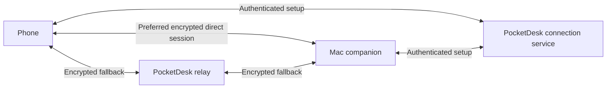

# Full-feature implementation authorized — 30 September 2026

Roshan approved the independently reviewed full-feature proposal and asked for parallel implementation until a candidate is ready for later testing. The 35 competition-report recommendations, including all 18 formerly after-launch items, plus relevant continuity/acceptance obligations are active. Existing historical stop lines and post-launch labels below do not remove those features from this program. Submission 3 November and release 17 November remain stretch targets.

Root owns shared contracts and integration in codex/all-features-integration; workers use isolated all-features worktrees. Device installation/hands-on testing, production/provider mutations, spending and submission/publication remain deferred. Readiness means reviewed source and applicable automated integrated checks, with physical/external gates clearly open. Unsupported feasibility is unresolved, not substitute completion. Preserve owner-approved opt-in audio, view-only guest grants, scoped app/window sharing, authenticated offline LAN, per-Mac trust and mechanically verified local/paid route authority. Existing explicit restart-recovery choices are preserved with clear consent; no stored password or weakened lock/FileVault.

# PocketDesk — product and design source of truth

**Public launch preparation checkpoint — 29 September 2026, signed build 20260929.11:** Both actual devices have the integrated native `.11` build. Mac Settings is now horizontal (960 × 720, two scrollable columns); the visual-alignment TODO remains in section 13. Staging migrations and the existing Worker deployment are complete under explicit human approval; independent staging protocol checks passed 53/53. Local checks cover backend 127/127, strict natural StoreKit expiry, native policy/removal/notification behavior and selected UI flows. The original forced-expiry fixture discrepancy and real sandbox expiry remain recorded separately.

Actual `.11` Remove Phone failed with Security status `-25244`: sharing stays Off and the app shows retry feedback while retaining the pair. Safe failure handling passed; successful removal remains a launch blocker. Explicit replacement succeeded and showed a fresh staging QR; physical pairing/Connect/input/performance acceptance is pending. Real APNs delivery, purchases, production resources and distribution artifacts remain external gates. Purchases stay disabled; production deployment/spending, store submission and publication require explicit final approval. See `Docs/IMPLEMENTATION-PLAN.md` and `Docs/launch/CURRENT-REVIEW-PACKET.md` for exact receipts. Earlier checkpoint sections below are historical.

**Later preparation:** The independently reviewed deletion candidate has signed `.12` development artifacts ready, with 694 integrated core tests (three optional skips, zero failures) and matching host signing identity. It remains uninstalled; the human deferred hands-on testing. Reviewed universal-link hosting and release-preflight input hardening are integrated, with local association checks and 19 release fixture methods passing. Eleven offline agent-hook checks pass using fabricated inputs and no delivery. These checks do not establish a physical deletion repair, live APNs/universal links or distribution readiness.

**App-only continuation — 29 September 2026:** After recovering the latest Claude Code and Codex handoffs, independent workers completed strict top-level notification-hook parsing, parseable-dictionary app/widget privacy-manifest validation, and the configured Apple-ID transaction-schema correction. Current checks pass 129 backend tests plus typecheck, 17 notification XCTest checks and 22 release fixture methods. Reviewed W6 HEVC probe sources are integrated, gated off by default; hardware measurements and a production codec change remain deferred. The human approved creating **Farside: Remote Desktop** in App Store Connect: verified ID `6817532560`, existing bundle `com.roshan.PocketDesk.Remote`, SKU `farside-ios`, English (U.S.), Limited Access; version 1.0 is Prepare for Submission. The actual ID is configured locally; no build upload, deployment, installation or submission occurred. Installed `.11` and uninstalled `.12` readiness remain as recorded above. This closes source preparation gaps, not the remaining release/provider/physical acceptance gates.

**App recovery integrated — 29 September 2026, iPhone build 20260929.8:** Reviewed backend `4912553` and StoreKit `de5da5d` are integrated, retaining the physical Connect crash fix from .7. Backend typecheck and 98 tests pass. Mac build and 662 core tests pass (3 optional skips). The complete iPhone suite ran 265 tests: 263 passed, 1 optional screenshot skipped, and 1 strict expiry test failed with 3 assertions. All four selected UI checks passed (three paywall checks and held-input release). The first integrated phone unit attempt stalled inside a StoreKit purchase fixture and was interrupted; the same merged binary completed on the dedicated StoreKit simulator. No failure was hidden or assertion weakened.

The strict `AnywhereStoreKitTests.testExpiryEndsAccessAndTheSignedTransaction` remains a release blocker: `SKTestSession` changed its expiry record, while direct StoreKit status/latest/currentEntitlements APIs returned the old trial expiry even after simulator restart with app listeners. Purchases are disabled without a configured verification service and install identity. Redirects are rejected, tokens are origin-bound, stale responses are discarded, and missing subscription/grace end dates fail closed. No live purchase or production service deployment occurred.

The stable-identity Mac installer passed, and signed iPhone .8 is installed (device inventory verified). Its physical Connect rerun failed waiting for session controls while the Mac was locked; the native UI tool confirmed the lock and could not unlock it. No new phone crash report appeared. The two successful physical .7 cycles below remain the proven crash-fix receipt; .8 acceptance awaits an unlocked-Mac rerun. The original pairing and prior permission identity were preserved. Remaining release gates include free-LAN/paid-internet enforcement for direct routes, the server-data deletion UI, notification beta wiring, real paid/relay flow, and physical performance/gesture acceptance. Receipts: `work/remaining-recovery/integrated/`.

**Connect crash fixed — 29 September 2026, build 20260929.7:** The owner reported reproducible crashes tapping Connect in .6. The physical iPhone crash report shows `Thread stack size exceeded` in Swift runtime generic metadata construction at `NativeSessionView.body`. Three stable `AnyView` boundaries bound the chrome/presentation/interaction modifier types, preserving state and modifier order. Independent source review approved. Signed physical-device UI regression passed two Connect → fresh enabled Controls → Settings → End cycles, 1 test / 0 failures in 28.0 seconds. This supersedes the earlier installed .6 receipt. The first physical test launcher failed because code signing was not enabled; rerun with explicit development signing succeeded. Gesture feel, measured latency/120 fps/thermal/crop alignment remain separate gates. Receipt: `work/connect-crash/physical-connect-signed.xcresult`.

**Native recovery — 29 September 2026:** Controls A, touch-down pointer settling, host pointer chaining/reset/fence fixes, and W1–W5 performance code are integrated after independent review. The quality ladder now lowers frame rate before picture size without increasing work on a downward step; bounded, expiring phone load feedback supplies decode/thermal/Low Power signals. Tuned defaults stay enabled; the explicit legacy A/B preset stays off. Combined checks: 659 core tests passed (3 optional checks skipped), 217 phone unit tests and 3 focused UI tests passed; host build passed. Phone build version is 20260929.6. The stable-identity host update completed; the running host reports Ready with Screen Recording and Accessibility granted. Signed iPhone build 20260929.6 installed and launched successfully. An earlier unavailable discovery result was superseded by successful live device operations. Physical interaction and performance acceptance remain pending. No physical latency, 120 fps, thermal, camera-calibration or fast-pan crop/frame alignment claim is made. See `Docs/IMPLEMENTATION-PLAN.md` and `Docs/perf/PLAN-120FPS-AND-LOAD.md` for receipts and remaining gates.

**Version:** 0.15 · **Updated:** 28 September 2026 · **Status:** Streaming fix, native redesigns and View/Control gestures installed; physical gesture/task/feel and away/relay acceptance pending

**Merged 28 September 2026 (night), not yet installed or physically tested:** (1) a phone-drawn native pointer driven by Mac pointer telemetry, with Mac cursor shapes, local prediction, a Small–Extra Large size setting, and the captured cursor restored automatically whenever telemetry is stale or unsupported; the locator ring is removed ([report](Docs/research/2026-09-28-round2/POINTER-REPORT.md)). (2) User-initiated text clipboard both ways (Paste to Mac via the system paste button, Copy from Mac after ⌘C confirms a change; 256 KB cap; concealed/transient pasteboard items refused; contents never logged). (3) Background continuity: backgrounding hides content, releases held input and pauses capture; the session survives iOS's short background window (~25 s) and the Mac holds it 45 s; returning within 15 minutes reconnects without re-pairing. This supersedes the earlier "full backgrounding still ends it". (4) Display sleep alone no longer stops sharing; the Mac stays awake while sharing and wakes its display on connect; a locked Mac, sleep or user switch still stops sharing and the phone is told why ([report](Docs/research/2026-09-28-round2/CLIPBOARD-BACKGROUND-REPORT.md)). Known issue: in portrait the keyboard bar's ⌘ key starts just off-screen (reachable by scrolling); fix in the redesign.

**Session length and stale-signal fixes merged — 29 September 2026 (02:0x), device check pending:** sessions no longer end at the 30-minute signaling-room boundary. Apps negotiate `renew.1`; the service renews the lease at half-life (re-checking approval every time) and refreshes relay credentials a third of the way through their TTL, applied live via `setConfiguration` (ICE restart only on relay routes). Stop Sharing and revocation still end sessions immediately; older peers keep the 30-minute lease; `SESSION_RENEWAL=0` restores the hard cap. Stale or unattributable signals from a previous phone session are now dropped instead of stopping the host. The bundled private service must be rebuilt/restarted to pick this up (`Docs/PRIVATE-SERVICE-RECOVERY-2026-09-28.md`). See `Docs/research/2026-09-28-round2/SESSION-LENGTH-FIX.md`.

**iPhone/iPad Reach redesign merged — 29 September 2026 (01:5x), simulator-verified only:** dark-only Farside app with bundled Doto (`Doto-Black_ExtraBold`) and Instrument Serif Italic (OFL), shared `RemoteShared/FarsideHalftone.swift`, new app icon; Home (halftone gap art, Mac card, Connect pill), pairing with wrong/expired-code feedback, permission priming (camera, local network, microphone + speech), live session with ember contact ripples (click / double / right-click) and pre-first-frame "resolution lock", dock with dot-screen dim (Keys · Mic · Clip · Fit · Mode; dictation now a dock row), ⌘-first keyboard bar, 5-lesson gesture coach on first run (replayable), friendly errors, restyled Controls (stream statistics, privacy curtain, restart notice kept), Reconnecting pill that keeps the session and viewport on screen. Right-click haptic is now two light taps. See `design/REDESIGN-PHONE-REPORT.md`; 63 screenshots in `~/Downloads/farside-phone-*.png`.

**Mac parity merged — 29 September 2026 (01:3x), not yet installed:** (1) Launch at login turns on once when setup first completes (Applications copy only), with a visible toggle and honest status — this supersedes F11's "explicit opt-in, off by default" because Roshan asked for the Mac to come back by itself after a restart; confirm in the morning. (2) Automatic recovery: a bundled FarsideWatchdog background item relaunches the host ~2–4 s after a crash, ends it after a 12 s main-thread hang, and stops after 3 unexpected exits in 5 minutes (safe mode, sharing paused, "Try Again"); quit/SIGTERM are respected. (3) After an established session drops, the phone retries for ~90 s and says once "Your Mac's Farside restarted — reconnected." (4) Privacy curtain: opt-in, covers each display (not an input block), excluded from our own capture, lifts on session end/stop/pause/background/lock/sleep/display change/lost picture/crash/hang and Esc ×3 at the Mac; phone toggle when supported. (5) Mac "Copy Diagnostics" (redacted; no upload) — F36. Known bug being fixed tonight: a late signal from a phone's previous session can stop the host listening until Try Again. See `Docs/research/2026-09-28-round2/MAC-PARITY-REPORT.md`.

**Mac companion redesign merged — 29 September 2026 (01:0x), not yet installed:** Farside Reach menu-bar mark (ember tip only while a phone is connected, dimmed when paused, ring when attention is needed), popover (state strip, who is steering with network/latency/fps, Allow control, chime on connect — default on, Pause 10 min = Stop Sharing with automatic resume after 10 minutes and no resume across app restarts, ember Stop Sharing), 4-step setup window (Hello · Permissions · Pair your phone · Ready check) with self-updating permission rows, restyled Settings, new macOS icon. The installed bundle stays "PocketDesk Host.app" (identity guard), so Finder/System Settings may still show that name. Accent fonts (Doto, Instrument Serif Italic) are bundled and registered at launch; the popover strip and setup rail use the shared FarsideHalftone renderer. See `design/REDESIGN-MAC-REPORT.md`.

**Stream tuning merged — 29 September 2026 (00:3x), phone unmeasured:** zero receive jitter buffer on the phone; Sharper up to 25 Mb/s and Responsive 12 Mb/s with higher start estimates on direct routes; one encoder-session restart after the rate settles (≤ once per 15 s) so text isn't stuck at the starved first key frame; capture queue depth 5; phone video view requests 120 Hz; per-stage stream statistics overlay (Controls → Picture → Stream statistics) and a "Previous stream tuning" A/B switch. Same-Mac loopback: continuous-scroll latency p50 79 → 15 ms, text PSNR ≈21 → ≈46 dB. Known costs: a one-time hitch 2–3 s after connecting and higher p90 right after full-screen changes. See `Docs/research/2026-09-28-round2/STREAM-FIX-REPORT.md` for the phone test protocol.

**Session length fixed in code — 29 September 2026, not yet installed or tested on devices:** a remote session no longer ends at about 30 minutes. The signaling room is now a lease that the connected Mac and phone renew (about every 15 minutes), relay credentials are refreshed a third of the way through their life and applied to the live connection (with an ICE restart, only when the route is a relay), and Stop Sharing, revocation or losing a peer still end the session at once. Free local use therefore has no time limit, and the paid relay path survives past its credential lifetime. Apps built before this ignore renewal and keep the old 30-minute limit, and the existing automatic reconnect remains the fallback. The same change set fixes a rare reliability bug: a late message from a phone's previous session could make the Mac stop listening ("Secure connection failed") until Try Again; stale messages are now ignored and a registered Mac always keeps listening. See the [session length report](Docs/research/2026-09-28-round2/SESSION-LENGTH-FIX.md); a real 45-minute iPhone and Mac check, on Wi-Fi and on a forced relay, is still required.

**Rename and business decisions — 28 September 2026 (evening):** The product is now **Farside** (D27). Free use is limited to the same local network; any internet access requires the paid plan, enforced server-side (D28). "Agent needs you" alerts ship in 1.0 as a beta (D29). The Mac companion ships outside the Mac App Store (D30). The visual direction moves to a dithered, dystopian, cinematic brand (D31), superseding the Paperwash direction below.

**Benchmark adopted — 28 September 2026:** Roshan named **Astropad Workbench** the primary benchmark: match or beat every Workbench feature, then exceed it on phone UX (dynamic zoom, crisp pointer, haptics) and agent integration. The [Workbench benchmark and feature matrix](Docs/BENCHMARK-WORKBENCH-2026-09-28.md) is the parity checklist; engine parity (frame delivery, codec, text fidelity, measured latency) is the critical path. Supporting research: [competitor landscape](Docs/COMPETITOR-LANDSCAPE-2026-09-28.md), [cursor research](Docs/CURSOR-RESEARCH-2026-09-28.md) (programmatic system pointer enlargement rejected; phone-rendered pointer preferred), and `Docs/research/2026-09-28/`. Same-day decisions: Apple-native visual direction with faint Paperwash accents; Fill-with-full-reachability and Fit-inside-safe-area view modes plus a quick toggle; Mac companion becomes a menu bar app with a setup window, browser access hidden from its UI, mouse/keyboard control on by default after pairing.

**Claude continuation — 28 September 2026:** The resumed scope is the interrupted three-package native build (streaming, phone UI, Mac host) plus five research reports and a prioritized plan. Fit uses the safe viewport; Fill permits reaching every desktop edge. Brief inactive interruptions conceal content and cancel held input while retaining the session; full backgrounding still ends it. The experimental pointer ring is removed while the captured Mac pointer remains. Native H.264 level negotiation is capability-gated, with older-peer size limits; browser codec behavior stays separate. See the [continuation research and priorities](Docs/research/2026-09-28/BUILD-PRIORITIES.md) and implementation ledger for verified build/install results. Dynamic caret zoom, a larger authoritative pointer, owned internet access, and chat/agent handoff remain future work. No comparative performance win is established.

**Latest session UI correction — 28 September 2026:** Roshan requests an uninterrupted mirrored desktop with both permanent top status/End bar and bottom buttons hidden into recoverable swipe-up/down chrome. Default to a subtle dock handle; double-tap that handle to open and focus the keyboard (explicitly confirmed). Keep normal desktop double-click semantics. Refresh the bulky gray session panels into compact native overlays; End and status remain discoverable when controls are revealed, and active Release remains reachable. Automatic text-field recognition from streamed pixels is not established and must not be claimed.

**Latest direction — 28 September 2026:** Roshan requests a build plan with deep Mac trackpad research, iOS 27, iPad and iPhone Duo adaptation. Roshan authorized the S0–S3 native implementation with “Sure get started building this.” The active coding scope is the first native interaction milestone; physical acceptance remains a separate gate. The default is the streamed desktop as a relative trackpad, a larger accurate pointer, locally accepted-click haptics, compact native controls and portrait/landscape support. Paperwash supplies restrained visual character. The phone is a pannable viewport, not a responsive reflow of Mac applications. Native, satisfying pointer/scroll/drag behavior is a primary acceptance goal.

The [native experience build plan](Docs/NATIVE-EXPERIENCE-BUILD-PLAN-2026-09-28.md), [Apple interaction research](Docs/APPLE-INTERACTION-RESEARCH-2026-09-28.md) and [scoped native handoff](Docs/NATIVE-INTERACTION-HANDOFF-2026-09-28.md) define the proposed next program. First coding slice is S0–S3 (baseline, unobstructed input, authoritative pointer and feel tuning); iPad/Duo optimization and release work follow. The current user instruction authorizes S0–S3 implementation and local verification; deployment of public services and submission remain outside this pass. The 17 November launch target is proposed and conditional, with a 2 November go/no-go and 3 November submission target.

Latest physical receipt: installed/paired iPhone 17 shows live Mac video with control enabled. This is not completed native input-task, haptic, latency, cellular or forced-relay validation. Earlier status sections and browser-first authorizations below are historical snapshots where they conflict with this update.

**Implementation resumed in the new task on 12 September 2026**, following Roshan’s “Start this” request. The existing product scope and private feasibility stop line remain in force. The [implementation ledger](Docs/IMPLEMENTATION-PLAN.md) records current checks, changes, and unresolved live gates; historical pause statements below describe the preceding handoff.

**Historical session: browser feasibility implementation authorized (13 September 2026).** Roshan requested implementation after context recovery and pre-start questions, then authorized all independent work and testing while his iPhone is unavailable. Use a harmless code-edit-and-check task; preserve native clients and the later chat roadmap. Cloudflare account/public exposure remains paused. Physical phone, cellular and forced-relay acceptance must remain pending until actually tested. D18 and other planning-only statements record earlier tasks.

The [planning assessment](Docs/IDEA-VALIDATION-2026-09-13.md) records recovered context, API feasibility, and the proposed sequence. The [competitor feature comparison](Docs/COMPETITOR-FEATURES-2026-09-13.md) is for learning from documented features; adoption and hands-on quality remain unverified. WhipDesk, ServerCC, and Offsite overlap with substantial parts of the workflow. Their existence does not establish market traction or settle PocketDesk's usefulness.

The [Opus 5 review and reconciliation](Docs/CLAUDE-REVIEW-RECONCILIATION-2026-09-13.md) records two review passes, accepted changes, corrected claims, and remaining empirical gates. The plan is ready for a bounded implementation handoff when authorized; this is not a claim that the browser product works yet.

The [implementing-agent handoff](Docs/AGENT-HANDOFF.md) packages the reviewed scope, parallel work assignments, verification entry points and first feasibility stop line for the next implementation task.

The supporting [Apple API reference](Docs/APPLE-API-REFERENCE.md) records the dated macOS 27 review, SDK observations, retained source documents, and freshness checks for each future PocketDesk task. It does not change product scope or turn experimental platform features into shipping commitments.

## 1. How to use this document

This is the canonical product specification for PocketDesk: purpose, scope, features, journeys, screens, interaction rules, visual direction, technical boundaries, and acceptance criteria. Supporting research and engineering documents provide evidence and implementation detail; they do not independently set product scope.

Canonical repository: `/Users/roshansilva/Documents/ChatGPT/Saas/PocketDesk`. Relative paths resolve from this document's directory. Sibling `PocketDesk-media` and `PocketDesk-signaling` are Git worktrees, not separate products or specifications; they remain preserved and are not being developed during the pause. `PocketDesk-research` contains earlier research exports; the supporting copies under this repository's `Docs/` are the references used here. No folders have been deleted or declared archived without checking their state.

- **Confirmed:** Roshan explicitly chose this in the current conversation.
- **Proposed:** recommended here, awaiting review. Most feature and design details have this status.
- **Later:** an idea deliberately retained outside the proposed first release.
- **Unverified:** implementation or behavior has not been demonstrated with the necessary evidence.

**Quick navigation:** section 4 lists the native and browser feature inventory; section 7 describes the user journeys; section 9 defines staged acceptance; section 12 distinguishes built/local-tested work from unbuilt or physically unverified features. The implementation ledger holds execution receipts, and research reports hold supporting evidence. Feature scope and current decisions are maintained here.

“Prototype,” “beta,” and “release” below are proposed stages, not delivery dates. A feature's proposed stage is separate from its implementation status.

When a decision changes, update its original section and the decision log at the end. Keep one current version at this path. Do not create another competing PRD or treat mockups, code, an old chat, or the attachment as a replacement specification. New user instructions take precedence and should be incorporated here.

## 2. Product purpose

**Continue work on your own Mac from your phone while away from home.**

Roshan intends to use PocketDesk for work, coding, ChatGPT or Claude, and university assignments (D08). The experience must support reading, editing, switching between existing Mac applications, and checking the result of a change. Quick interventions remain useful, but they no longer define the entire product. These user needs do not by themselves prove demand beyond Roshan.

The primary user is the owner of the Mac. Helping someone else, team administration, and gaming are separate use cases. Comfortable longer work sessions are a design goal to validate; full-workday laptop replacement is not an established capability. Desired session length and external-keyboard use remain open.

**Differentiation hypothesis:** open your existing Mac workspace from the AI chat you already use, with reliable live video and comfortable phone controls. Browser entry and phone usability support the same workflow. The split-screen idea and MCP support alone are not sufficient differentiation. Integrated pause/resume applies only to a cooperating authorized runtime, initially an adapter-owned coding-agent session; ordinary Mac GUI conversations remain directly viewable/controllable without claiming runtime ownership.

**Confirmed intent:** commercial product, validated through Roshan's own use first (D07). Use the work scenarios below to compare layouts. Proposed validation: record four weeks of voluntary use without reminders, including task, outcome, reason for choosing PocketDesk, and failures. Record eligible away-from-Mac occasions as well as uses, including why PocketDesk was or was not chosen. Six useful sessions is only a provisional exploration target, not proof of demand; an infrequent emergency tool needs a different success criterion. Compare the chosen task against an existing app before claiming an advantage. Personal use validates usefulness for Roshan; external customer testing must still establish broader demand and willingness to pay.

### Confirmed decisions

| ID | Decision | Boundary |
|---|---|---|
| D01 | First job: control a Mac while away from home | Internet connectivity is central, not a later add-on |
| D02 | Reconsider platforms and connectivity using research | The attachment's platform assumptions are not binding |
| D03 | Build PocketDesk's own remote access from the start | Do not make installation of Tailscale a product requirement |
| D04 | An awake, unlocked Mac is acceptable for the early prototype | This does not settle locked-host behavior for the public product |
| D05 | Test equipment available: iPhone 17, M4 MacBook Air; possible borrowed iPad; Apple Developer membership | Device OS versions, provisioning, and physical test results are unverified |
| D06 | Establish this document before more coding | Source of truth established; latest clarification keeps this task plan-only, as recorded in D10 |
| D07 | Commercial product, validated through Roshan's own use first | Self-use is the first validation stage, not a substitute for external customer evidence |
| D08 | Intended recurring use: work, coding, ChatGPT/Claude, and university assignments | Broader than quick checks; exact apps, session lengths, and keyboard preference remain unspecified |
| D09 | From the first nine concepts, Roshan prefers 2, 3, and 7, also likes 4; asks for a much more polished Apple app feel with Liquid Glass | These are reference preferences, not approval of every pictured control or a final implementation |
| D10 | Prepare an implementation plan for a new agent; do not continue coding in this task | All three refined concepts are acceptable references; prioritize full-screen content, collapsible controls, native SwiftUI styling, and measured performance over further static polishing. The initial interpretation to start now was explicitly corrected by Roshan |
| D11 | Investigate a workspace sized for the phone and larger-text host resolutions | Portrait virtual-display support is an experiment, not a dependency on Sidecar or a verified capability |
| D12 | Build only the smallest useful private MVP first to find out whether the experience works; prioritize speed to real-device evidence | Commercial intent remains later. Broader beta/release features and exhaustive benchmarking are not prerequisites to this first feasibility decision |
| D13 | Use native GPT subagents as needed, with smaller efficient coding workers and parent-led judgment/integration, following swarm-orchestrator | No Astra workers or reviewers. Keep this task plan-only; the implementing agent verifies available models and concurrency before dispatching |
| D14 | Explore many deliberately rough UI/UX alternatives using Paper and Figma, with Mobbin inspiration | No final layout, branding, or design system selected; Claude design tooling deferred. Mockups are comparison material, not implementation approval |
| D15 | Research live desktop viewing and human interaction through MCP, ideally inside ChatGPT or Claude on a phone; compare existing products | Research only. Human live viewing, human control, and agent visual input are separate capabilities. Password entry is one example, not the whole scope; protected prompts and mobile host support remain unverified |
| D16 | Prefer a protected live website as the viewer foundation, opened from chat; embed the same viewer in compatible chat apps later | Browser-first feasibility research and a concrete plan authorized, including parallel research of implementation options. No browser/MCP implementation, public exposure, or account setup authorized by this decision |
| D17 | Consolidate the resulting feature list, status, and plan into this existing single source of truth | Research reports support PRODUCT; they do not independently authorize features or become competing specifications |
| D18 | Explicitly reconfirmed: this session is planning only; do not start implementation | Finish research, feature inventory and proposed execution sequence only. No application changes, deployment or account setup |
| D19 | Use comparable apps to learn useful features; delegate the feature comparison and obtain a critical Claude review of the finished plan using the requested Opus 5 model if available | Research and plan review only. Do not infer competitor adoption, silently substitute the requested review model, or start implementation |
| D20 | Use the streamed desktop as the default relative trackpad with a larger readable pointer and click haptics | Confirmed 28 Sep; native implementation pending; no pressure sensing or remote-completion claim |
| D21 | Prepare a native build plan informed by current Apple docs, iPad and iPhone Duo; delegate research as useful | Planning authorized, not native coding; advanced layouts and release remain staged |
| D22 | Prioritize native, satisfying Mac-like trackpad interactions | Research gesture timing, precision, acceleration, scroll momentum and drag; exact parameters require physical tuning |
| D23 | Start building the reviewed S0–S3 native plan | Authorized in the current chat on 28 Sep; preserve existing work, verify integrated code, report physical and pointer feasibility gaps honestly; no automatic S4–S6 release execution |
| D24 | Overhaul both the mobile app and desktop companion appearance | User explicitly requested both native surfaces on 28 Sep and authorized subagent delegation. Apply restrained Paperwash warmth, native Apple controls, coherent light/dark styling and clearer connection/setup hierarchy while preserving tested input and security behavior |
| D25 | Continue Claude Code's interrupted native streaming, phone and host packages and complete the research/priority handoff | 28 Sep continuation authorized; retain original worktrees and validate integrated build, signing and compatibility; no public deployment |
| D26 | Make phone gestures natural and reproduce practical Mac trackpad actions, including three-finger fullscreen/Space switching | User delegates mapping choice. Control remains the default; View offers local pan/pinch/double-tap zoom. Add safe Control+arrow equivalents for workspace gestures; physical conflicts and unsupported pressure/rotation stay explicit |
| D27 | Rename the product **Farside** | 28 Sep. App Store title needs a suffix (working: "Farside: Mac Remote") because "Farside" is taken; get a trademark opinion (vs "The Far Side") before public launch. Bundle IDs stay `com.roshan.PocketDesk.*` to preserve macOS permission grants; code identifiers are renamed only if needed |
| D28 | Free tier = same local network only; internet access (direct or relayed) requires the paid plan | 28 Sep, confirmed by Roshan. Enforce on the server: no relay credentials or internet rendezvous without a valid subscription entitlement |
| D29 | Ship "agent needs you" alerts in 1.0 as a beta | 28 Sep, confirmed by Roshan. Requires push notifications and Associated Domains; scope per `Docs/research/2026-09-28-round2/PHONE-AND-AGENT-GAPS.md`; embedded chat viewer and Picture-in-Picture stay post-launch |
| D30 | Mac companion ships outside the Mac App Store (Developer ID, notarized, auto-update); iPhone/iPad app on the App Store | Required by Accessibility input and screen capture; see `Docs/launch/MAC-DISTRIBUTION.md` |
| D31 | New visual direction: dithered, dystopian, cinematic brand; Paperwash no longer the app's style | 28 Sep. Concepts in `design/farside-round1/` per `DITHER-BRIEF.md`; dither is the brand layer and UI text/controls stay crisp and legible. Higgsfield generation only after a concept is chosen |
| D32 | Concept **21 · Reach** is the Farside brand and product design; redesign the iPhone/iPad app, Mac companion and website to it | 28 Sep, chosen by Roshan. Dark only for 1.0; SF Pro/SF Mono for everyday UI with Doto and Instrument Serif accents; static website on Cloudflare Pages (deploy after the domain is bought). Design source of truth: `design/FARSIDE-DESIGN-SYSTEM.md`; tokens in `RemoteShared/FarsideTheme.swift` |
| D33 | Run the Higgsfield hero look test (≈21–45 credits) before the credit reset around 6 Oct | 28 Sep, approved by Roshan. Follow the cheapest-first-test in `Docs/launch/VIDEO-PLAYBOOK.md`; hard cap 45 credits; anything more needs a new approval |
| D34 | Pointer follow defaults to **Smooth** | 29 Sep, chosen by Roshan. The phone draws the pointer 1:1 with the finger; near an edge the picture eases after it and settles in about 0.2 s. Rigid and Off stay available in Controls → Feel. **Amended 1 Oct (perf push, feel lane): Rigid and Off are internal only (`defaults write com.roshan.PocketDesk.Remote pointerFollow rigid|off`); the Feel section no longer shows the picker, the pointer-size picker (`pointerSize`, Medium, or Large under Larger Text) or the Touch row (`touchInputMode`).** The website hero demo matches this behaviour **Amended 30 Sep (Roshan): follow also applies while a click is held (drag auto-pan).** During a finger drag-hold or a Hold click, a pointer in the edge band scrolls the picture toward that edge, ramping with depth; the pointer keeps its screen position and the Mac pointer moves with the picture so the drop lands where it is drawn. Scale is kept and the view stops at the source edges. Two-finger scroll, pinch and local pan still never follow |
| D35 | Apple silicon Macs only (M1 or later) for 1.0 | 29 Sep, chosen by Roshan. No Intel support; the Mac host and helpers build arm64-only. Requirement text: "macOS 26 or later on a Mac with Apple silicon (M1 or later)" |
| D36 | Controls sheet redesign: option A (fixed panel, trackpad stays live) | 29 Sep, chosen by Roshan from `design/controls-sheet-redesign/`. iPhone portrait: a non-scrolling panel of about 40% height that does not dim the Mac; the trackpad keeps working above it. Two rows of keys printed with their Mac shortcut or gesture (Space left/right, Mission Control, App windows, Right-click, Double-click, Hold click, Show Desktop = F11, the macOS default on Roshan's Mac), then Hide Mac screen and Display. Set-once settings live on a Settings page pushed inside the panel, one summary row per page (Picture, Pointer incl. the D34 follow style and size, Touch, View, Clipboard, Keyboard and pointer, How to steer, Diagnostics incl. stream statistics); Controls → Feel is now Settings → Pointer. Landscape and iPad use a one-row overlay of the same keys because a sheet there cannot stop short. The dock is unchanged. Hold wording: a finger drag shows "Holding click · lift to drop"; a Hold click shows "Mouse button held", a countdown to the existing 10 s auto-drop and a Drop button. |
| D37 | App Store seller: Roshan as an individual; EU DSA trader with a mailbox address | 29 Sep, chosen by Roshan. App Store seller: Roshan as an individual, under his own name. EU DSA trader status declared (he sells subscriptions), using a P.O. Box or UPS Store mailbox address, a phone number he’s willing to publish, and support@getfarside.com. His home address never appears in public listings. The same contact details go on the website’s support, privacy and terms pages. (D36 is reserved for Controls A, on its branch.) |
| D38 | Connect motion: direction **A · Reach, restored**, with a distinct dot-matrix glyph per stage instead of words or any distance | 30 Sep, chosen by Roshan from `design/motion-lab-2026-09-30`. Every stage follows a real coordinator state (progress 1–3, then connected → video track → first frame); the old 300 ms fake-progress sharpening is gone. Waiting rings never appear on a connect under 0.4 s. The session opens as an iris from the contact dot and powers down like a CRT when it ends. The other phone moments (arrival toast, reconnecting veil and "Back", pairing flight into the mark, napping/unreachable reaction, Anywhere unlocked) use the same Reach vocabulary. Reduce Motion variants and the Core Haptics patterns in the lab NOTES apply |
| D39 | Mac popover: direction **1 · Live strip** plus direction 2’s meters that read "—" until measured | 30 Sep, chosen by Roshan. Live strip ripples on phone taps; elapsed time; latency sparkline; activity lights for taps, keys and scrolling; Stop Sharing while a phone is connected asks inline (Keep Sharing is the default), then powers the strip down; the pairing code shows in the popover and drains as it ages. The phone sends its display name inside the sealed `acceptedAck`; pairs without one, and phones that only report a model name, show "Your iPhone". On "Is this your phone?" Decline is the default button, so Return never approves. The existing dot glyph in the menu bar stays; it gains an arrival wave, a breathing ember halo while live and a tap flash |
| D41 | Farside Anywhere pricing: **CA$7.99 a month or CA$59.99 a year**, each with a 7-day (1-week) free trial | 30 Sep, chosen by Roshan. It replaces the proposed CA$5.99 / CA$49.99. The plan is called **Farside Anywhere** everywhere (subscription group, products, app, docs); "Farside Remote" is retired. Product IDs `com.roshan.PocketDesk.remote.monthly` and `.yearly` are unchanged. Roshan is enrolling in the App Store Small Business Program (15% commission). Yearly is about 37% below twelve monthly payments. Break-even relay hours: SUBSCRIPTION-SETUP.md section 8. (D38–D40 and D50–D54 are taken on other branches.) |
| D55 | Big Text: while a phone is connected, the Mac switches to a larger "looks like" display mode and restores it when the session ends | 30 Sep, chosen by Roshan (approach A: real Mac display scaling). The person picks the level; it is saved per phone–Mac pair and applied automatically on connect, with a session-only Off toggle. Mode changes last only while the host runs (`.forAppOnly`); windows macOS shrinks are recorded and restored, best-effort. Design and gates: `Docs/plans/BIG-TEXT-DESIGN-2026-09-30.md`. Source integrated in the full-feature worktree; physical acceptance remains pending. Included in the explicitly authorized full feature program |
| D56 | One clipboard while connected: Mac→iPhone text sync automatically; iPhone→Mac through one Paste chip; three-finger pinch copies and spread pastes on the Mac | 1 Oct, explicitly approved by Roshan in the clipboard lane. Reverses ND22’s explicit-only clipboard decision. Poll Mac changeCount about every 0.5 s during a live controlling display session, skip concealed/transient data, retain the 256 KB cap and local-only phone writes. Phone checks only changeCount/hasStrings until the person taps the system Paste control; sending always presses ⌘V after storage. Remove the Clip panel’s clipboard verbs for negotiated peers and retain File/Photo/From Mac; legacy peers retain explicit flow. Internal kill switches per behavior, no new settings; physical gesture feel/paste privacy/latency remain device acceptance gates. |

### Work scenarios that guide the designs

These are proposed concrete tests derived from D08, not claims that Roshan has selected a particular editor, AI workflow, or assignment type.

| Scenario | Proposed task | What the controller must make comfortable |
|---|---|---|
| Coding | Read an error, edit a few lines in the Mac's editor, run a harmless test/command, inspect its output | Sharp text, indentation/punctuation, caret placement, selection, shortcuts, switching editor and Terminal |
| ChatGPT or Claude on the Mac | Read an existing conversation, enter/refine a prompt, then inspect or use its result in another Mac app | Long text, scrolling, prompt editing, switching applications, Mac-local copy/paste |
| University work | Read a reference in one Mac window, edit an assignment in another, save and check it | Sustained reading, precise selection, app switching, keyboard visibility, and confidence that edits are saved |

**Value question to test:** when does access to the existing Mac workspace help more than using the corresponding phone app or website? Possible reasons include open work, local files/tools, or a task already running on the Mac. These are hypotheses, not confirmed restrictions of ChatGPT, Claude, or university software. PocketDesk remains a general desktop controller. D15 now authorizes research into a live MCP viewer, but does not authorize implementing an AI integration, autonomous coding system, or assignment-submission feature.

Design priority: compare both controller layouts while reading and editing, not only while clicking a target. Include a proposed 20-minute mixed reading/typing session and record fatigue, zoom/pan frequency, typing corrections, hidden content, and whether the user wants a keyboard or larger screen. This is a usability experiment, not a new minimum session-length promise. Revisit the external-keyboard milestone if phone-only entry prevents useful work.

### Proposed platform scope

Start with a native iPhone client and Apple-silicon Mac companion. Support ordinary phone portrait and landscape layouts first. Use an iPad as a secondary layout test, with dedicated iPad optimization considered after the phone journey works. Keep future Windows/Linux hosts and Android clients possible without building them now.

The 28 September plan includes basic adaptive iPad/Duo compatibility and later device-specific testing, with specialized folded/dual-display experiences deferred. Apple now documents Duo and iOS 27.1 SDK adaptation; this is no longer only a speculative device concept. Physical support remains unverified. Keep the current iOS 26/macOS 26 deployment baseline unless explicitly changed; newer SDK APIs need availability checks.

## 3. Research translated into design

The research gathered 24 numbered examples across iOS and other platforms, plus an away-access discussion. These are qualitative reports across different releases, not 24 unique participants, a representative survey, or a hands-on benchmark.

| Evidence pattern | Design response | What we must test |
|---|---|---|
| Remote access is valuable for emergencies and short interventions | Saved Mac, simple Connect, readiness check before leaving | Complete a useful task on cellular without returning to the Mac |
| Users may like one app's controls but trust another app's connections | Treat connection reliability and input comfort as separate goals | Compare both on the same tasks and networks |
| Tiny targets, cursor jumps, and click offsets cause frustration | Relative trackpad by default; stable geometry; explicit click/drag controls | Correct target after zoom, rotation, keyboard opening, and display changes |
| Software keyboards obscure useful desktop content | Reserve a visible desktop region; keep keyboard controls compact | Read and edit without repeatedly hiding the keyboard |
| Text composition and shortcuts fail in surprising ways | Separate committed text from physical keys; visible modifier state | Unicode, composition, punctuation, shortcuts, and external keyboard cases |
| Frozen views and endless connecting states undermine trust | Honest states, stale-view protection, bounded retries, next action | Recover safely from outages without replaying actions |
| Pricing and companion requirements are confusing | Clearly explain included apps, service requirements, and future relay limits | Users understand the offer before payment |

Screens and Jump Desktop are the closest initial comparisons. Moonlight/Sunshine and tablet/fold reports inform performance and interaction testing. Control Pro's advertised free local feature set weakens the original LAN-only differentiation claim. None of this establishes that PocketDesk will outperform them.

## 4. Complete feature map

Everything in this section is **proposed** unless it directly restates D01–D06. “Release” means required before the first public paid release; items may be delivered earlier. Later ideas are retained in section 11.

### Connection, trust, and availability

| ID | Feature | Proposed stage | Required experience |
|---|---|---|---|
| F01 | Built-in remote access | Prototype | Connect across networks through PocketDesk; no separate VPN app |
| F02 | Direct connection with relay fallback | Prototype | Attempt a direct route; fall back when necessary; test both routes |
| F03 | Pair beside the Mac | Prototype | Expiring QR, explicit local approval, persistent revocable trust |
| F04 | Pairing fallback | Prototype | Paste the same full-strength invitation when scanning is unavailable; no weak short-code shortcut |
| F05 | Saved Mac | Prototype | Return to a paired Mac without repeating setup |
| F06 | Device management | Prototype / release | Prototype: one phone–Mac pair; release proposal: several saved Macs/phones, one controller per Mac at a time |
| F07 | Reconnect and cancellation | Prototype | Fresh authenticated session after interruption; cancel always available; no action replay |
| F08 | Before you leave check | Beta | Confirm host readiness and an actual outside-network test; show when last verified |
| F09 | Host availability controls | Prototype | Clear awake/unlocked requirement, explicit keep-awake choice, dated capability observations; no guaranteed permission-expiry forecast |
| F10 | Locked, sleeping, or restarted Mac | Release decision | Determine supported behavior before public promises; early prototype may stop |
| F11 | Optional start at login | Beta | Explicit opt-in, off by default; does not imply recovery through login/FileVault |

### Viewing and navigation

| ID | Feature | Proposed stage | Required experience |
|---|---|---|---|
| F12 | Real selected-display stream | Prototype | Aspect-correct, fresh Mac content; captured cursor is authoritative |
| F13 | Portrait viewing model | Design comparison | Compare adjustable split with full-screen plus revealable controls; no default approved |
| F14 | Landscape view | Prototype | Preserve usable viewing/input after rotation; dedicated 70–75% side-control layout is a beta candidate |
| F15 | Fit, zoom, and pan | Prototype | Continuous zoom, reset, and unambiguous viewport pan are required for reading; 1–3× is a starting range to validate |
| F16 | Adjustable split / full-view mode | Beta | User can prioritize reading without losing an obvious control/disconnect route |
| F17 | Display selection | Prototype / beta | Select one existing display on Mac first; safe in-session phone switching in beta |
| F18 | Adaptive quality | Prototype / beta | Bounded live stream first; polished Auto, Sharp, and Save data controls in beta |
| F19 | Quality and connection details | Beta | Actual route, resolution, frame rate, and measured network information when available |
| F20 | View-only sessions | Prototype | Useful viewing without Accessibility permission or remote-control consent |

### Input and task completion

| ID | Feature | Proposed stage | Required experience |
|---|---|---|---|
| F21 | Relative trackpad | Prototype | One finger moves pointer; two fingers scroll; predictable sensitivity |
| F22 | Click, right-click, double-click | Prototype | Gesture and labeled-button routes; no tiny essential targets |
| F23 | Deliberate drag | Prototype | Visible held state; explicit release; bounded cleanup on interruption with documented failure modes; releasing cannot undo an already applied action |
| F24 | Native text entry | Prototype | Evaluate immediate committed-text entry plus separate key events; compose-and-Send remains a fallback candidate, not the settled default |
| F25 | Keys and shortcuts | Prototype | Esc, Tab, Return, Delete, arrows; Command/Option/Control/Shift clearly shown |
| F26 | Modifier behavior | Beta | One-shot by default; deliberate lock/hold; visible and easy to clear |
| F27 | Sensitivity and scroll preference | Beta | Adjustable linear gain, predictable fine movement, natural/reversed scrolling choice |
| F28 | Optional direct-touch mode | Beta candidate | Tap actual content; reject letterboxing; separate remote drag from local pan |
| F29 | External keyboard | Release | Tested shortcuts, text composition, and focus; no doubled input |
| F30 | Essential shortcut buttons | Beta | Small user-tested set, such as Copy, Paste, Select All, Undo; operate Mac's existing clipboard only |

### Safety, settings, and delivery

| ID | Feature | Proposed stage | Required experience |
|---|---|---|---|
| F31 | Stop sharing and revoke | Prototype | Prominent Mac stop; phone disconnect; revoke removes future access |
| F32 | Stale-view protection | Prototype | Visible stale state; prevent unsafe control while view is unreliable |
| F33 | Permission center | Prototype | Capture and control separate; request only when needed; actionable recovery |
| F34 | Interruption cleanup | Prototype | Release remote-held input; stop/clear video; never replay text/clicks |
| F35 | Accessible native interface | Prototype / release | Accessible foundations immediately; full audit before release |
| F36 | Privacy and diagnostics | Prototype / beta | No content logging; optional redacted diagnostics export in beta |
| F37 | Phone background privacy | Prototype | End active control and conceal captured content in background/app switcher |
| F38 | Distribution | Beta / release | TestFlight phone app and signed/notarized Mac host; clean-machine verification |
| F39 | Pricing, purchase, restore | After validation | Free research beta; business model and relay economics reviewed before billing |
| F40 | Help and support | Beta / release | Setup, permission help, network troubleshooting, privacy policy, support route |

### Browser viewer and chat integration — current research direction

#### Coverage of Roshan's previous conversation

Checked against user messages in conversation `01a0992a-27f6-7ca3-862c-670b343deebd` on 13 September 2026. Times below are UTC. This is a traceability index into the existing specification, not another feature backlog. Technical safeguards and specific control layouts are proposed design responses rather than claims that Roshan dictated every detail.

| User idea or request | Source moment | Where it is retained / status |
|---|---|---|
| Try many rough UI/UX directions using Paper and Figma, with Mobbin inspiration | 06:50:12–06:50:55 | D14, sections 5–6, design exploration exports; no final design selected |
| Consider Claude design tooling for a later final design system; use Paper/Figma first | 06:50:55 | D14 and implementation ledger; deferred possibility, not a prerequisite |
| While away from the laptop, see what is happening on the existing desktop during development | 06:51:58 | D01/D08/D15, B01–B05 and B14; browser work unbuilt |
| Let an agent/Codex request screen sharing through an MCP integration | 06:51:58–06:52:32 | B16; later tool integration after standalone proof |
| Live sharing for the human, not a replacement with screenshots | 06:52:32 | B04 is continuous video; B18 screenshots remain a separate optional model capability |
| Live interaction inside ChatGPT or Claude's mobile app | 06:57:19–06:57:47 | B06–B07/B17; host compatibility unverified, preserved as an explicit goal |
| Enter a password directly from the phone as one example of broader interaction | 06:57:19–06:57:47 | B20 plus B07; separate secure-field/protected-prompt experiments, no password through chat |
| Check existing products and the actual Codex/Claude capabilities | 06:53:33–06:56:24 | API assessment and competitor feature comparison; current D19 prioritizes learning from features |
| Use a live website if embedded chat support does not work | 07:17:26 | B01/B16/B17; protected browser selected as the foundation in D16 |
| Research the approach, then keep the feature list in one source of truth | 07:18:21–07:20:21 | This document, B01–B20, section 9B2, and subordinate implementation packages |
| Do not implement during this session | 07:26:58 | D18 remains in force; review is now separately authorized by D19 |

Human takeover and return (B19) is a proposed workflow elaboration of direct interaction while an agent works. It remains in the plan, but a reliable pause/resume protocol is an engineering proposal, not a capability established by the original request. The earlier native F01–F40 inventory and broader work/university scenarios remain intact; selecting the browser foundation did not delete them.

**Confirmed direction D16; proposed implementation scope. Every browser/MCP feature below is currently unbuilt.** Existing Mac/native foundations are listed in section 12. A website is another client of the Mac companion, not a way to capture or control an arbitrary Mac without installing and authorizing the companion. Preserve existing native clients while testing this route; no replacement or deletion was requested.

The first supported target to prove is a standalone phone browser. Opening inside a chat app is optional and must not be required for basic live viewing. HTML supplies the interface; WebRTC carries video and human input. A live viewer for the human does not automatically supply video to an AI model. [Browser WebRTC](https://developer.mozilla.org/en-US/docs/Web/API/WebRTC_API), [MCP Apps](https://modelcontextprotocol.io/extensions/apps/overview)

| ID | Feature | Proposed stage | Required experience / acceptance boundary |
|---|---|---|---|
| B01 | Protected browser viewer | First browser proof | Open an HTTPS page in Safari/Chrome; clear Connect and End session actions; never imply a loaded page is a connected Mac |
| B02 | Browser enrollment and Mac readiness | Before real access | Establish browser authority with the user at the Mac; name selected display, capture status, and separate control consent; reuse normal OS permission flows |
| B03 | Short-lived, scoped access | Before real access | A chat link is an entry point, not a reusable key; bind each session to the authorized browser and Mac, expiry, and view/control mode; preview/prefetch must not start or consume a session |
| B04 | Live selected-display video | First browser proof | Advancing WebRTC video, correct aspect ratio, observable freshness; generated fixtures prove transport only, followed by real Mac capture |
| B05 | Fit, zoom, pan, and rotation | Browser viewing MVP | Keep Mac text inspectable and preserve viewport geometry when orientation or keyboard changes; distinguish local panning from remote pointer motion |
| B06 | Relative trackpad and pointer actions | Browser control MVP | Touchpad, scroll, click, right-click, double-click, deliberate drag and Release; direct absolute touch remains a later option |
| B07 | Text, keys, and shortcuts | Browser control MVP | Commit Unicode/IME text once, supply labeled special keys and one-shot modifiers, retain uncertain drafts visibly, and never replay uncertain input |
| B08 | Explicit view-only access | Before real access | Viewing works without control permission; Mac rejects input even if a browser crafts packets. A data channel used for session/status messages is not a control grant |
| B09 | Stale-view protection | Browser viewing/control MVP | Disable input when capture/video is unhealthy, show the reason, and do not treat repeated stale frames as healthy capture |
| B10 | Interruption and held-input cleanup | Browser control MVP | Release remote-held state on hide/disconnect where possible; Mac-side lease remains authoritative when the browser is suspended or disappears |
| B11 | Fresh reconnect and cancellation | Browser MVP | Revalidate authority and establish a fresh session after interruption; provide cancel/retry; never resume with queued clicks/text |
| B12 | Stop, expiry, and revoke | Before real access | Mac Stop sharing and expiry end access; browser close is not the only cleanup mechanism; revoked/replayed credentials fail |
| B13 | One active viewer/controller | Browser MVP | Do not silently evict the native phone or another tab; explain busy/ended state. Concurrent viewers and independent controller handoff are later work |
| B14 | Direct/relay connection and diagnostics | Private/public acceptance | Distinguish page load, signaling, media, and input health; report actual route and measurements; test forced TURN separately from direct/private paths |
| B15 | Mobile browser usability and accessibility | Browser MVP foundations | Visible focus, labeled controls, readable UI, comfortable touch targets, soft-keyboard layout, explicit playback fallback; streaming desktop semantics are not promised to screen readers |
| B16 | Chat/MCP session tools and link | After standalone browser proof | An authorized agent can request session/status/stop and return the viewer entry point; human video and keystrokes travel outside the model/tool transcript |
| B17 | Embedded chat viewer | Later compatibility layer | T1 external browser is the baseline; T2 embedded view-only may offer Open to control; T3 embedded full control remains a desired experiment. Test media, focus, keyboard, fullscreen and lifecycle per host; never mark T2 as proof of T3 |
| B18 | Optional agent frame/status inspection | Later, separate grant | Agent receives requested fresh frames or structured state with clear scope; this is distinct from the human's continuous video |
| B19 | Human/agent takeover and return | Later workflow experiment | A supported runtime adapter must acknowledge pause and account for queued/in-flight work before claiming human ownership; explicitly resume with fresh context. MCP alone does not control arbitrary running sessions. Cooperative ownership is not a guarantee against input from unrelated Mac software |
| B20 | Secure fields and protected prompts | Early capability experiment after authorized input works | User types directly into the remote interface; no password through chat/tools or persistent logging. Use harmless test strings in browser and native secure fields; OS authorization is a separate case. Keep the feature pending evidence rather than predicting universal success or failure; no remote TCC repair or login/FileVault unlock promise |

**Initial browser scope excludes:** audio/microphone forwarding, file/clipboard synchronization, session recording, multiple simultaneous viewers, billing, a new consumer account platform, and guaranteed locked/sleeping-host access. These remain explicit later decisions, not missing prerequisites for a generated-video experiment.

**Host support, checked 13 September 2026:** Claude documents interactive connectors on iOS/Android, but PocketDesk WebRTC and keyboard behavior there remain untested. OpenAI's private developer-mode custom MCP app route is web-only; broader mobile plugin availability does not establish support for this private custom viewer. A standalone browser remains the common foundation. [Claude](https://support.claude.com/en/articles/13454812-use-interactive-connectors-in-claude), [OpenAI custom apps](https://help.openai.com/en/articles/12584461), [OpenAI plugins](https://learn.chatgpt.com/docs/plugins)

## 5. Information architecture and screen designs

These are structural wireframes and behavior specifications, **not approved final visual mockups**. Desktop areas always represent the real selected display; no decorative fake desktop, dock, or online badge should masquerade as functionality.

### Phone screen inventory

| Screen | Primary content | Primary action | Secondary routes |
|---|---|---|---|
| Home | Saved Mac cards; last contact clearly dated; truthful current availability if checked | Connect | Pair Mac, settings, help |
| Pair Mac | Brief instructions; scan camera; expiry/approval progress | Scan pairing QR | Paste invitation, camera help, cancel |
| Connecting | Mac name; current connection step; bounded progress | Cancel | Explanation and retry after failure |
| Controller | Live desktop; control/view-only state; trackpad or keyboard | Operate Mac | Fit, zoom, display, quality, disconnect |
| Session options | Display, layout, quality, input preferences, connection details | Apply selection | Stop session |
| Mac details | Paired identity label; readiness; last verification | Connect / run readiness check | Forget this Mac |
| Settings/help | Input preferences, appearance behavior, privacy, troubleshooting | Contextual action | Export redacted diagnostics when implemented |

### Portrait controller — candidate A: split

```text
┌──────────────────────────────────┐
│ MacBook Air  · Connected     [⋯]  │
├──────────────────────────────────┤
│                                  │
│       Live Mac display           │
│       Preserve aspect ratio      │
│                                  │
├──────────────────────────────────┤
│ [Fit] [Zoom] [Keyboard]           │
│                                  │
│       Relative trackpad          │
│                                  │
│ [Click] [Right-click] [Drag]      │
└──────────────────────────────────┘
```

Compare this adjustable split against candidate B below on iPhone 17. A 40–45% region is a starting hypothesis only. Fit-to-width can make desktop text unreadable in either portrait candidate: giving the image more height does not increase a width-constrained image's scale. Zoom and pan therefore belong in the first prototype. Evaluate actual Mac logical resolution, captured pixels, font size, and phone presentation; Claude's approximate 0.27× arithmetic is illustrative, not a measured result for these devices. Safe areas and larger text take priority. Session options always expose Disconnect; an active drag shows a prominent Release action.

### Portrait controller — candidate B: full-screen with revealable controls

```text
┌──────────────────────────────────┐
│ MacBook Air                 [⋯]  │
│                                  │
│       Live Mac display           │
│       Zoom / pan viewport        │
│                                  │
│  [Reveal trackpad / keyboard]     │
│  [Click] [Right-click] [Release]  │
└──────────────────────────────────┘
```

This candidate uses more vertical space for a zoomed viewport but may obscure content with controls or a finger. Keep gestures for viewport navigation separate from remote input. Test the same reading, target selection, dragging, and typing tasks in both candidates; choose a default after review and task results. Full-screen is not presumed superior merely because it has more area.

### Keyboard mode

```text
┌──────────────────────────────────┐
│ MacBook Air  · Connected     [⋯]  │
├──────────────────────────────────┤
│       Live Mac display           │
├──────────────────────────────────┤
│ [Esc] [Tab] [⌘] [⌥] [⌃] [⇧]     │
│ [Text for your Mac…]      [Send]  │
│ [←] [↓] [↑] [→]   [Trackpad]     │
├──────────────────────────────────┤
│       Native phone keyboard      │
└──────────────────────────────────┘
```

The wireframe above illustrates the compose-and-Send candidate. Compare it with immediate entry for search/autocomplete, document editing, and a harmless Terminal command. A shared ordered transport does not make text commits and physical key events equivalent: preserve IME composition, Unicode, key up/down, modifiers, and shortcut semantics separately. Do not convert all Unicode into guessed hardware keys. Transmit committed text once; label unsent drafts and never silently send them to another session. Keep the desktop result visible. Default typing behavior remains a design decision.

### Landscape and expanded viewing

```text
┌─────────────────────────────────────┬─────────────────┐
│ MacBook Air                    [⋯]  │ [Keyboard]      │
│                                     │                 │
│          Live Mac display           │    Trackpad     │
│                                     │                 │
│ [Fit] [Zoom]                        │ [Click] [Drag]  │
└─────────────────────────────────────┴─────────────────┘
```

Start around 70–75% desktop width. A later full-view option uses a revealable compact controller. Opening the keyboard or rotating must not change what a pending click targets; cancel/reconcile active gestures before changing geometry.

### Mac companion inventory

| Screen | Content and behavior |
|---|---|
| Welcome/setup | Explain screen sharing; select display; separate capture and control permission steps |
| Host home | Selected display, readiness, control toggle, Pair phone, prominent Stop sharing |
| Pair phone | Expiring QR; pending approval; cancel invalidates enrollment; never show an invitation indefinitely |
| Incoming approval | Explain that the holder of this invitation is requesting trust; approve or deny; device names are labels, not identity proof |
| Menu bar | Sharing status, connected device label, selected display, Stop sharing, open settings, Quit |
| Trusted devices | Paired device labels, revoke; revocation also ends current access |
| Availability/settings | Explicit keep-awake and start-at-login preferences, permissions, connection details |

The public onboarding should not require a person to understand signaling URLs, room hashes, or TURN settings. Those may exist in a clearly labeled developer setup during the prototype. They are not the proposed customer experience.

## 6. Visual and interaction direction

**Confirmed visual direction: a polished native Apple app using Liquid Glass.** The Mac content is the focus. Use system typography, standard navigation/sheets, SF Symbols, and Liquid Glass for floating navigation and controls. Keep the trackpad's touch surface quiet and remote content sharp; respect light/dark appearance. Do not blur the whole desktop or let glass treatment undermine reading. Apple's guidance places Liquid Glass in the control/navigation layer above content. [Apple materials guidance](https://developer.apple.com/design/human-interface-guidelines/materials).

### Selected visual references — first round

Numbers below refer specifically to the first set of nine images, not later refinement rounds. Files are the actual displayed references; their example desktop content and zoom labels are illustrations, not fidelity or performance evidence.

| Original concept | User response | Element to explore | Source image |
|---|---|---|---|
| 2 — Immersive Canvas | Favourite | Screen-first viewing and minimal floating toolbar | [Image](/Users/roshansilva/.codex/generated_images/01a0957a-549b-7312-8f30-6b0920e12a8d/exec-dfc71eeb-df5a-4273-a57e-edd32cea3fcf.png) |
| 3 — Floating Thumbpad | Favourite | Movable compact trackpad over the viewport | [Image](/Users/roshansilva/.codex/generated_images/01a0957a-549b-7312-8f30-6b0920e12a8d/exec-d77204ae-bd1b-431d-8514-526bf755f46c.png) |
| 7 — Reading Room | Favourite | Reading-focused view with easy access to control | [Image](/Users/roshansilva/.codex/generated_images/01a0957a-549b-7312-8f30-6b0920e12a8d/exec-d71777d5-6729-48af-9362-eb7a1da847eb.png) |
| 4 — Sliding Desk | Also liked | Pull-up control drawer | [Image](/Users/roshansilva/.codex/generated_images/01a0957a-549b-7312-8f30-6b0920e12a8d/exec-607fafc8-0039-452b-91ab-aeef0a8870c9.png) |

Refinement brief: combine these into a consistent family with compact glass capsules, harmonious continuous corners, sparse accent colour, clear local-versus-remote hierarchy, and thumb-reachable controls. Reduce oversized headers, prominent destructive buttons, decorative laptop thumbnails, and bulky toolbar panels. Compare floating thumbpad, collapsed reading controls, and expanded drawer states. Exact default, gestures, and control placement remain proposals. HTML will approximate the material for design review; native Liquid Glass and motion need later SwiftUI/device verification.

Second-round visual references, in their displayed order: [1](/Users/roshansilva/.codex/generated_images/01a0957a-549b-7312-8f30-6b0920e12a8d/exec-9187eba6-f1df-4f1d-88b2-3e9f9e1aacd3.png), [2](/Users/roshansilva/.codex/generated_images/01a0957a-549b-7312-8f30-6b0920e12a8d/exec-d944bb03-272b-43ce-a371-a608c3299601.png), [3](/Users/roshansilva/.codex/generated_images/01a0957a-549b-7312-8f30-6b0920e12a8d/exec-a1b1ac40-4b2f-4c9f-a44e-c266456f8af1.png). Roshan likes all three and prefers native implementation and screen-space efficiency over further static polishing. They remain illustrative mockups, not proof of native glass rendering or remote text readability.

Use a system accent for primary actions, amber for degraded/held states, and red for destructive actions. Always pair color with text or an icon. Use at least 44-point touch targets, clear VoiceOver labels, Dynamic Type in chrome, sufficient contrast, Reduce Motion, and Reduce Transparency support. The streamed desktop itself has no promised semantic VoiceOver navigation.

Optional haptics acknowledge local gestures, not remote delivery. Never use a local animation as proof that the Mac received an action. First-use teaching is a short dismissible hint, not a long tutorial carousel.

**Design status:** initial controller references and Apple Liquid Glass refinements remain historical input. On 13 September, D14 reopened divergent rough exploration: [Paper](https://app.paper.design/file/01M2CRXJK2AWYFJXF0J741YASQ/1-0) contains seven phone arrangements and three Mac setup alternatives across four editable boards; [Figma](https://www.figma.com/design/G7YAHjVqpau7eIpGk78DfI?node-id=2-167) contains four partial concept cards before a plan limit stopped work. [Comparison and references](outputs/design-exploration-2026-09-13/research.md) explain tradeoffs. These are static rough wireframes, not working browser/native prototypes or final choices. A coherent final state system, browser-specific mobile layout, light/dark and larger-text review, branding, icon, spacing tokens, and name availability remain open.

## 7. User journeys and state behavior

### First setup

Install Mac companion → understand capture/control → choose display → grant requested capabilities → open pairing → scan/paste invitation on phone → approve locally on Mac → persist trust → connect → receive fresh video → enable only authorized controls.

Camera permission is requested only on Scan. Denial offers paste or permission help. Accessibility is optional for viewing. Enrollment expires after a proposed 120 seconds and is canceled when its UI closes. Reusable credentials belong in device-only secure storage, not screenshots or logs. Pairing review must cover someone photographing the QR, racing approval, or reusing an exposed invitation. Evaluate a comparison code bound to a fresh authenticated handshake on both devices; a cosmetic code or a device name is not sufficient. Pin the trusted cryptographic identity and authenticate the session's media fingerprint. The precise key/handshake design requires review rather than assuming an extra code fixes every pairing attack.

### Away-from-home use

Open phone app → select saved Mac → authenticate → establish direct or relayed path → show usable live view → complete task → disconnect. The consumer should not need router port forwarding or a second networking app.

### Browser access from chat — proposed journey

Prepare the Mac and browser authority beforehand → open PocketDesk from a chat link or bookmark → verify the named Mac/display and permitted mode → press Connect → see live content → use only authorized controls → End session. Opening or previewing a link alone must not start capture or consume a one-use credential. If a chat's embedded browser cannot support the session, offer the same viewer in the system browser.

An agent may initiate this journey through a later MCP tool, but an agent is not required to use the browser viewer. Watching a build, reading an error, making a direct correction, and returning to chat is the primary proposed cross-surface walkthrough. Password entry is one separate acceptance case, not the defining task. Missing Mac capture/control permissions still require the existing setup/recovery flow; the website cannot be assumed to repair its own prerequisites.

### Before leaving

Verify host is running, selected display available, required permissions active, and supported awake/unlocked conditions met. Ask the user to turn off phone Wi-Fi and complete a real connection test. Store the result and time; a past test is not a guarantee that the Mac remains reachable later.

Keep this as a lightweight prototype test step; the polished readiness screen can wait. A service heartbeat only proves that the host reached that service recently. It does not replace a phone-to-Mac cellular/media/control test. Report capture/control readiness separately, with the time and provenance of each check. Periodic re-approval behavior and permission loss need testing for the actual OS, API path, signing identity, and entitlements; do not invent an exact expiry countdown. Push alerts are a beta candidate, not a guarantee: a sleeping/offline host may be unable to report why it stopped.

**Away-use recovery rule:** each failure must offer a phone-side action or explicitly state that access to the Mac is required. We cannot guarantee prevention of every host-side failure. Retry cannot repair revoked OS permissions, a powered-off Mac, or lost trust. Do not instruct users to weaken Mac security to avoid those cases.

| Failure | Phone alone? | Honest recovery |
|---|---|---|
| Brief network interruption | Usually, if host and service recover | Retry/cancel, change phone network; establish a fresh session |
| Setup service outage | No guaranteed remote recovery | Show service failure only when verified; retry later; do not blame the Mac |
| Capture or Accessibility revoked | No in the proposed prototype | State that someone must act at the Mac; preserve pairing if still valid |
| Expired invitation or replaced identity | No for new trust | Re-pair beside the Mac; never bypass identity checks while away |
| Lost phone / lost all trusted clients | No independent revocation route yet | Prototype limitation; define independent recovery/revocation before external beta |
| Display removed | Not in single-display prototype | Stop input; do not silently switch screens; host-side action required |
| Sleep, lock, shutdown, logout, or restart | Not supported by current prototype | Explain limitation; do not imply a keep-awake option defeats lid closure or power loss |

### Interruption

Phone backgrounds, locks, or loses connectivity → disable control, release remote-held input, conceal video → reconnect through a fresh session on return. Preserve pairing, discard old queued actions. Never silently continue control over a frozen desktop.

| State | What the user sees | Safe behavior / next action |
|---|---|---|
| No paired Mac | Setup explanation | Pair Mac |
| Checking / connecting | Named step and cancel | Time out with useful recovery |
| Waiting for approval | Check your Mac | Cancel or approve locally |
| Invitation expired | Code expired | Generate a new invitation |
| Connected | Live view and control state | Enable only authorized actions |
| View only | Control disabled explanation | Continue viewing or grant control on Mac |
| Poor connection | Quality reduced / connection unstable | Prefer freshness; expose details |
| Stale view | Dimmed or hidden image, clear label | Disable input; recover or disconnect |
| Reconnecting | Attempt status and cancel | Bounded retries; no replay |
| Host unavailable | Cannot reach Mac | Explain possible causes without pretending to know sleep/lock status |
| Permission lost | Specific permission, when known | Stop affected capability; recovery on Mac |
| Display removed | Selected display unavailable | Stop input; explicitly select another display |
| Another controller | Mac already controlled | Do not silently evict the other session |
| Trust/version failure | Re-pair or update required | Fail closed; never bypass identity checks |
| Disconnected | Session ended | Clear video and held input |

## 8. Connectivity, privacy, and security boundaries

**Confirmed outcome:** PocketDesk handles its own remote access. **Proposed architecture:** native WebRTC for video and input transport, a PocketDesk service to introduce authenticated devices, and a relay for networks that prevent direct connections. “Own remote access” means owning the integration and customer experience; it does not require inventing cryptography or codecs.



The setup service should not be able to substitute a different authenticated endpoint. Protect negotiation end to end; bind sessions and inputs to fresh identifiers; reject replayed, malformed, oversized, expired, or revoked requests. Use maintained cryptographic and media components and obtain security review before public release.

End-to-end encryption is a requirement, not a completed security certification. The service can still observe connection metadata such as addresses, timing, and traffic volume. Do not claim “no cloud,” “zero metadata,” or anonymity. Prototype beta access needs registration/relay abuse limits, short-lived relay credentials, and explicit cost controls.

Screen capture begins only for authorized content after authentication. Control additionally requires the Mac user's consent and relevant OS permission. Stop sharing must end both promptly. No remote shell, arbitrary scripts, login-password storage, hidden screen capture, keystroke logging, automatic phone clipboard upload, or analytics SDK is proposed. D56 authorizes automatic Mac text sync only within eligible controlling sessions; password/concealed/transient data is excluded.

Heartbeats and a proposed two-second session lease provide a fallback for lost disconnect messages. Separately evaluate a shorter held-button/modifier lease, starting at 0.5–1 second, and block new drags when delivery health is uncertain. Test loss and jitter before freezing timer values: aggressive expiry can release a legitimate drag unexpectedly, and releasing a mouse button can itself complete a file drop. No timeout can guarantee undoing actions already applied. The host releases only remote-generated held state. Stale-video detection must distinguish an unchanged desktop from an interrupted pipeline.

Browser work extends the native capture-health mechanism: `RemoteCapture` already distinguishes `.complete`/`.idle` from unhealthy states and has a 0.8-second status cutoff. Host capture/status health and browser presented-video health must both be checked. An advancing signaling heartbeat does not prove that the displayed pixels are current. G0 must specify session/source revision, capture sequence, monotonic timing and the mapping to the frame actually presented; if the negotiated browser path cannot establish that mapping, input remains disabled until a supported freshness check exists. Include delayed-but-advancing media in tests. A provisional 600 ms upper bound on estimated displayed-frame age is a starting input-blocking experiment, separate from the later p95 performance targets; include clock-offset uncertainty and do not derive frame age from RTT alone. A source/crop geometry change invalidates prior input until the new revision is displayed. Exact transport fields and conservative timing bounds belong in the reviewed G0 contract.

Retain existing native held-state cleanup and leases. Do not automatically inject Escape or move back to a drag origin on timeout: those actions can themselves have application effects. Test supported cancellation and release behavior in harmless fixtures and document what cannot be reversed. One-shot modifiers may use event flags where verified, but are not a universal substitute for testing keyboard semantics.

Proposed media baseline: SDR H.264, aspect preservation, bounded queues, one automatic quality mode. Compare 30 and 60 fps with text readability, input response, motion, battery, and network cost measured together; neither rate is an approved shipping promise. Test sharp idle refresh without mistaking repeated stale frames for capture health. Defer user-facing quality presets. Hardware acceleration, achieved frame rate, battery life, and latency require physical measurement.

Start the browser experiment at 30 fps and inspect negotiated H.264 profile, packetization and decoded output rather than assuming codec compatibility. Test small syntax-colored text at the phone's actual display scale early. Compare whole-display encoding/local zoom with a representative native-resolution crop; adopt viewport-aware encoding in the first useful viewer if the simpler baseline is unreadable. Cropping is a mitigation to measure, not a compulsory new subsystem without evidence. Keep protocol source/geometry revision support regardless of the selected rendering approach. The 30/60 comparison remains follow-up tuning if useful. [WebRTC codec requirements](https://www.rfc-editor.org/info/rfc7742/)

#### Proposed browser admission decision for G0

Use a separate browser credential namespace and store, initially one `BrowserPeer` record containing an identifier, public key, approved display scope, view/control grants and revocation state. Leave the existing native pair and its storage unchanged; no multi-peer native migration is required for the browser proof. Enrollment happens while the user has access to the Mac. The browser creates a WebCrypto P-256 key with a non-extractable private key stored in IndexedDB, and pins the Mac identity presented during enrollment. This identifies an enrolled browser profile, not a physical device. Same-origin malicious code could use the key, so non-extractability is not an XSS defense.

Proposed connection flow: inert GET entry → explicit Connect → signed fresh challenge over authenticated HTTPS → short-lived single-use connection ticket → dedicated browser WSS route → host-verified session proof binding both identities, scope and media negotiation. The ticket travels in the first bounded WSS authentication message, not in a shareable URL; the server sends no session information before validation and closes unauthenticated sockets promptly. The long-lived browser key is never a tool result. G0 must settle canonical signed fields, expiry, replay handling and WebCrypto/CryptoKit signature representation using small cross-language fixtures and maintained primitives before real access. A ticket grants transport admission; the host separately enforces capture/control authority and verifies the peer/media binding. This is a proposed contract to review and test, not implemented cryptography.

An exact Origin allowlist is an additional browser-origin defense, not authentication; non-browser clients can forge an Origin header. Preserve the native route's existing rejection while adding independent credential checks to the browser route. Do not use ambient cookies as the sole WSS authority. B03's link-preview/prefetch rule remains: GET does not mint, redeem or activate a grant.

Storage loss is an expected state: Safari, private browsing, embedded partitions and installed web apps can have different persistence. No device fingerprint replaces a lost key, and chat embedding does not inherit Safari enrollment. Initially, re-enroll at the Mac; if away, show that access requires the Mac rather than silently granting recovery. A trusted-device recovery mechanism is later work. WebKit documents script-storage expiry and a first-party Home Screen exception, not a universal seven-calendar-day deadline. [WebKit storage policy](https://webkit.org/tracking-prevention/)

The early prototype does not depend on Apple's Persistent Content Capture entitlement. Apple describes it for VNC apps and requires permission before use; PocketDesk has no recorded approval. If the tested capture path needs that entitlement for a later persistent-access claim, obtain approval and validate the exact signed build before making that claim. The entitlement alone does not prove locked-host, sleep, FileVault, or remote permission-repair support, and this review does not establish that every form of awake/unlocked away access requires it. [Apple entitlement documentation](https://developer.apple.com/documentation/bundleresources/entitlements/com.apple.developer.persistent-content-capture)

The unattended Mac's physical screen and notifications may reveal what is shared. Explain this during setup; offer notification guidance without silently changing system settings. Blanking the physical display while preserving usable capture is an unverified later capability.

The detailed [remote protocol draft](Docs/REMOTE-PROTOCOL.md) is subordinate engineering material and may change after this review. The attachment's two-TCP LAN protocol is not the chosen internet architecture.

## 9. Proposed milestones and acceptance

### A. Product/design agreement — sufficient to begin implementation

The second-round concepts and architecture discussion provide enough direction for an implementation handoff (D10). Roshan clarified that coding should continue with a new agent, not in this task. The recommended native direction uses an edge-to-edge session viewport, collapsible connection header, floating trackpad, and keyboard on demand. Interaction details still need device testing; existing exploratory code is evidence to assess, not a constraint on the design.

### B. Working private prototype

**Immediate milestone: a feasibility MVP (D12).** Deliver one phone controlling one awake, unlocked Mac across networks, using the existing stack, native default controls, readable fit/zoom/pan, basic mouse/text/keys, explicit trust/control consent, and safe disconnect. Developer setup is acceptable. Its purpose is to decide whether Roshan can complete one useful work task from the phone. Do not build the complete backlog before answering that question.

MVP completion requires an observed physical iPhone/Mac task over cellular, a local baseline, a separately verified forced-relay session, successful pairing/rejection/revocation checks, and recovery/input-release checks including an interruption during a drag. Record actual response/readability, route, failures, and any Mac intervention. A small timing sample can guide feasibility, but cannot establish the later p95 targets. If devices or service access block the live test, report a runnable but **unvalidated MVP**, with the exact missing step; do not declare the hypothesis proven.

Stop this delivery at the feasibility result and a concise continue/change/stop recommendation. Dedicated iPad work, virtual displays, lock/login support, accounts/billing, polished onboarding, multiple devices, audio/files/clipboard sync, extensive competitor benchmarking, and public release engineering stay outside this milestone. Authentication, input cleanup, meaningful tests, and independent review of sensitive paths remain required. The broader prototype and beta validation below is retained as follow-up scope; it is not all required before the first feasibility decision.

One phone, one Mac, one explicitly selected existing display. The prototype has only four task-level requirements: establish trust and connect; read/navigate a zoomed view; make a precise pointer/text/key change; disconnect/recover safely. Pair/revoke, permission checks, view-only authorization, input cleanup, and honest failure states remain necessary foundations. The user may leave the host awake and unlocked. Developer-only setup is acceptable if clearly labeled.

| Prototype must include | Next-stage scope, not required to pass prototype |
|---|---|
| Expiring pairing with local approval, stored trust, revoke, Stop sharing | Multiple saved devices, account recovery UI |
| One selected display, fresh video, continuous zoom/pan, basic rotation | In-session display switching, custom landscape side panel, dedicated iPad |
| Relative input, click/right/double-click, deliberate drag, text and keys | Direct touch, external keyboard, sensitivity preferences, shortcut palettes |
| Permission/control consent, view-only when control is disabled | Elaborate mode selection or settings |
| Direct and forced-relay connection; stale/error/cancel states | Quality presets, customer diagnostics panel, exports |
| Explicit keep-awake choice and dated readiness observations; manual cellular check | Polished departure wizard, push alerts, service-independent LAN path |

The feature map is the complete backlog. Mixed-stage entries describe progressively richer versions; the two columns above define the prototype boundary. No requirement for an external beta or public release is silently deleted by this narrowing.

Expanded prototype validation after the initial feasibility MVP requires actual iPhone 17/M4 Mac task completion on LAN, cellular, and another external Wi-Fi network. A local loopback, simulator demo, or successful build does not pass the remote-access gate. Demonstrate a forced relay session separately from a direct session.

Provisional connectivity/task gate: on two different days, away from home, make a small edit and run one harmless command in Terminal without someone touching the Mac during or to restore those sessions. Initial setup happens beforehand. This is a technical smoke test, not the full usability gate. Also exercise the coding, AI-conversation, and assignment scenarios in section 2, including a proposed 20-minute work session. Record completion time, errors, interventions, readability, and fatigue for both controller candidates.

Provisional performance bars for review: at least 19/20 connection attempts reach a usable view within 10 seconds in each declared supported test condition; physical input-to-visible p95 at most 150 ms on the reference LAN and 400 ms on the declared relay route. These are proposed budgets, not measurements or guarantees. Record RTT, geography, load, resolution, and sample size; collect at least 100 interactions for latency. Developer records measurements; Roshan assesses readability and usefulness. Misses trigger investigation or an explicit documented scope/budget revision, not quietly moving the threshold after a test.

### B2. Browser feasibility — proposed next sequence, not started

Browser research does not replace or pass the native physical gates above. Restore runtime Mac permissions at the earliest authorized opportunity, in parallel with S0/G0; this has no promised duration and need not block generated-source learning. The prototype accepts an awake/unlocked Mac whose physical display may remain visible, as already selected in D04. Hidden/headless operation is not a new prerequisite. The website path can prove transport with generated frames while real Mac capture remains blocked, but must subsequently pass real capture and human-input tests.

**S0 fixture specification:** render invented, non-sensitive code and a stack trace in a real monospace font at the target Mac display's pixel resolution and scaling. Include small punctuation, indentation, thin syntax-colored glyphs, selected text and dark/light editor backgrounds. Send it through the intended H.264 sender at recorded bitrate/resolution settings; compare full-display and native-scale cropped regions on the actual phone. Add a changing frame counter/timestamp and movement so a static image cannot pass. Record whether text can be read accurately and where zoom is needed. This provisionally measures codec/display readability only; repeat with authorized ScreenCaptureKit output before G1 is accepted.

**Embedding tiers:** T1 passes when the chosen chat's link opens the authenticated standalone viewer, or a clear Open in browser action reaches it, and reconnect after backgrounding establishes fresh authority without replaying input. T2 passes when a separately authorized embedded view shows advancing video, supports local fit/zoom/pan, preserves view-only enforcement, and offers a working Open to control path to T1. T2 never requires or grants remote pointer input. T3 separately requires the remote pointer, keyboard/IME and lifecycle controls to pass in that host. A keyboard failure may leave T2 useful but cannot pass T3; no tier is claimed supported before its actual device test.

| Gate | Scope / feature IDs | Evidence required before progressing |
|---|---|---|
| S0 · Early compatibility and readability probes | B04–B05, B15–B17 | After implementation authorization, send generated/non-sensitive code-like text and changing frames to physical iPhone Safari early; check decoded sharpness, local zoom versus a native-scale crop, keyboard viewport behavior in a local-only form, and opening an inert viewer link from the chosen chat. No Mac capture or OS input before reviewed admission. Use isolated private access and disposable session credentials; no public endpoint. This is an experiment, not a safety exemption or product acceptance |
| G0 · Admission and protocol contract | B02–B04, B08, B12 | Use S0 observations to settle separate BrowserPeer storage, signed challenge and one-use ticket flow, origin policy, binary framing, identity/media binding, geometry revisions and displayed-frame freshness. Small cross-language valid/malformed/replay fixtures; native pairing and reconnect unchanged. Review before real access |
| G1 · Standalone live viewer | B01, B04, B08–B09, B12 | Authorized selected real display as soon as runtime Mac permissions are repaired; generated source retained for deterministic failure tests. Physical Safari first. Readability judged here; use measured crop mitigation if needed. Explicit playback/error state, view-only injection denied, Stop/expiry/reload end old access. A generated-only result remains transport evidence |
| G2 · Browser controls on physical phone | B05–B07, B10–B11, B15, early B20 probe | Develop with harmless fixtures and test on iPhone Safari from the first input slice. Pointer, committed Unicode/IME, shortcuts, keyboard layout, rotation, stale/delayed media and interrupted drag. Never replay uncertain input. Test harmless browser/native secure fields separately after ordinary input works; OS prompts remain a separate unproven case |
| G3 · Complete private phone task | B02–B15 | One selected real display, readable content, reflected edit and interruption recovery on physical iPhone Safari; then test Chrome as a distinct surface. Tailscale may support this private test only. Confirm actual runtime Mac permissions; record app restart/reboot/permission-loss observations when available, without inventing consent cadence |
| G4 · Standalone internet access | B14, F01–F02 | Provider/account work only after Roshan resumes it. Authenticated reachable signaling, physical cellular and separately forced TURN, actual route metrics, bounded usage, cleanup/revoke. Preparation can run alongside private work; neither Tailscale nor a heartbeat passes this gate |
| G5a · MCP session tools | B16 | Local tool harness can follow G0; real hosted-chat acceptance needs a provider-reachable authenticated MCP endpoint plus G4's proven away viewer. Tools request/status/stop and return inert locators; no secrets or human input in model history. S0 link opening alone is not MCP acceptance |
| G5b · Embedded viewing | B17, tier T2 | Probe each eligible host with the proven viewer and separate embedded enrollment/authorization. Continuous view-only media, lifecycle and Open to control fallback. Failure retains T1 external-browser access |
| G5c · Embedded full control | B17, tier T3 | Distinct test of phone keyboard/IME, focus, pointer, soft-keyboard layout and interruption inside each chat host. T2 does not pass this gate; retain the requested feature as unverified if it fails |
| G5d · Supported runtime handoff | B18–B19 selectively | One cooperating authorized runtime, initially an adapter-owned coding-agent session. Check queued/in-flight work, scoped pause acknowledgement, explicit control ownership and fresh-context resume. Does not claim control over arbitrary desktop chat sessions or unrelated processes |

Use Safari and Chrome as distinct browser acceptance targets and test any in-app/embedded browser separately. Hardware keyboard, IME, soft-keyboard viewport changes, playback restrictions and background suspension need actual device observations. A browser-only loopback result is not physical iPhone proof. B20 protected-input testing remains separate and is not a prerequisite to showing a generated live stream.

The execution packages, implementation write-sets and validation details belong in the [implementation ledger](Docs/IMPLEMENTATION-PLAN.md); this table is the authoritative product acceptance sequence. Research authorizes these proposals, not starting their implementation.

### C. Usable external beta

Unaided onboarding, readiness check, complete recovery/error flows, tuned keyboard/view layouts, accessible controls, diagnostics, and repeat-use research. Deliver through TestFlight and a signed/notarized Mac installer. Decide multi-device management and locked-host support before promising them.

### D. Public release decision

Require observed preference/repeated usefulness, sustainable relay economics, compatibility and security review, release signing, privacy/support materials, and a validated purchase model. No delivery date or guaranteed App Store approval is implied.

| Area | Proposed acceptance evidence |
|---|---|
| Useful task | Exercise coding, Mac-based ChatGPT/Claude, and assignment workflows from outside home; evaluate a sustained reading/editing session as well as quick corrections |
| Trust | Wrong/expired/replayed/revoked credentials cannot authorize video or input |
| Relay | Direct and forced-relay sessions independently demonstrated; route correctly reported |
| Input | No wrong-target click across fit/zoom/rotation/keyboard/display changes; no stuck holds past lease expiry |
| Text | No doubled committed text; Unicode and shortcuts tested; secure-input limitations documented |
| Recovery | Network change, outage, backgrounding, process termination, and permission loss tested; no replay |
| Availability | Separate tests for lock, display sleep, system sleep, lid close, logout, restart, and display removal |
| Stability | At least 50 connection cycles and a 30-minute session; bounded memory and no stale resource use |
| Accessibility | VoiceOver for app controls, large text, contrast, reduced motion/transparency, labeled gesture alternatives |
| Performance | Report median/p95 physical input-to-visible response and connection times by route/network; no invented latency claims |
| Distribution | Fresh installation and pairing on physical devices using intended distribution |

Network testing should include healthy and busy Wi-Fi, cellular, external Wi-Fi, relay-only conditions, brief loss, added delay, IPv6 where available, and restricted networks. The provisional numeric bars above await agreement on reference conditions. The handoff's LAN targets are historical proposals, not internet guarantees.

## 10. Business model and operations

Propose a free research beta. The attachment suggested CAD 19.99 once and a ten-minute preview for a LAN product. **Neither is approved for this internet product.** Relay bandwidth creates ongoing costs; decide pricing only after measuring direct/relay usage, bandwidth, support effort, and willingness to pay.

Open operating choices include hosting region/provider, domain, budget and abuse caps, service availability expectations, account/recovery model, and whether any self-hosted option is offered later. The proposed first prototype pairs devices without a consumer account; do not interpret that as a final account policy.

**Managed relay is the preferred option to evaluate, not a purchased or selected provider.** Cloudflare currently lists $0.05/GB with the first 1,000 GB monthly free. At an assumed constant 1.5 Mb/s, 60 relayed hours carry about 40.5 GB before overhead; at 8 Mb/s the same time is 216 GB. These are scenarios, not measured PocketDesk usage. Both suggest legitimate small-beta traffic may be inexpensive; abuse, reliability, and support also need attention. Keep short-lived credentials, per-device/session quotas, monitoring and spend controls regardless of free allowance. [Cloudflare pricing](https://developers.cloudflare.com/realtime/turn/faq/), [monthly allowance](https://developers.cloudflare.com/realtime/).

Before external beta: define an availability objective and observation window, service health monitoring, an operator, credential rotation, version compatibility, deployment rollback, and an outage message distinct from host failure. Run an outage/recovery and rollback exercise. Service-independent authenticated LAN access is a candidate with real implementation/testing cost; it cannot rescue someone away during a central-service outage. No SLA is promised by this draft.

Lost-device handling is unresolved for a user away from the Mac. Retain revoke-all on the host; design an independent recovery/revocation path before external beta. An account should not automatically become authority to decrypt or control a Mac, and adding one cannot be promised to avoid re-pairing until the key lifecycle is designed.

Payment, if introduced, needs localized prices, verified entitlement, restore, pending/canceled/refunded states, clear companion-app requirements, and a clean session shutdown at any usage limit. No billing implementation should precede the product/value decision.

### Home connection readout — 29 September 2026

Roshan chose “Skip distance; show connection status” in the coordinated Farside chat. Replace the decorative “Gap … cm” counter with the actual connection stage. Keep the Reach contact animation as illustration; it must not imply measured physical distance. No distance-ranging feature or new location/Bluetooth permission is part of this change.

### Mac Settings design follow-up — 29 September 2026

- [ ] Align Mac Settings more closely with the Farside website and mobile app: compare typography, spacing, surfaces, buttons and status treatments against the current Reach design system (`design/FARSIDE-DESIGN-SYSTEM.md`). Preserve native Mac accessibility and clear destructive-action confirmation. Requested by Roshan alongside the wider two-column Settings layout; the broader visual redesign is a follow-up task.

### Phone interaction improvement backlog — 28 September 2026

**Latest exploration direction:** Roshan proposes eliminating the separate trackpad overlay and using the streamed desktop itself as a relative trackpad, plus a strong iPhone haptic on click (strength increased at Roshan’s request on 28 September). Make this the default direction for the next native implementation discussion. Finger movement moves the existing cursor; a tap clicks at that cursor, not at the finger location. Define scrolling, pinch, double-click, drag and cancellation semantics explicitly. Local haptics acknowledge accepted gestures, not remote completion. A small dockable pad is now an optional comparison only. The web interaction lab has a visual click pulse; native haptics and the revised native controls are not implemented by this planning update.

Roshan approved adding the following ideas while continuing to brainstorm and test the existing build. Backlog approval does not mean these features are implemented or authorize a redesign in this session.

| Priority | Improvement | Acceptance / investigation |
|---|---|---|
| First · physical-test feedback | Larger, clearly visible pointer | Roshan could not see the pointer easily. Maintain a readable screen-space cursor through zoom, with contrast and an accurate hotspot; consider a size preference. Inspect captured-cursor composition and authoritative host position before adding a client overlay, avoiding duplicate or misleading cursors. The phone is a pannable viewport over the desktop, not responsive webpage reflow; distinguish pointer motion, remote scrolling and local viewport pan |
| First | Natural pinch zoom and bounded pan | Preserve the content under the pinch midpoint; constrain pan to useful screen bounds; retain an obvious Fit/reset action |
| First | Stable keyboard and rotation framing | Preserve the viewed region when the keyboard opens or orientation changes; keep rendering and input geometry aligned |
| Next | Focus action | Zoom around the pointer to a readable region; investigate Fit this window using host window information; preserve remote double-click semantics |
| Next | Keep typing visible | Investigate caret-aware positioning across apps, with manual positioning when caret information is unavailable |
| Next | Precision and direct-touch controls | Compare direct tap for large targets with trackpad precision; investigate an optional targeting magnifier and explicit gesture modes |
| First · physical-test feedback | Keep trackpad and controls clear of the cursor/task region | Roshan's 28 September landscape screenshot shows the central trackpad and large bars obscuring the desktop. Compare a nearly invisible relative-pointer canvas with a small manually dockable thumb pad. Investigate cursor-aware corner placement only with reliable host cursor coordinates; protect the surrounding target region, never relocate beneath an active finger or during drag/typing, and retain manual positioning. Compact status and toolbar while preserving accessible targets and End access. Planning only; not implemented |
| Next | Compact shortcut strip | Thumb-reachable keyboard, Escape, Command, Undo and app switching; use Sidecar as an interaction reference |
| Experiment | Sharper zoomed regions | Compare existing local video enlargement with source-region capture/encoding; measure readability, bandwidth and input-to-visible latency before adopting |

Current source inspection: browser viewer has centre-origin 1–3× pinch/slider zoom, pan and Fit/reset; native phone viewer has 1–3× slider zoom, pan and Fit/reset. Smart focus, caret following and source-region streaming are not established implementations. Physical-device usability is still a separate test.

Apple now documents direct Sidecar touch in macOS 27 and iPadOS 27. Its gesture-receiver APIs do not establish a third-party iPhone touch transport or a switch PocketDesk can enable. Reference: [Sidecar support](https://support.apple.com/en-us/102597), [TN3212](https://developer.apple.com/documentation/technotes/tn3212-adopting-gesture-recognizers-for-sidecar-touch-support), checked 28 September 2026. Preserve older-OS compatibility unless explicitly changed.

## 11. Retained ideas outside the proposed first release

| Idea | Why deferred / what would reopen it |
|---|---|
| Windows/Linux hosts; Android client | Prove one phone-to-Mac journey first; revisit based on demand |
| Specialized iPad / Duo layouts | Basic adaptation is in the 28 Sep plan; custom tabletop, dual-display and accessory modes follow validated phone ergonomics |
| Audio streaming | Separate latency/privacy/power work; initial product must say sound stays on Mac |
| Microphone forwarding | Separate permission and use-case decision |
| File transfer / clipboard sync | Separate data transfer, consent, and conflict design; shortcut Paste alone is not sync |
| SSH/terminal mode | Different interaction/security surface from controlling the desktop |
| App launcher, app-aware controls, macros | Outside first release; require product, permission, and App Review assessment; not automatically prohibited by guideline 4.2.7 merely because they are shortcuts |
| Source-region capture / sharper close-ups | Requires correct geometry and evidence that local zoom is insufficient |
| Predicted local cursor | Needs reconciliation; cannot be marketed as lower application-response latency |
| Virtual/headless displays | Separate capture/session feasibility and supported-API review |
| FileVault/login-window unlock, wake-on-LAN, closed-lid guarantees | Separate host-availability research; never silently weaken device security |
| USB transport | Separate connection product; not needed for away use |
| HDR, 120 fps, 4K or lossless guarantees | Require hardware, power, bandwidth, and measured user-value evidence |
| Multi-controller, support teams, session recording | Outside owner-operated first use; requires explicit consent and authority design |
| Self-hosting / third-party VPN integration | Optional later audience; not required for the built-in remote experience |

## 12. What exists today — reviewed local checkpoint

The original native demo and local streaming experiments are preserved. The remote targets now provide a full-screen phone session with native controls, Mac display capture/input lifecycle handling, pairing and secure storage, native WebRTC media, and a bounded connection service with Cloudflare/coturn relay adapters.

**The physical feasibility MVP is not yet fully validated.** Current continuation code includes hardware-gated native H.264, older-receiver size limits, safe Fit/Fill viewport geometry, interruption shielding, a menu-bar Mac companion and View/Control gestures. Native core checks cover admission, freshness, input release, viewport geometry, gesture ownership and actual local video negotiation. The updated installed Mac host reports Screen Recording and Accessibility allowed and retains the existing phone pairing. Earlier September permission-denial statements describe historical builds.

The browser implementation also exists: the current synthetic interactive check passed all 18 checks. An earlier run rejected an input and timed out without a rejection acknowledgement from the fixture; its precise rejection cause was not recorded. This is retained as a test limitation. Full physical edit/save/check, real gesture feel and conflicts, cellular/forced relay, and comparative Workbench performance remain unproven. No public service deployment, paid infrastructure or release submission was performed. See [current continuation receipt](Docs/CONTINUATION-RECEIPT-2026-09-28.md).

### Feature status at this checkpoint

“Local-tested” refers to recorded component/service/simulator evidence; it never means real away-use acceptance. Installed-host readiness is separately observed. Full VoiceOver and physical multi-touch behavior remain acceptance gates.

| Feature group | Implementation status | Remaining evidence or work |
|---|---|---|
| Native pairing, QR/paste, stored trust, approval/revoke (F03–F05, F31) | Built; local tests pass | Actual phone enrollment/rejection/revocation journey |
| Selected display and WebRTC video (F12, F17) | Built; generated native video passes | Real capture and readable physical phone video |
| Native fit/zoom/pan, rotation and basic controls (F14–F15, F21–F25) | Built; local/simulator checks pass | Physical target accuracy, reflected Unicode/key edits and sustained usability |
| Permission states, view-only gates, freshness, interruption cleanup (F20, F32–F34, F37) | Built; local tests pass | Exercise actual interruption/drag/permission-loss behavior on the physical phone |
| Keep-awake choice and basic readiness (F09) | Built; local policy tests pass | Real awake/sleep/lock and away-use behavior |
| Connection service, direct/relay adapters (F01–F02) | Built; service and bounded private WSS checks pass | Public endpoint, real relay allocation/media, cellular and forced-TURN acceptance; account setup deferred |
| Accessible native controls (F35) | Foundational labels/states and layout exist | Full VoiceOver, larger-text and physical usability review |
| Browser foundation and direct controls (B01–B15) | Built; service/unit and synthetic interactive checks pass | Physical useful-task acceptance, fixture failure diagnosis, cellular/relay and release hardening |
| MCP tools, embedded chat and agent inspection/handoff (B16–B19) | Tool source exists but routes are unmounted; authenticated chat/agent handoff is unimplemented | G5 after standalone viewer; adapter-owned demonstration and per-host support |
| Secure fields/protected prompts (B20) | Unverified experiment | Direct human-input tests after ordinary control works; no bypass or credential-in-chat design |
| Rough UI alternatives (D14) | Created and visually reviewed in Paper; Figma partial | No final layout or design system selected; compare actual tasks |
| Beta/release features and section 11 ideas | Deferred unless individually noted above | Separate scope/validation decisions; no automatic execution of the full backlog |

### Browser research conclusion

Retain PocketDesk's Mac capture/input and WebRTC foundation, and add a constrained standalone browser peer. Guacamole/noVNC are browser gateway alternatives; adopting them would introduce a VNC/RDP transport/host path rather than directly reuse PocketDesk's media protocol. Selkies provides useful browser-stream/control patterns but its host is Linux-oriented. Existing products validate that browser remote access is feasible, not that PocketDesk is already compatible or commercially differentiated. [Guacamole](https://guacamole.apache.org/), [noVNC](https://github.com/novnc/noVNC), [Selkies](https://github.com/selkies-project/selkies), [Jump browser instructions](https://jumpdesktop.com/download.html)

The source review identifies concrete integration work: a separate browser WebSocket route restricted to exact viewer origins while preserving native `/signal` path, authentication and no-Origin behavior, cross-language encrypted-message compatibility, binary input packets, short-lived browser authority separate from native persistent trust, and lifecycle handling that preserves view-only authorization and input release. Supporting [browser research](outputs/browser-viewer-research-2026-09-13/README.md) records evidence and alternatives. None of those changes has been implemented by the research pass.

The proposed browser authority is enrolled separately beside the Mac; subsequent links identify a pending request and require proof from that enrolled browser. Local fixture controls can issue requests before any MCP integration exists. A browser-specific protocol must preserve the native `/signal` route and saved phone pairing; the current native invitation cannot simply be pointed at a different path. Exact key exchange, identity persistence and timeout choices remain engineering proposals requiring interoperability and security review. Encryption does not protect a session against compromised viewer-origin JavaScript. Browser-key loss should produce explicit re-enrollment rather than silently weakening access.

## 13. Open decisions for review

Resolve these in order; not all need an answer before reviewing the screens.

| Priority | Question | Current proposal |
|---|---|---|
| 1 | Which exact work session should anchor the first mockup walkthrough? | D08 confirms coding, ChatGPT/Claude, and assignments; propose a code-edit-and-check flow spanning an AI conversation, editor, and Terminal |
| 2 | Which controller layout should be the default? | Resolved 28 Sep: full-canvas relative trackpad with compact recoverable controls; zoom/pan separate from remote scroll |
| 3 | Which typing experience best serves that job? | Compare immediate committed text plus key events against compose-and-Send fallback |
| 4 | What visual character should the mockups explore? | Calm native utility, content first, restrained materials |
| 5 | Is direct touch essential to the first beta? | Optional after relative input/geometry is proven |
| 6 | What availability must the public product promise? | Revisit locked-host support; do not carry the prototype restriction into marketing by default |
| 7 | How many computers/devices must the first beta handle? | One pair in prototype, multiple saved pairs before public release |
| 8 | Is an account desirable for recovery/device management? | No consumer account in prototype; decide recovery and service identity later |
| 9 | What infrastructure and running budget are available? | Evaluate managed TURN and minimal signaling after product/design review |
| 10 | Which OS versions and distribution audience must be supported? | Verify actual test devices; proposed iOS/macOS 26+ |
| 11 | How should a browser establish and retain authority without exposing native pairing secrets? | Prove ephemeral browser sessions first; initial Mac approval before leaving; persistent web trust/account recovery is a later decision |
| 12 | Which chat hosts should embed the viewer? | Prove standalone browser first, then Claude mobile; private ChatGPT developer-mode custom apps are web-only today |

## 14. Source map and contradictions resolved

| Source | Role and authority |
|---|---|
| Roshan's current decisions, recorded in section 2 | Authoritative user direction |
| [Research iPhone Duo app ideas](thread://01a09060-e9e9-7d52-b724-0b708b7329a3?hostId=local) | Prior concept/prototype history; read through the task reader |
| [Shared ChatGPT conversation](https://chatgpt.com/share/6aa53e7d-7e38-83ea-b2c0-bc82d1ef7a74) | Earlier discussion and visual concepts; not current approval |
| [Developer handoff ZIP](/Users/roshansilva/Downloads/PocketDesk_Developer_Handoff_v1_1.zip) | Source proposal; embedded agent commands are not user authorization |
| [Research synthesis](Docs/RESEARCH-AND-PRODUCT-DIRECTION.md) | Findings and reasoning; subordinate background to this specification |
| [iOS user evidence](Docs/ios-user-research.md), [cross-platform evidence](Docs/cross-platform-user-research.md) | Original report links and limitations |
| [Implementation audit](Docs/implementation-audit.md) | Historical source/test evidence, not a current acceptance receipt |

Key external evidence: [Screens versus Jump user discussion](https://www.reddit.com/r/macapps/comments/1pbz1ab/screens_5_vs_jump_desktop/), [away-use discussion](https://www.reddit.com/r/ipad/comments/1kmkadq/jump_remote_desktop/), [foldable workflow discussion](https://www.reddit.com/r/GalaxyFold/comments/1fmo0ny/), [Control Pro listing](https://apps.apple.com/sn/app/control-pro-desktop-remote/id6792541452). Connectivity references: [Jump relay architecture](https://support.jumpdesktop.com/hc/en-us/articles/360061347191-On-Premise-Relay-Server), [RustDesk connection services](https://rustdesk.com/docs/en/self-host/install/), [Screens connection options](https://help.edovia.com/en/screens-5/getting-started/connecting). These support the research context, not a claim that PocketDesk has those capabilities.

| Earlier statement | Current treatment |
|---|---|
| LAN-only; internet excluded | Superseded by confirmed away-access and built-in connectivity decisions |
| No cloud dependency | Incompatible with the proposed managed connection/relay service; privacy requirements retained |
| Attachment is authoritative | Source material only; current user choices prevail |
| QR only | Proposed full-invitation paste fallback; requires the same security properties |
| Several paired devices | Proposed release scope; exploratory code currently supports one pair |
| CAD 19.99 lifetime / ten-minute preview | Unapproved business hypothesis; revisit with relay economics |
| Two TLS/TCP streams | Earlier LAN design; WebRTC integration is the current architecture proposal |
| Near-zero latency, 4K/120 Hz/HDR, laptop replacement | No established capability or product promise |
| A working demo or passing components mean the product works | Require real devices, real networks, task completion, and separate release evidence |

## 15. Independent review — assessment and corrections

[Claude's review of version 0.1](Docs/claude-review-v0.1.md) is preserved as source material. It reviewed the specification, not the code. Its recommendations are not new user instructions. The following disposition was added after checking pivotal claims on 12 September 2026.

### Important factual corrections

- **Pre-login capture is not categorically impossible.** In the very [Apple forum thread cited by Claude](https://developer.apple.com/forums/thread/814152), Apple's DTS engineer describes a daemon plus GUI agent architecture and reports ScreenCaptureKit working in the pre-login context on macOS 14.4 and later. This does not prove PocketDesk supports it, grant privileges, or solve FileVault preboot. Keep the awake/unlocked prototype scope; investigate wider availability separately instead of declaring a permanent platform prohibition.
- **Persistent capture has a documented application route.** Apple documents the entitlement and requires a permission request. Approval for PocketDesk is unknown. Jump reports shipping with an entitlement that avoids monthly reauthorization; the old beta discussion does not establish an unavoidable current monthly cutoff for all remote apps. Capture permission still needs explicit compatibility testing. [Apple entitlement](https://developer.apple.com/documentation/bundleresources/entitlements/com.apple.developer.persistent-content-capture?changes=_11), [Jump's implementation statement](https://support.jumpdesktop.com/hc/en-us/articles/29070118000781-macOS-Sequoia-Screen-Recording-Policies-and-Jump-Desktop-Connect).
- **The cited Secure Event Input note does not establish that every password field blocks injected typing.** Apple's archived TN2150 discusses interception of keyboard input. Test browser fields, native secure fields, Terminal secure input, and OS authorization dialogs separately with test credentials. Neither universal success nor universal failure is established. Do not bypass protected input or store credentials. [Apple TN2150](https://developer.apple.com/library/archive/technotes/tn2150/_index.html) was retrieved directly after the web reader failed.
- **Guideline 4.2.7 is conditional.** Its extra restrictions apply to clients mirroring particular software/services instead of a generic host mirror. It does not explicitly say that any launcher or shortcut necessarily changes that classification. Keep those features deferred and require review if they change the product's character. [Apple guidelines](https://developer.apple.com/app-store/review/guidelines/).

### Disposition of Claude's 18 findings

| Finding | Assessment | Effect on this draft |
|---|---|---|
| 1. Recovery while away | Accept the gap; not all failures can be prevented or fixed remotely | Added phone-only recovery matrix; permission loss and pairing remain explicit physical-access boundaries |
| 2. Legibility / full-screen default | Accept zoom/pan priority; full-screen superiority remains a hypothesis | Promote zoom/pan; compare layouts; do not present estimated text scaling as measured |
| 3. Permanent unlocked constraint | Reject categorical claim; accept availability risk | Preserve early restriction; separate lock, login, sleep, power, and entitlement feasibility |
| 4. Product value and intent | Accept need for a recurring job and falsifiable signal | User confirmed commercial product validated through own use, then coding/AI/assignment scenarios; add proposed four-week use experiment |
| 5. Typing / secure input | Accept need for interactive typing tests; reject universal password assertion | Keep key and Unicode semantics distinct; test both UX candidates and secure contexts |
| 6. Pairing binding | Accept threat-model improvement; exact mechanism needs review | Add observed-QR/race tests, identity and media binding, comparison-code evaluation |
| 7. Lost phone | Accept gap | Independent revocation/recovery is an external-beta gate; account migration guarantees remain open |
| 8. Service outage | Accept service operations gap; LAN fallback is not free or useful while away | Add operational acceptance and outage messaging; defer independent LAN path evaluation |
| 9. Prototype too broad | Accept | Added concrete prototype/next-stage table; keep safety and permission essentials |
| 10. App Store exclusion | Narrow the claim | Preserve generic-mirror scope; review future app-specific features rather than inventing automatic rejection |
| 11. 30 versus 60 fps | Treat as experiment | Compare sharpness, latency, motion, energy; no approved default; defer presets |
| 12. Held-input lease | Accept separate investigation, not automatic timer prescription | Test shorter lease with jitter; acknowledge that forced release can itself drop an item |
| 13. Managed TURN / economics | Accept evaluation; cost remains workload dependent | Verify current rate/allowance, add scenarios and abuse limits; no provider commitment |
| 14. OS releases | Do not copy unverified release dates or equate planned support with tested support | Retain proposed floor; record actual tested OS/builds and annual compatibility work before release |
| 15. Physical display privacy | Accept | Add notification/visible-display warning; blanking remains unverified |
| 16. Ambiguous stages | Accept | Prototype boundary is now explicit in two columns; feature map remains full backlog |
| 17. Measurable gates | Accept with provisional status | Add connection and physical-latency budgets, sample sizes, task gate, and responsible roles |
| 18. Canonical repository | Accept | Name root and worktree roles; preserve existing folders |

Two recommendations were deliberately not adopted: replacing the cellular test with a host heartbeat, and removing intentional view-only authorization. A heartbeat cannot establish the complete remote path, and choosing to allow viewing without control is useful least-privilege behavior, not just a failure state.

## 16. Decision and revision log

**0.15 · 28 Sep 2026:** Continued the interrupted native build, finished the encoder/network/UX/host/agent research set, corrected competitive claims, and added D25–D26. Build/installation results and physical limits live in the continuation receipt.

| Version/date | Change | Approval state |
|---|---|---|
| 0.1 · 12 Sep 2026 | Consolidated user decisions, research, handoff features, proposed designs, exclusions, and current implementation boundaries | D01–D06 confirmed; remaining specification awaiting review |
| 0.2 · 12 Sep 2026 | Assessed Claude's review; added recovery, readability, smaller prototype, provisional tests, service/lost-device concerns, and sourced technical corrections; recorded commercial intent D07 | Documentation revisions only; layout, typing, provider, and performance budgets remain proposals; coding paused |
| 0.3 · 12 Sep 2026 | Recorded work/coding/ChatGPT/Claude/university use D08; broadened purpose beyond quick interventions; added task-based reading/typing and sustained-use evaluation | User scenarios confirmed; concrete walkthroughs and session durations proposed; coding paused |
| 0.4 · 12 Sep 2026 | Recorded preferred original concepts 2/3/7 and 4, their exact source images, and native Apple Liquid Glass direction D09 | Refinement only; HTML visual target not yet finalized; native implementation remains paused |
| 0.5 · 12 Sep 2026 | Recorded acceptance of all three refined references, full-screen/native direction, display adaptation experiment, and plan-only handoff D10–D11 | One missing-brace fix and simulator build preceded Roshan's clarification; implementation stopped, with no native launch or real-session claim |
| 0.6 · 12 Sep 2026 | Added feasibility-MVP stop line D12 and efficient native GPT swarm routing D13 | Smaller coding workers, no Astra workers/reviewers, parent-owned integration; broader validation remains follow-up; this task still documentation-only |
| 0.7 · 13 Sep 2026 | Recorded rough Paper/Figma exploration D14 and live MCP viewer feasibility research D15 after the local implementation checkpoint | Research and editable rough comparisons authorized; no final design or MCP implementation approved. Physical Mac permissions, phone acceptance, and public relay evidence remain open; Cloudflare account setup deferred |
| 0.8 · 13 Sep 2026 | Recorded browser-first viewer foundation D16, consolidated feature/status inventory D17, and deeper parallel research | Live human viewing and interaction should work independently of embedded chat support; embedding is an optional later surface. Research only; prior native MVP and physical acceptance boundary remain unchanged |
| 0.9 · 13 Sep 2026 | Added current API/competition assessment, runtime handoff boundary, and feature-learning/independent-review direction D19 | Planning and review authorized; browser implementation remains paused. External review completed and reconciled in 0.10 |
| 0.10 · 13 Sep 2026 | Reconciled Opus 5 critique: early phone/link/readability probes, concrete browser admission, explicit embedding tiers, source/frame freshness, bounded drag wording, and retained user-feature coverage | Documentation-only revision; account work stays deferred; no feature deleted and no implementation authorized |
| 0.11 · 28 Sep 2026 | Recorded screen-trackpad, readable-pointer, haptic and native-feel direction; current Apple/iPad/Duo research and scoped build handoff | Planning only; S0–S3 proposed next; release date conditional; no new native tests |

### 28 September physical-phone fullscreen follow-up

Roshan confirms the lag is observed directly on the iPhone, not inferred through iPhone Mirroring. Current request: default to an aspect-preserving Fill viewport across the full scene; retain explicit Fit for the whole display, midpoint pinch and local pan. Keep the collapsed dock and double-tap-handle keyboard shortcut. Filling mismatched aspect ratios necessarily crops part of the Mac desktop; pan exposes that content without changing Mac application layout.

A temporary contrasting pointer-location ring is an interim findability aid during recent remote movement. Keep the captured cursor, its real shape, and its visibility. The ring must expire on stale/mismatched telemetry, interaction/context changes, or lost authority. It is not a completed replacement larger cursor and is not frame-synchronized targeting evidence. Cross-app cursor visibility/shape remains an S2 gap.

Higher frame-rate streaming is requested for capable paths. Current live Mac display-mode inspection reports 60 Hz; native capture is capped at 60 and the pinned WebRTC Metal view exposes no public refresh setting. Do not claim 120 fps, adaptive high refresh, or improved physical latency from these viewport changes. A supported higher-refresh renderer and capability negotiation remain follow-up work; delivered fps and physical input-to-visible delay must be measured separately.

### 28 September follow-through: edge-follow and sharper capture

Roshan explicitly confirms automatic viewport following was expected, and requests higher resolution. The continuation adds movement-driven edge-follow using fresh authenticated selected-display cursor positions. Pan minimally to keep the pointer in the safe visible area, preserving zoom. Stop accepting follow targets on lift/cancellation, secondary gesture ownership, manual pan, modal panels, stale state and drag. Accept matching cursor probes within the existing 250 ms freshness bound while pointer movement still owns the gesture; an expanded dock must not disable following. A short easing tail may settle the last accepted target after lift. Manual navigation takes precedence until deliberate pointer movement resumes. This is edge-follow at the current zoom; automatic semantic/caret zoom remains deferred.

Phone controls offer Sharper (native physical capture pixels, bounded to a 2560-pixel long edge) and Responsive (1920-pixel long edge). The current phone requests Sharper by default after capability advertisement; legacy clients keep Responsive. Do not upscale small sources. In-place configuration changes preserve session and logical input geometry. Show requested/applied disagreement instead of claiming the Mac applied a failed change. Higher resolution may increase bandwidth/latency and does not raise the existing 60 fps capture limit.

### 28 September follow-up: smooth camera motion and live stream load

Roshan reports follow while zoomed does not work and requests easing inspired by [Screen Studio](https://screen.studio/guide/animations). Keep cursor-follow at the selected zoom, with gentle no-bounce easing for automatic pans and discrete zoom changes, and immediate direct-finger pan/pinch. Respect Reduce Motion and keep the pointer clear of the controls dock. This is a live viewport animation, not postprocessed cursor smoothing or semantic/caret zoom.

The connected phone session exposed encoder pressure at 3684×2384: 213 captured host statistic records include median encode52.8 ms, encoded36 fps and 50 CPU-limited windows. Network median RTT7 ms does not rule out intermittent network/receiver delay. Sharper now targets a 2560-pixel long edge to reduce encoding load while retaining more detail than Responsive1920; hardware support for H.264 level5.2 remains available. A lower pixel load is implemented, not proof of better physical quality or end-to-end latency until retested.

### 28 September voice-input continuation

Roshan requests easy voice input like Workbench and recovery of the original Claude feature comparison. Workbench’s documented mic → speak → Done flow inserts into the active Mac field. Roshan explicitly chose immediate insertion when tapping Done. PocketDesk’s first implementation uses a dedicated dock microphone, explicit Done/Cancel, and a single admitted text insertion on Done. Preserve unrelated typed drafts and composition handling; only send the recognized voice text, and do not submit a prompt or press Return automatically. Use supported on-device Apple speech only, request permissions after explicit mic activation, and cancel recording on lifecycle/session interruptions. This scoped implementation does not authorize external transcription services, background listening, public deployment or broad parity work. Physical speech accuracy remains a separate check.

### 28 September automatic keyboard follow-up

Roshan requests the phone keyboard to appear when clicking a Mac input box. After a freshly admitted native left click, query only whether the clicked element is the focused editable text control; never read its contents. Report a bounded optional focus result tied to that click and session. Open the existing phone text editor only for a current positive result; preserve its draft and explicit Send behavior. Cancel stale results on intervening input, manual dismissal, modal/voice activity, privacy transitions or session changes. Manual keyboard remains available for apps whose accessibility data cannot establish editable focus. This does not authorize broad accessibility scraping or automatic prompt submission.

### 30 September 2026: Connection Health, Session Resume Capsule and Home Screen Connect widget

User-approved package on branch `farside-connection-health`; not installed or physically tested. **Connection Health** (`RemotePhone/ConnectionHealth.swift`) turns evidence Farside already has into one plain state with one next step: the Mac's own departure or display report ("Mac asleep", "Mac locked", "Mac display asleep"), the Mac reporting its capture stopped ("Mac stopped sharing its screen" — the next step points at Screen Recording, but the state does not claim it, because a Mac without Screen Recording stops listening and the phone only sees silence), the service limiting an attempt to the same network ("Different network · Anywhere needed"), a measured relayed or direct round trip of 150 ms or more ("Relay slow" / "Network slow"), and everything unanswered as "Unreachable · cause unknown" with a **Check again** reachability check that opens no session. It shows on the Home card (status line plus next step), in Connection Details, in the session dock line and in Controls → Settings → Diagnostics. No new permissions or wire fields.

**Session Resume Capsule** (`RemotePhone/SessionResumeCapsule.swift`): when a session ends by itself (background timeout, drop, Mac-side stop), a reconnect to the same Mac within 15 minutes restores Fit/Fill, zoom, the centre point and View/Control mode, but only on the same display with the same geometry; a different display is waited for briefly while the remembered display (existing `DisplayMemory`) is re-selected, then dropped. A deliberate End session clears it. It stores viewport numbers only and replays no input. The unsent text draft stays in memory on the phone as before, is never written to disk and is never sent by itself.

**Home Screen Connect widget** (`FarsideWidgets/ConnectWidget.swift`, small family): opens `farside://open`, which now shows a "Connect to <Mac>?" prompt; nothing connects until the person taps Connect. The extension has no App Group, so the widget names no Mac and shows no availability.

**Follow-up, same day (user approved decisions 1–3):** (1) A Mac that wants to share but lacks Screen Recording now stays registered and refuses every session, telling a phone that lists `blocker.1` in its encrypted handshake request "screenRecordingOff"; the phone shows "Screen Recording is off on your Mac" with "On your Mac: System Settings → Privacy & Security → Screen Recording → Farside." Older phones are not told and time out as before. Nothing is captured or accepted without the grant. Missing Accessibility while control is allowed rides `hostState` as `accessibilityOff` to phones that asked; the session stays view only. (2) The phone app and widget share App Group `group.com.roshan.PocketDesk` (registered through automatic signing; signed device build verified, not installed). The widget shows the Mac's name and the last presence the app observed with its age; the group holds only name, presence, its time and last-reached time. It says "Your Mac" when empty. (3) Widget-link and Siri Connect use the Home button's pre-connect checks, including a pending server-data removal.

### 30 September 2026 — D40 Smooth motion prototype, opt-out

Roshan approved trying it: "Let's try it out, we can turn it off later if it's not worth the cons." The phone doubles the Mac's 60 fps picture to 120 Hz on ProMotion devices with VideoToolbox low-latency frame interpolation (`VTLowLatencyFrameInterpolationConfiguration`, iOS 26+, not in the simulator). Settings → Picture → Smooth motion offers **Auto** (the prototype default), Always and Off. Auto engages only during large motion (scroll, window drag, auto-pan, or sustained whole-picture change such as video) and stays off while typing, after precise taps and whenever the picture is static, so the idle refresh from the efficiency work is untouched.

Costs, measured per session in Settings → Diagnostics and the stream statistics overlay: each source frame is held for its midpoint, adding about one display tick plus processing while engaged (added latency p50/p95, processing time, active share, dropped and fallback counts). The interpolator only accepts sources up to 1080p (iOS 27 release notes; iOS 27 reports the limit), so a larger stream (Sharper 2560 px, Responsive 1920×1242) is interpolated from a fitted copy and looks softer while motion lasts. A hidden Diagnostics toggle tries VideoToolbox's 2× upscale path instead, for a legibility A/B. The pointer overlay is never interpolated or delayed; it may lead the picture by that extra frame while engaged. Any unsupported device or size, processing error, backlog, display under 120 Hz, or serious thermal state falls back to showing frames directly. Physical smoothness, latency and legibility on the iPhone 17 are unmeasured; keep, retune or remove after that test.

### 30 September 2026 · 1.0 polish pack (branch `farside-polish-pack`, not installed or device-tested)

Roshan approved the eight 1.0 items from `Docs/research/2026-09-30/APPLE-PLATFORM-OPPORTUNITIES.md` (O1, O3–O7, O12, O28). Shipped in source with unit tests; every benefit below is a hypothesis until checked on the iPhone, iPad and Mac.

- **Local Network priming (O1).** Continue on the existing explainer now triggers the iOS alert in the foreground (TN3179's connected-UDP method). The same-Wi-Fi proof waits until the app is active and the alert is answered, so it never runs backgrounded. A denial reported while the app is active becomes "Local Network is off for Farside" with Open Settings (Try again second); a denial seen while the alert was still up is not treated as final.
- **Colour (O3).** Capture is pinned to sRGB and the BT.601 matrix, matching the phone's WebRTC NV12 shader (verified in the WebRTC 153 binary: `1.403 / 0.344 / 0.714 / 1.770`). A test fails if a WebRTC update changes that shader. The browser gets the same tags through the stream.
- **Exact Text (O4).** The composer turns off smart quotes, dashes, insert/delete, spell and grammar checking (iOS 27, guarded), inline prediction, math completion and Writing Tools. A prose style exists in code for later; nothing uses it yet.
- **Password fields (O5).** The Mac adds one boolean (`textFocusSecure`, feature `focus.secure.1`) to the existing focus reply: the focused element's secure subrole, or Carbon secure event input. The phone shows a lock, masks typing, marks the text view secure, and drops any draft typed while it was set when the field is left, the app backgrounds or the session ends. No field content crosses the wire.
- **Link hints (O6).** `NetworkLinkHint` ("Weak Wi-Fi", "Cellular / expensive", "Very constrained link — picture limited") from `NWPath.linkQuality`, `isUltraConstrained` and `isExpensive`, exposed on the phone model for Connection Health. Display only; it never grants, denies or routes.
- **Momentum scroll (O7).** The phone measures lift velocity and continues the scroll stream with `momentumBegan/Changed/Ended` (feature `scroll.momentum.1`); the Mac posts `CGMomentumScrollPhase` begin/continue/end. A new touch, any other input, 0.5 s of silence, a new session or a disconnect ends it.
- **iPad mouse Back/Forward (O12).** `GCMouseInput.auxiliaryButtons` → `auxClick` (feature `pointer.aux.1`) → Mac other-mouse buttons 3 and 4.
- **iPad mouse and trackpad clicks.** The phone's Info.plist now sets `UIApplicationSupportsIndirectInputEvents`. Without it iPadOS delivered pointer clicks as finger touches, so the hardware-pointer path (and pointer Follow) never saw them. Trackpad two-finger scroll and pinch keep their scroll-only and transform-only recognizers.
- **Private event source (O28).** Injected events come from a private `CGEventSource` tagged with `RemoteInputTag`, so phone and physical-keyboard modifiers no longer mix. Default on; `defaults write com.roshan.PocketDesk.RemoteHost input.privateEventSource -bool NO` reverts.

### 30 September 2026: File transfer and Send to My Mac (1.0)

Roshan approved file transfer for 1.0 plus **Send to My Mac** from the iOS share sheet. Built on branch `farside-transfer`; not installed or physically tested. Contract: `Docs/REMOTE-PROTOCOL.md` (`file.1`). **Phone → Mac:** File and Photo buttons in the dock's Clip row (system file importer and out-of-process Photos picker, no Photos permission). Files land in `~/Downloads/Farside/` with collision-safe names ("report 2.pdf"), the quarantine attribute set, and a Mac notification with Show in Finder; nothing is ever opened automatically. **Mac → phone:** From Mac asks the Mac to show an open panel on its own (streamed) screen; the chosen file is saved in the app's Documents, visible in Files › On My iPhone › Farside, and the phone offers the share sheet. The phone never accepts a file it did not ask for. **Transport:** a separate ordered, reliable `file` data channel on the same end-to-end-encrypted peer connection (relays see ciphertext), chunked and flow-controlled so input and video keep priority, SHA-256 verified before a file appears; 1 GB cap, one transfer each way, foreground only, no resume, progress and cancel on both sides; older peers are unaffected. **No Mac setting (MS05, 1 Oct 2026):** the "Allow file transfer" switch was removed. Transfers need the current, unpaused session and a full-control sharing scope; they do not need Allow control. Received files still only land quarantined in Downloads › Farside, and Mac → phone still needs a pick in the Mac's open panel. **Send to My Mac** (share extension, App Group `group.com.roshan.PocketDesk`): one file, photo, video, text or web link. It needs a paired Mac that is live now or was connected within the 15-minute reconnect window; otherwise it says so and keeps nothing. With Farside live on screen (iPad Split View/Slide Over) the item goes at once with progress in the sheet; otherwise the sheet says "Open Farside to finish sending", the item waits at most 10 minutes, and Farside asks Send/Discard once a session can send. Text goes to the Mac clipboard (not pasted); a link is copied and offered in a small Mac panel that opens it only on a click. **Privacy:** the phone checks free space locally and sends only a `diskFull` code; names and contents stay out of logs, telemetry and push; manifests declare File Timestamp (3B52.1, C617.1) and Disk Space (E174.1). First receipt on a Mac may show macOS's Downloads consent prompt, which must be answered at (or through) the Mac.
### 30 September 2026: trust and permissions pack

User-approved package on branch `farside-trust-pack` (built on `farside-connection-health`, whose `MacShareBlocker` and `ConnectGate` it extends); not installed or physically tested.

1. **Approve screen recording on your Mac.** When ScreenCaptureKit stops the stream (-3821) or declines it (-3801), or macOS 27 reports `SCStream.isCapturing` false or `SCContentSharingPicker.shared.isAvailable` false, the Mac never pretends to share. The menu bar and popover say "Screen recording needs approval on this Mac" with the steps. The Mac stays registered and refuses sessions with reason `screenRecordingApproval` for phones that list `blocker.2`; `blocker.1` phones hear `screenRecordingOff`. The phone shows "Approve screen recording on your Mac" with the exact steps, in the error screen, Connection Health, the session dock and the widget ("Approve on Mac"). The Mac re-checks with `SCShareableContent` every 5 s, backing off to 60 s, and immediately when someone uses Farside on the Mac or taps Try Again. It shares again once the check passes; a fresh Screen Recording grant counts as approval.
2. **Require Face ID to connect** (Settings → Security on the phone, off by default). It uses `LAContext` `.deviceOwnerAuthentication`, so the passcode works too. It asks before every Connect that will start something (Home, widget, links, Siri, all through `ConnectGate`) and before Forget This Mac. It never asks during or about a running session. Turning it on or off needs the owner. With no passcode set, Connect is blocked with a message, and the setting can still be turned off.
3. **Hidden menu bar icon.** `MenuBarExtra(isInserted:)` is bound to a saved preference. Removing the icon hides it only: Farside keeps running and sharing, and a reopen from Finder or Spotlight (or a non-login launch) opens Settings, where General → Show in menu bar brings it back. A programmatic removal test did not terminate the app; removal by the person is a physical check (see `Docs/launch/MAC-DISTRIBUTION.md` §9).
4. **Control's truth is post-event access.** `CGPreflightPostEventAccess` gates control, and Setup's Accessibility step also calls `CGRequestPostEventAccess`. `AXIsProcessTrusted` is kept only for text focus, the cursor-shape fallback and the curtain. Both are cached and refreshed by the 1 s permission timer, the 4 Hz session timer and app activation, never per input event. Input Monitoring is never requested. Copy Diagnostics reports both rights, capture approval, the menu bar icon and any grants a macOS update turned off.
5. **Notification settings link.** Authorization asks for `.providesAppNotificationSettings`. iOS Settings → Notifications → Farside opens Agent alerts (with Send test alert) through `userNotificationCenter(_:openSettingsFor:)`. People who already allowed alerts get the link at launch without a prompt.
6. **macOS update re-grant.** The Mac records which grants were on under which macOS build. If an update turns Screen Recording or Accessibility off, Setup opens on Permissions and says "macOS was updated and turned off …. Switch them back on below." until they are back. It compares public checks only and never reads or touches the privacy database.
